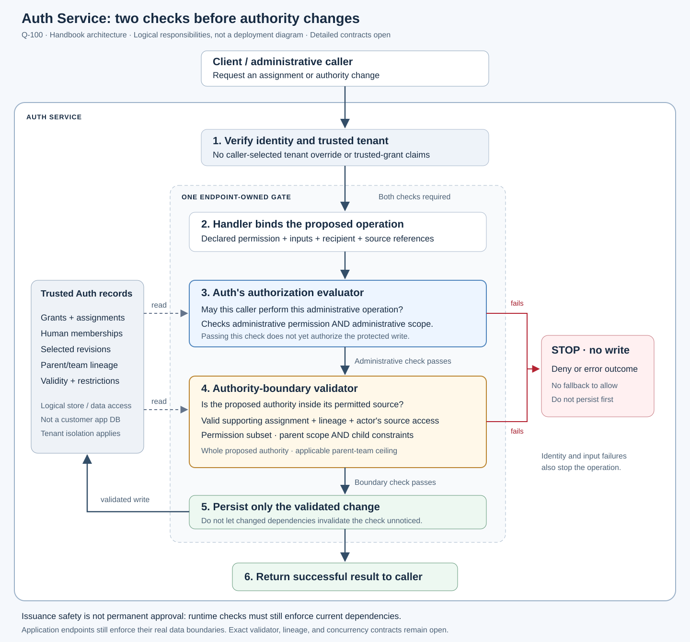

# Auth Service's internal authority-validation gate — Q-100

**Q-101 supplies the binding rules:** [parent-grant bindings](parent-grant-bindings.md)
adds the grant/team/assignment graph, bottom-up structural guards, and explicit
enablement against current reality. The authority validator must inspect these
dependencies in addition to administrative-operation authorization. The internal
flow below remains valid; its open lineage-reference questions are narrowed by
Q-101, without prescribing a new validator API or runtime implementation.

Status: **AGREED AT ARCHITECTURAL RULE LEVEL; detailed contracts open.** The user
requested adding the Q-100 scratchpad write-up and SVG to the lab. This records
the two responsibilities within Auth's endpoint-owned gate, not a deployed
implementation or finalized validator API. The scoped integration does not reopen
unrelated lab work or authorize commit/push; scratch originals remain unchanged.

## The distinction

Auth Service protects its own APIs using the authorization framework. Authorizing
an administrative operation is necessary, but does not alone establish that the
authority being distributed stays within its allowed source boundary.

Two responsibilities therefore sit inside the Auth endpoint's gate:

| Responsibility | What it establishes | What it does not establish alone |
|---|---|---|
| **Auth's authorization evaluator** | The caller may perform the declared administrative operation within its administrative scope, including the intended recipient where applicable. | That the proposed business permissions and scope are supported by the permitted authority lineage. |
| **Authority-boundary validator** | The complete proposed authority respects its valid source, permission subset, inherited scope, and applicable team ceilings. | That the caller is authorized to perform the administrative operation. |

“Authority-boundary validator” names a logical responsibility here. It need not
be a separately deployed service or duplicate the evaluator's resolution code.
Shared resolution primitives can supply trusted effective authority to both.

The evaluator is **not scope-blind**: it checks the administrative scope of the
operation. The second check concerns a different boundary—the authority being
created, changed, or assigned. Passing the first check is not final permission
to persist an arbitrary grant or assignment.

## Internal flow

[Open the SVG](assets/auth-service-authority-gate.svg).



1. **Establish context.** Verify identity and trusted tenant. Tenant remains the
   mandatory implied outer boundary, not an ordinary caller-controlled scope key.
2. **Bind the operation.** The Auth endpoint declares its one required permission
   and selected inputs/sources. Its handler validates and binds the proposed
   change, intended recipient, and supporting references. This is an Auth API,
   not a customer application endpoint accessing a business database.
3. **Evaluate administrative authority.** Use the caller's valid grants,
   assignments, memberships, and restrictions to establish permission for this
   operation within its administrative scope.
4. **Validate the authority boundary.** Load trusted supporting assignments and
   their grant/revision lineage; check source availability to the acting human,
   the applicable team ceiling, and the whole proposed resulting authority.
   A parent definition ID or caller-claimed membership is not sufficient proof.
5. **Persist only the validated change.** Both responsibilities must succeed.
   The write must correspond to the proposal and dependency state actually
   validated. Prevent a concurrent change from invalidating the safety check
   unnoticed; exact transaction/version-check mechanics remain open.
6. **Return the outcome.** A failed mandatory check prevents the protected
   write. An inability to establish required authority, such as a failed lookup,
   must not become allow. Denial and evaluation error remain distinct outcomes;
   the diagram does not introduce a new result schema or HTTP-status policy.

The diagram's numbered sequence is a logical flow, not a mandate for separate
network calls or an assertion that the implementation already exists.

## Concrete grant example

These are **versioned grant definitions**, not a complete request or derived-
assignment contract. Assignment records and source-link fields are deliberately
not invented here. The example is hypothetical and does not alter Maya's
existing scratch grants or Team1/Team2's stored examples.

Assume this administrative definition is validly assigned to Maya:

```json
{
  "version": "1",
  "id": "G-EXAMPLE-MAYA-ASSIGN-TEAM2",
  "permissions": ["auth:assignment::create"],
  "scope": {"group": "team-2"}
}
```

Here `group` identifies the intended assignment recipient. It is an
administrative boundary, not an application department.

Assume the following definition has a valid selected supporting assignment to
Team1, and Maya has legitimate access to it through her valid Team1 membership:

```json
{
  "version": "1",
  "id": "G-EXAMPLE-PARENT-FIN-READ",
  "permissions": ["hrms:payroll:payslip::read"],
  "scope": {"dept": "FIN"}
}
```

Now Maya proposes assigning this definition to Team2, using that parent route:

```json
{
  "version": "1",
  "id": "G-EXAMPLE-PROPOSED-ENG-WRITE",
  "permissions": ["hrms:payroll:payslip::write"],
  "scope": {"dept": "ENG"}
}
```

- **Administrative check: can pass.** Maya may create assignments to Team2.
- **Authority-boundary check: rejects the proposed reach.** FIN-read cannot
  supply ENG-write. Write is absent from the selected parent permissions;
  ENG cannot replace the inherited FIN constraint. Nothing is assigned.

Scope narrowing is constructive, not a free-form overwrite:

```text
Child permissions ⊆ selected parent effective permissions
Effective child scope = parent effective scope AND child additional constraints
```

Selecting read and adding supported `cert = C17` would instead produce read
within `dept = FIN AND cert = C17`, subject to all other checks. Additional
scope `{}` retains FIN; it does not become tenant-wide. Adding an incompatible
ENG constraint cannot escape FIN: FIN AND ENG is not ENG. Whether to reject all
unsatisfiable definitions at registration is a separate validation-contract
question; they cannot authorize an operation outside FIN.

## Required material and continuing dependencies

The validator needs the intended assignment/change context, not just an isolated
grant definition. A reusable definition grants nobody access by itself.
Registration/schema validation and authorization of a definition's creation do
not replace boundary validation when it is assigned or adopted.

- Preserve the exact supporting assignment and selected revisions, not merely
  a parent grant's existence or some other assignment of the same definition.
- Check the source available to the acting administrator under Q-093. Separate
  administrative permission remains mandatory.
- Preserve the parent-team ceiling under [Q-095](authority-lineage.md). The
  exact source-selection and parent-reference contracts remain open.
- Validate the complete resulting authority, not only its added delta. Q-100
  applies this to the authority-change gate; exact operation coverage stays open.
- Under Q-099, team-held support remains tied to its selected assignment and
  actual lineage, not the original owner's identity merely because they acted.
  Explicit personal dependencies remain, including upstream dependencies.

Auth can enforce registered structure and canonical lineage/narrowing rules.
It does not thereby learn arbitrary customer-domain facts. In particular,
`$self` must not silently change meaning across source/recipient contexts;
identical scope text is not proof of identical reach. Those binding semantics
remain open. If required containment cannot be established, the engine must
not accept the change as safely bounded by guessing.

Related scratch context: Q-097 explores whole-result changes by different
administrators; Q-098 proposes the specific child-team-to-parent-team source
relationship. Those separate decisions and their concrete formats are not
independently promoted by this integration. The original scratch write-up retains
that discussion context; this chapter uses the handbook's agreed parent ceilings.

## One mandatory path, not the only security protection

Centralize authority-change validation so protected writes cannot bypass it via
another endpoint or an internal code path. Relevant assignment, grant-change,
revision-adoption, and lineage-change operations must apply the appropriate
checks before their changes take effect. Publishing an immutable definition
does not itself authorize its adoption by existing assignments.

This does not mean every administrative action distributes new authority or
requires the same checks. For example, permitted membership writes distribute
already assigned team access under their own administrative boundary; Q-100 does
not silently add a new business-permission-possession rule for adding a member.
The exact operation-by-operation validation contract remains to be specified.

It is the mandatory **authority-change gate**, not the only defense against all
leaks. Runtime resolution still enforces current parent and membership validity.
Application endpoints still bind and enforce their real data boundaries. Safe
issuance cannot make later orphaned authority valid or prove a certificate
belongs to FIN. Root/bootstrap authority also needs its explicit trust rules;
ordinary callers cannot declare themselves parentless to bypass validation.

## Rationale and boundaries of the proposal

The split prevents “may administer Team2” from becoming “may assign anything to
Team2.” It also prevents business access from becoming administrative authority.
Keeping the checks in one endpoint-owned gate makes both necessary before the
protected write while retaining the handbook's existing auth-first architecture.

Only checking administrative permission permits unsupported authority creation.
Only checking permission/scope subsets permits an unauthorized caller to change
someone else's access. Treating an issuance-time check as permanent approval
misses later broken dependencies. These are different failures, requiring the
distinct responsibilities shown in the diagram.

Still open: exact validator API/result shape, source and parent-reference fields,
recipient-relative binding, root bootstrap mechanics, operation coverage details,
revision/adoption contracts, and concurrency/freshness enforcement. No new
canonical permission, wire field, deployment boundary, or runtime migration is
approved merely by naming this component.

Related chapters: [Q-093 assignment authority](assignment-authority.md),
[Q-095 lineage](authority-lineage.md), and
[Q-099 ownership](ownership-lineage.md).
