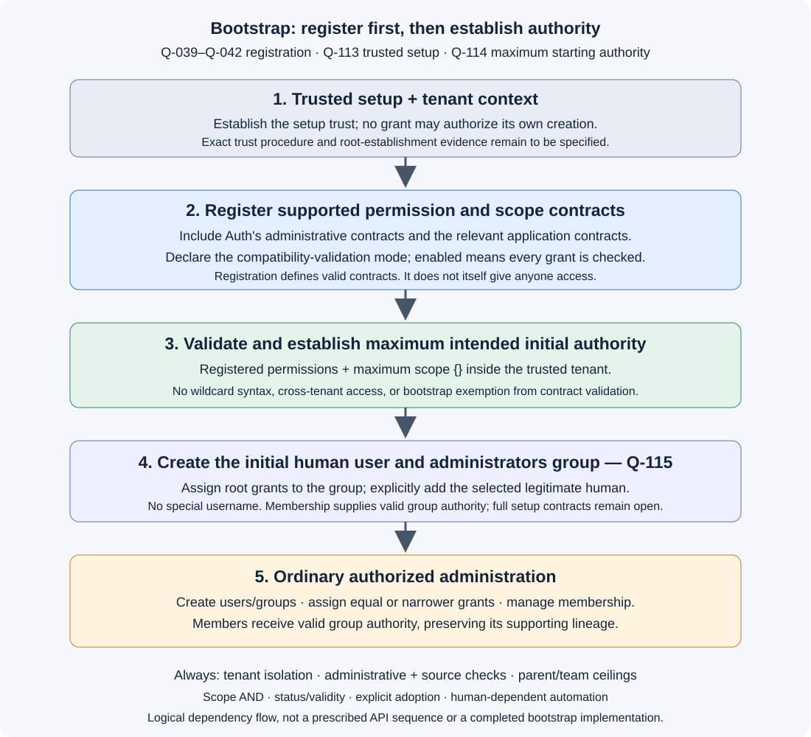

# Bootstrap authority — registration, maximum starting authority, bounded distribution

**Later root evolution — Q-120A:** legitimate application capability upgrades
should expand applicable root permission coverage automatically, without a
separate manual root-update approval. [Rationale and open mechanism](root-permission-evolution.md)
distinguish this from live wildcard syntax, which is not approved. Initial trust/
registration, maximum intended tenant authority, normal enablement, and bounded
child selection remain. Earlier separate-manual-expansion framing is qualified;
bootstrap replay and arbitrary cross-application expansion are not authorized.

## Q-114 — Maximum starting authority: agreed, with registration prerequisite

**AGREED AS CORRECTED.** The user clarified that the initial administrator must
have maximum permissions and maximum scope to create users, create groups,
assign grants, and add users to groups, then answered “agreed.” The user then
corrected the omitted prerequisite: **permissions and scope definitions must be
registered first**. This reaffirms Q-039–Q-042, not a new optional setup step.

The earlier FIN-read-only bootstrap recommendation does not represent the
approved starting model. Trusted setup establishes maximum intended authority
within the tenant using the applicable registered permission/scope contracts.
From that source, ordinary administration distributes equal or narrower authority.

### Correct logical setup flow



[Open the setup flow SVG](assets/bootstrap-registration-flow.svg).

1. Establish the trusted setup and tenant context under Q-113. This is not a
   request's self-asserted root status or permission supplied by a not-yet-created grant.
2. Register the permission identifiers, scope definitions/contracts, and explicit
   permission-scope compatibility-validation mode relevant to the initial grants.
   This includes **Auth's own administrative contracts**, not just application
   business permissions. When compatibility validation is enabled, every seed
   grant must satisfy it; disabled mode does not skip registration or syntax checks.
3. Validate and establish the initial grants supplying maximum intended
   permissions and scope inside the tenant. Unsupported definitions do not become
   acceptable merely because a grant is created during bootstrap.
4. Under [Q-115](bootstrap-initial-assignment.md), create a legitimate human user
   selected through trusted setup and an Auth administrators group. Explicitly
   assign initial authority to the group and add the human as a member. No
   special username is required; a grant definition alone gives nobody access.
   The arrangement is agreed; full user/group/membership schemas remain open.
5. The administrator creates users/groups, assigns equal or narrower dependent
   grants, and manages membership through normal authorized operations. Users
   receive their groups' valid authority; no independent grant copies are created.

This is dependency ordering, not a mandate for five HTTP calls, database tables,
or a new unauthenticated initialization API. The first registry/root establishment
must be supported by the trusted setup procedure, not a circular demand for an
administrative grant whose permission has not yet been registered. Exact setup
authentication, persistence, failure/rollback, and API contracts remain open.
Future applications need their relevant definitions registered before their own
grants are accepted; this does not require pre-registering every future application.

### Concrete intended authority

| Recipient/context | Authority in the example |
|---|---|
| Initial administrator | Maximum intended registered permissions and scope within the tenant, including the administrative authority needed for the setup workflow. |
| Finance group | Payroll read/write within FIN, through valid derived grants. |
| Finance readers group | Payroll read within FIN, through valid derived grants. |
| Nutan, a Finance readers member | The group's valid read route, not Finance write or independent copied authority. |

Maximum scope is `{}` inside the implied tenant; it never removes tenant isolation.
Maximum permissions means the full intended initial permission set, not a new
wildcard or `all` operator. The exact seed catalog, root-identification format,
user-management permission names, and number of seed records remain to be specified.
The example does not implicitly establish team parentage or ownership permissions.

**Q-115 refinement:** the original Q-114 flow left initial direct/group placement
undecided. The explicit user, administrators group, assignment, and membership
arrangement above now settles that choice. Direct assignments remain supported
generally; full setup contracts remain open.

**Rationale:** the initial administrator needs a complete starting source for
legitimate administration, not an artificially FIN-read-only ceiling. Registration
and maximum starting authority are complementary: registration establishes the
valid vocabulary/contracts; trusted bootstrap deliberately establishes and assigns
authority using them. Registration alone is not access, while bootstrap is not
an exemption from registered-contract validation.

**Core-philosophy check / accepted trade-off:** initial authority is deliberately
powerful within the intended tenant. Normal administrative/source checks, grant
and team ceilings, scope AND, human-dependent automation, status/validity, and
lineage-supported latest remain mandatory. No permanent bootstrap-user bypass,
implicit inherited human membership, independent agent authority, automatic
future revision adoption, or interpretation of application business data is added.
Protecting this initial authority and its trusted establishment remains essential;
the flow is not a claim that the complete bootstrap contract is finished.

**Supersession:** older Q-088 “minimal” wording and the original Q-114 FIN-read
seed proposal cannot require an artificially restricted initial capability ceiling.
They remain below as history where they conflict. Ordinary grant lifecycle,
explicit assignment, no-personal-bypass, and bounded distribution still apply.
No new principle vote is needed for the registration prerequisite already agreed
under Q-039–Q-042 and reaffirmed by the user's correction.

## Q-113 — Legitimate root establishment: agreed with clarification

**AGREED AT RULE LEVEL.** The user agreed and clarified that ordinary grant
operations are already bounded; omitting a parent cannot escape those bounds.
The user also required a check against all core philosophy, rules, and boundaries.
Q-088 already allows minimal bootstrap-created grants to remain under normal
lifecycle controls, and Q-093/Q-100 already require applicable source authority.
Q-113 therefore clarifies legitimate root establishment; it does **not** discover
or introduce a new parent-omission loophole or separate rejection mechanism.

<details>
<summary>Earlier proposal status and framing — superseded by approval and the user's correction</summary>

Previous status: PROPOSED / NOT APPROVED. The question was framed as distinguishing
a legitimate starting grant from a grant without a valid parent, emphasizing
ordinary parent omission. The user correctly pointed out that the existing
bounded-authority rules already prohibit using omission to escape the ceiling.
The trusted-root-establishment recommendation was approved; its concrete trust
procedure and proof are still open.

</details>

**Agreed rule:** legitimate root authority must be established through an
explicit trusted initialization/provisioning procedure. Ordinary grant creation
or modification must not confer root authority merely by omitting/removing a
parent reference, even when the caller may administer grants. A request's own
claim to be a root is not proof that trusted establishment occurred.

```text
Trusted establishment → G0 root authority → G1 dependent authority → G2
```

Example: Maya can administer grants but holds supporting authority only for FIN
read. She cannot obtain tenant-wide read/write by submitting a parentless grant.
The administrative operation check does not manufacture a new source boundary.
Conversely, G0 deliberately established through trusted setup is a legitimate
starting point; resolution does not invent a nonexistent parent for it.

This does not prohibit retaining an ineffective orphan or disabled record where
existing lifecycle rules allow it. Such a record does not thereby become a root.
Q-101's structural guards permit certain parent changes but are not authority
to establish a new trust anchor. The resulting root remains an ordinary grant
subject to status, validity, revisions, assignments, and its explicit boundaries;
the bootstrap human has no permanent personal bypass.

**Rationale / core-philosophy check:** every dependent chain needs an established
starting boundary, but a missing parent cannot be a way to escape that boundary.
The recommendation preserves ordinary grant representation and the separation
between administrative permission and authority to distribute access. It does
not introduce a root permission wildcard, unlimited source grant, or new field.

**Trade-off and remaining risk:** new top-level authority requires governed setup,
not an ordinary bounded assignment operation. The trusted operator/procedure,
exact seed bounds, registration of new application authority, proof of root
establishment, repeated initialization, root changes, and recovery still need
discussion. This decision does not approve an unauthenticated setup endpoint,
permanent backdoor, one-shot initialization restriction, or a full root schema.

**Q-113, answered with agreement and correction:** approve explicit trusted
establishment for root authority, recognizing that ordinary bounded operations
already cannot acquire new source authority merely by omitting a parent?

### Core-philosophy and boundary review

This is a documentary consistency review of the agreed rule, not executable
security verification or approval of the still-undefined bootstrap procedure.

| Existing rule / boundary | Q-113 consistency and constraint |
|---|---|
| Trusted implicit tenant; no cross-tenant authority | Root authority is established within its declared trusted tenant context. Setup does not waive tenant isolation or make a platform identity entitled to every tenant's application authority. |
| Non-amplification; Q-093 / Q-100 separate administrative and source authority | Ordinary operations remain bounded by existing valid support. The initial trust source establishes a root; the new grant cannot justify its own creation. Later administration remains subject to the existing two checks, not a bootstrap-user exception. |
| Q-095 grant/team ceilings; Q-103 / Q-112A supported latest | A legitimate root terminates the required parent chain without inventing another parent. Descendants still resolve current supported lineage top-down and remain within grant and team ceilings. No independent parent revision selector is introduced. |
| SCOPE-007 and AND narrowing | Roots use the same flat boundary selector and trusted tenant outer boundary. An empty scope is intentionally broad within that tenant, not a missing tenant or universal exception. Descendant empty scope retains inherited restrictions. |
| Q-090 definition versus assignment | Merely storing a seed definition gives nobody access. Applicable assignments and human memberships remain necessary to make its authority available. No implicit ownership or membership is manufactured. |
| Q-088 / Q-099 ordinary lifecycle and owner separation | Root grants may remain; bootstrap actors get no permanent personal privilege. Owner changes do not automatically rewrite source authority. Actual personal dependencies still apply. |
| Human-only groups and dependent service/agent authority | Trusted establishment is not permission to create an independent service/agent principal or first-class automated group member. The procedure and any automation's trust/identity must be specified before implementation. |
| Q-102–Q-109 revisions and validity | Published root content is not mutable in place merely because it is seeded. Explicit adoption, valid windows, and live grant/assignment controls still apply; publication or re-enablement does not silently expand adopted authority. Authority to change the root boundary itself still needs its trust contract. |
| Q-094 orphans; Q-101 structural guards; Q-111 cycles | A missing parent, disabled binding, or circular graph cannot turn into legitimate root authority. Root establishment does not permit automatic orphan repair or bypass guarded parent changes. |
| Q-039–Q-042 abstract registration; permission matching rules | Setup does not make unsupported permission/scope definitions acceptable, add wildcard permissions, or authorize Auth to interpret application business facts. The registration/seed initialization ordering still needs definition. |
| Endpoint-owned gate and actual operation enforcement | No new prepared mode, second application decision, or business-logic evaluator. Initial trust establishment is not an implied exemption for normal Auth APIs. Applications still enforce authorized boundaries on actual effects. |
| Q-110 checked-state preservation; fail-closed and failure distinction | Subsequent protected Auth writes retain their current authorization/consistency requirements. Unproven root status is not authority. Exact bootstrap concurrency and failure results are not inferred from this rule-level approval. |
| Canonical representation and scope discipline | No new root entity type, caller-controlled root flag, parent-revision field, condition language, or external audit-system design is approved. Root identification/proof remains a contract deliverable. |

**Review outcome:** no contradiction found in the rule when these existing
constraints are retained. It is not correct to claim the complete bootstrap
design is secure or finished: the trust source, actor authorization, exact seed
bounds, reliable establishment evidence, reinitialization, and recovery remain
undefined. The first bootstrap cannot be authorized by the grant it is about to
create; its independently established trust is the initial condition, not a
permanent runtime bypass or proof supplied by a request's own fields.

### Counterexamples checked against the rules

| Attempt | Required consequence |
|---|---|
| Maya submits a parentless broad grant despite only FIN-read support | Existing bounded administration cannot establish that authority; Q-113 adds no new escape/rejection policy. |
| A stored orphan is relabeled as a root by ordinary editing | Missing support does not become trusted root establishment. |
| The bootstrap human acts after required administrative grants are disabled | Bootstrap provenance alone provides no authorization. |
| A parent is disabled but its descendant stays stored enabled | Descendant authority is ineffective under the existing live dependency rule. |
| A newer root revision is published with wider authority | Publication alone does not upgrade assignments; required explicit adoption and validation remain. |

<details>
<summary>Original Q-114 proposal — superseded by maximum starting authority and the registration-first flow above</summary>

## Original Q-114 — Selecting initial seed authority: proposed, not adopted as framed

**PROPOSED / NOT APPROVED.** Recommendation: trusted setup uses an explicit
reviewed selection of initial grant permissions and scope, rather than treating
the entire registered permission catalog as automatically seeded authority.
This concretizes how the initial maximum boundary is selected; it does not ask
again whether ordinary operations must respect it.

Example: an application registers read, write, and delete, while the approved
initial source grant contains only FIN read. Registration establishes available
vocabulary; it does not by itself seed write/delete or tenant-wide authority.
Adding new catalog entries later does not rewrite existing seed revisions.

**Rationale / philosophy:** seed contents establish the root ceiling, so they
must reflect a deliberate authority choice, not capability discovery. This
preserves minimal seeding, registration-versus-authorization separation, and
explicit revision/adoption. The trade-off is that unseeded capabilities need a
separately authorized trusted source-authority change before ordinary grants can
derive them. The approver, seed representation, and change procedure remain
open; no new manifest schema or approval workflow is selected here.

**Q-114:** should initial root permissions and scope be explicitly selected for
trusted setup, rather than automatically covering everything registered?

</details>

## Earlier approved bootstrap foundation — Q-088 and later refinements

Current refinement: [Q-093](assignment-authority.md) requires a supporting parent
authority route available to the assigner, in addition to assignment permission.
The old provision-without-possession example below is superseded for dependent
assignments. Bootstrap must establish the required explicit source authority;
Q-092's team-administration grant alone cannot distribute unrelated business
authority. The full seed set and bootstrap trust contract remain open.

Post-0.0.1 update: [Q-090](grant-assignments.md) separates grant definitions from
recipient-bearing assignments. Bootstrap authority must be established through
the applicable assignments, not merely by creating definitions. The earlier
recipient-bearing wording below is preserved history; no bootstrap bypass is added.

[Q-092](team-administration.md) approves the example initial grant assigned to
Maya: `auth:group::create`, `auth:group::write`, and `auth:group::delete`, with
empty scope inside the implied tenant. Create includes subteams, write includes
human membership, and assignment of authority remains separately authorized.
This replaces the create-only starting proposal, not the remaining bootstrap gaps.

Status: **AGREED.** The user answered the clarified Q-088 “yes, agreed.”
Previous status, retained as history: **USER DIRECTION RECORDED; clarified rule
awaiting confirmation** until that answer. This
is a bootstrap authority discussion, not a new grant format. The user clarified:
some grants are created through bootstrap, they may remain, they should be minimal,
and the bootstrapped user can subsequently assign more grants to himself.

## Agreed shape

Bootstrap creates the minimal ordinary grants needed to establish administration.
Those grants can remain after setup and use the normal grant lifecycle. They do
not have to expire or be deleted merely because setup has finished.

The bootstrapped human may explicitly assign additional grants to himself **when
his current administrative authority permits the whole assignment**. This preserves
the agreed distinction between permission to provide access and permission to use
that access. It also preserves recipient, assignable-permission, scope, validity,
and other applicable administrative bounds; new grants cannot authorize their own
creation or enlarge those bounds without supporting current authority.

## What “bypass” meant

The earlier wording meant allowing an operation solely because someone was the
bootstrap user, without a currently applicable grant authorizing the operation.
It did **not** mean retaining bootstrap-created grants. For example, allowing
Vinay to create grants after his only administrative grant has been disabled,
just because he performed setup, would be such a special exception.

The distinction is between ordinary authority created during setup and permanent
special treatment of the setup identity. No separate bootstrap-user privilege,
automatic deletion of seed grants, or automatically expiring bootstrap account
is proposed.

## Concrete example

Suppose the seed authority permits Vinay to create Finance certificate-read grants
for eligible human recipients, including himself. These are plain-language
administrative bounds; their exact scope encoding is not finalized here.

1. After bootstrap, Vinay can administer those assignments. That seed alone does
   not give him certificate-reading access.
2. He explicitly creates a Finance certificate-read grant for himself. The
   evaluator checks that his administrative authority permits that assignment.
3. The new grant can supply Finance read authority through normal evaluation.
4. He cannot instead assign Engineering access or Finance write access using seed
   authority that permits only Finance read assignments.

If tenant-wide provisioning authority is intentionally seeded, it can permit
correspondingly broad self-assignment within its bounds. That is powerful authority
even if represented by just one grant. “Minimal” must concern the authority needed
to initialize administration, not merely a small number of grant records. It does
not silently prohibit legitimate root administration or prescribe exact seed bounds.

## Rationale and remaining work

Keeping seed grants ordinary avoids a second privilege system. Keeping the seed
minimal limits initial authority without preventing authorized administration.
Making self-assignment explicit preserves the separation between administration
and use. Checking existing authority prevents “can create a grant” from being
interpreted as “can create any grant with any reach.” These are authorization
rules; no business-rule or external audit-system design is added.

The approved administrative model already supplies the whole-assignment rule.
This clarification applies it to bootstrap rather than introducing a new
universal possession ceiling: Vinay need not already possess the business access
he is authorized to assign. Exact seed contents, bootstrap control, administrative
scope representation, recovery, and repeated-initialization behavior remain open.
HC-05-09 remains open; no completion credit is claimed.

**Q-088 clarified:** Bootstrap seeds minimal ordinary grants that may remain;
the bootstrapped human can explicitly assign himself additional grants within
his current administrative authority. Is this the agreed shape?

**Answer: agreed.** Seed minimal ordinary grants, allow them to remain under the
normal lifecycle, and permit explicit self-assignment within current administrative
bounds. The user did not approve a temporary-only seed policy, automatic removal
after setup, or unrestricted self-assignment. The rationale and example above
are part of this decision; the full bootstrap procedure remains open.

## Original question — retained with terminology clarification above

**Q-088:** Should bootstrap establish the starting administrative grants, with
all subsequent administration governed by normal authorization and no permanent
bootstrap bypass?
