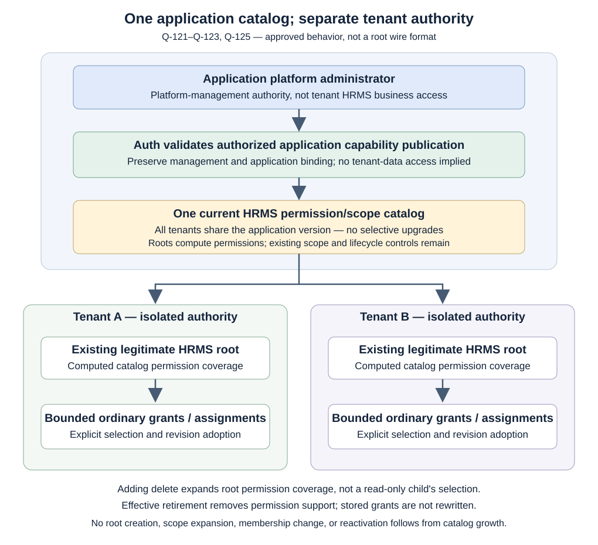

# Current handbook state — RECON-002, through Q-130

## Publication checkpoint — RECON-002 and C01-D1/D2

The user has now requested commit and push of this change set: reconciliation,
the boundary-validation behavior draft and the direct-human record trace.
Earlier local/uncommitted notices below describe the preparation stage before
this publication request. The preceding pushed decision checkpoint was b661b39;
the resulting publication commit is identified by Git history.

Publication does not approve a direct-human source-eligibility policy or the
subsequent C01-D3 investigation's suggested supporting-context approach. No new
parent field or additional completed criterion is implied. Tags and archived
discussion remain unchanged.

This is a reconciliation of approved discussion, not a new authorization design.
Decision checkpoint `b661b39` was committed and pushed to main before this pass.
The reconciliation is a separate local change set, left uncommitted for review.
The existing tags and preserved scratchpad/history sources are unchanged.

## Drafting continuation — C01-D1

**C01-D2 trace delivered:** [direct-human support lookup](direct-human-parent-context.md)
now shows the supplied records and each lookup step. The original Q-101 case
used identical parent content; the later FIN/ENG case has different adopted
revisions. Candidate discovery alone does not establish eligibility for Nutan's
direct route. No new selection rule or field is approved, and C01 is not declared
fully closed. The user approved tracing the case, not a choice of its authority.

Following the user's instruction to keep going, the
[authority-boundary validation chapter](authority-boundary-validation.md) now
consolidates the two gates, required material, actual parent-team support lookup,
AND/subset construction, seven versioned core-record examples, twelve operation
categories and 28 sourced expected-outcome cases. It reuses the existing Auth
flow SVG and adds a worked dependency flow. No new policy or wire field is adopted.

C01 is no longer merely a list of scattered rule references. Its remaining work
is direct-human support discovery, recipient-relative source binding, and exact
interface/evidence representation coordinated with C02–C05. These are existing
gaps, not additional work packages. The full HC-05-08 criterion remains open;
the delivered drafting work is recorded here rather than lost in its binary score.

This continuation takes priority over the earlier next-question scheduling at
the end of this page. Draft supported behavior first; do not start another
question sequence merely because a review-area row remains open. Changes remain
local/uncommitted, including the preceding reconciliation. No scratchpad edits.

## Eleven decisions recorded since the previous checkpoint

| Decision | Current approved rule | Source with rationale and examples |
|---|---|---|
| Q-121 | Application platform administration authorizes capability publication outside tenant business scope, within its own management authority. No invented publisher-grant format is adopted. | [Application platform authority](application-platform-authority.md) |
| Q-122 | Legitimate root permission coverage is computed from the applicable registered application catalog. No automatic root revision/adoption cycle for catalog additions. Exact source encoding remains open. | [Root evolution](root-permission-evolution.md) |
| Q-123 | One shared version/catalog per application; no selective tenant updates, release pins, or catalog adoption. Tenant authority stays isolated. | [Shared catalog](root-permission-evolution.md) |
| Q-117 | Initial bootstrap authority is unavailable until the complete intended setup is validated and durably established. No partial-access route. | [Bootstrap](bootstrap-initial-assignment.md) |
| Q-124 | Authorized interrupted setup may resume only for the same revalidated intent. No silent administrator/authority replacement or merging conflicting attempts; completed replay remains Q-116. | [Bootstrap continuation](bootstrap-initial-assignment.md) |
| Q-125 | Authorized permission retirement may proceed despite existing grant references. Effective retirement withdraws that permission; stored grants and assignments are not rewritten or deleted. | [Permission lifecycle](permission-lifecycle.md) |
| Q-126 | Existing/retired permission identifiers cannot be repurposed for materially different authorization meaning. Cosmetic labels may change. | [Stable meaning](permission-lifecycle.md) |
| Q-127 | No proxy-to-proxy delegation chains in v1. Direct human-linked delegations, agent collaboration without implicit authority transfer, and team/grant hierarchies remain supported. | [Delegation](delegation-lifecycle.md) |
| Q-128 | New checks after any confirmed authority reduction cannot rely on withdrawn stale support. Other complete valid routes may allow; uncertain freshness is not proof of denial. | [Freshness](authority-freshness.md) |
| Q-129 | The same already-allowed ordinary synchronous application operation may finish within evaluated boundaries after later withdrawal. Q-074 and Q-110 remain; queues, streams, long-running and not-yet-allowed cases are not included. | [Concurrent enforcement](concurrent-enforcement.md) |
| Q-130 | Different complete valid grant routes may cover different batch items. All items need complete support before effects; no permission/scope fragment mixing or partial successful filtering. | [Bulk enforcement](bulk-enforcement.md) |

These are eleven answered decisions, not eleven completed chapters or eleven
of the original eighteen agenda packages. Q-117 is no longer parked. Q-131 has
not been approved; move source/destination grant composition remains open.

## Current counts and how to read them

**User correction on blocker language:** most recent questions were straightforward
policy confirmations, not obstacles to continuing contract drafting. The inventory
below counts review areas, not proven blocking questions. Do not ask the user to
confirm consequences already implied by approved rules. Draft complete examples
first; escalate only a materially different unresolved behavior, new canonical
choice, or necessary scope decision. Earlier conversational use of “blocker” for
every unfinished row was too broad and is not the current working classification.

| Measure | Current value | Meaning |
|---|---|---|
| Design review areas with remaining work | **12** | D01 and D03–D13 in the [current assessment](discussion-assessment.md). Not twelve mandatory questions or blockers; drafting may resolve further items from existing approval. |
| Contract-review packages | **5** | C01–C05; assistant drafts and validates, user approves genuinely new contract choices. |
| Final acceptance | **1** | User acceptance after reconciliation, contracts, and scenarios are finished. |
| Assistant execution packages | **8** | Same A01–A08 supporting the above agenda, not eight additional discussions. |
| Full criteria | **38 DONE / 30 OPEN / 1 EXCLUDED** | 68 in scope: 55.9% closed, 44.1% open. Original criteria/statuses are preserved. |

The original thirteen design topics reduce to twelve because D02's mechanism
choice is settled. Its remaining root wire representation is C02/C04 work, not
a second vote on computation. The other ten answers close choices within broader
topics. No new topic or criterion was added to offset progress. The current agenda
is **17 discussion/review packages plus final acceptance**, not seventeen guaranteed
single questions. New evidence that eliminates an open choice should be recorded
directly, not re-asked to preserve a planned count.

The coarse 68-criterion score does not move from an approval alone: each currently
OPEN criterion still has a concrete incomplete deliverable. The
[updated detailed register](handbook-completion-audit.md) records current evidence
and residual gaps; the [milestone report](milestone-progress.md) preserves the
arithmetic. This is a targeted post-Q-130 reconciliation, not certification of a
runtime engine or final semantic acceptance of every older example.

## Current authority flow and its limits



```text
Application platform-management authority
    → accepted shared application permission/scope catalog
    → computed permission coverage of each legitimate application root
      (tenant authority and lifecycle remain isolated)
    → bounded ordinary grant revisions and explicit assignments
    → current membership / direct human-to-proxy delegation / actual lineage
    → endpoint-owned permission/material evaluation and boundary enforcement
```

Root catalog growth does not enlarge scope, create membership, reactivate an
ineffective route, rewrite immutable child content, or select new child permissions.
Root parent omission is agreed, but no stored wildcard or computed-source field
is approved. Auth platform administration, application platform administration,
tenant administration, and application business access must not be collapsed.

## Reconciliation and preservation rules

- Current summaries and checkpoint evidence use the approved state above.
- Earlier progress notices and open labels are preserved in explicitly labeled
  history sections; their original wording is evidence of discussion, not a second
  current policy. Still-valid decisions remain valid unless explicitly superseded.
- Q-041–Q-050-F explanations, original rejected proposals, and existing source
  history remain available; no contract or rationale is deleted to simplify counts.
- The [grant closure inventory](grant-contract-closure.md) distinguishes the
  computed-root encoding gap from ordinary direct/role content already approved.
- No selective application versioning, proxy chains, external audit design, or
  business-rule engine is reintroduced as an implementation requirement.
- Canonical completion still requires full contracts and scenario review. Reader
  build/tests verify documentation delivery, not authorization correctness.

Next discussion when resumed: whether different complete grants may cover the
current and proposed boundaries of one move (D09), distinct from Q-130's batch
items. This reconciliation does not decide that question.
