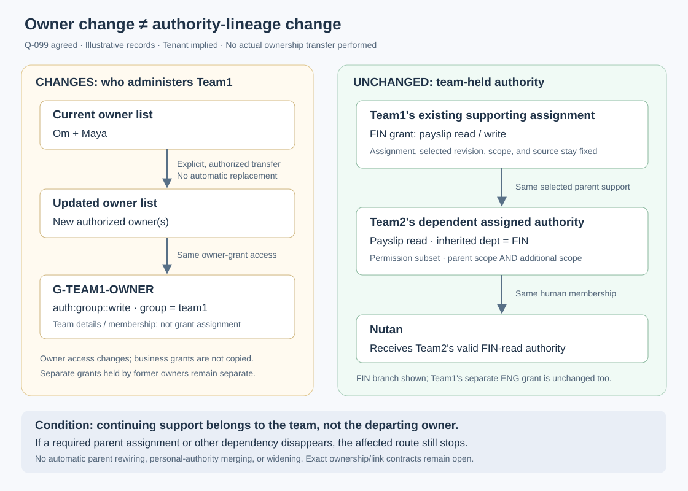

# Ownership changes and team-held authority — Q-099

**Q-101 refinement:** [parent-grant bindings](parent-grant-bindings.md) specifies
current grant/team support lookup and structural-change rules. Q-099's separation
of owner administration from team-held business authority remains unchanged;
the earlier ownership diagram is not a complete Q-101 binding/lifecycle diagram.
Specific-assignment identity language below is historical where Q-101 supersedes it.

Status: **AGREED AT RULE LEVEL.** The user approved Q-099 and authorized adding
it to the handbook. This settles Q-096's separation of team-held continuing
support from the acting administrator, and refines Q-093 accordingly. It does
not finalize ownership permissions, owner-list JSON, or parent-link fields.

## Canonical rule

An explicit authorized ownership change changes who receives the relevant
owner/administrative authority. It does not automatically change the team's
business grants, assignments, selected revisions, parent links, or other human
memberships. With those supporting dependencies unchanged, downstream team-held
authority remains unchanged.

The continuing source of a team-held route is its selected supporting team
assignment and that assignment's required lineage—not the original administrator's
ownership or membership merely because that person created the route.

This is not an ownership bypass. At creation or change, the acting administrator
still needs both the required administrative authority and a valid supporting
source under [Q-093](assignment-authority.md). Being an owner alone supplies
neither arbitrary business authority nor permission to assign grants.

## Two different questions

| Question | Required authority or dependency |
|---|---|
| May Maya create or change this assignment now? | Her current administrative permission and valid supporting source, plus the applicable recipient and parent ceilings. |
| What keeps this team-held route valid afterward? | The specifically selected team assignment and its required lineage, not the identity of the administrator who acted. |
| What if the route explicitly depends on Maya personally? | Its declared personal assignment/membership dependencies remain required; Q-099 does not migrate or rebind it. |

Source selection must remain explicit. Finding another assignment of the same
grant definition does not repair missing selected support. A team-held assignment
whose own parent lineage depends on a human still retains that dependency.
Q-099 removes no actual upstream dependency merely by calling a route team-held.

## Example: Om and Maya, Team1, Team2, and Nutan

[Open the ownership/lineage SVG](assets/ownership-lineage.svg).

Assume Team1's valid FIN-read/write assignment already supports a dependent
FIN-read assignment to Team2. Nutan receives that route through her direct
Team2 membership. Om and Maya currently administer Team1; Suma administers Team2.
These are illustrative existing relationships, not new wire contracts.

An authorized operation explicitly replaces Team1's owners. It leaves the
selected Team1 supporting assignment, Team2's dependent route, and Nutan's
membership unchanged. Nutan therefore retains that FIN-read route, subject to
its continuing validity and normal endpoint evaluation/enforcement. Suma's
separate Team2 administrative relationship is not automatically changed either.
The illustration performs no actual ownership or membership change.

The illustrated `G-TEAM1-OWNER` contains `auth:group::write` within
`group = team1`, for team details and membership. This is the scratch example,
not a complete canonical owner bundle or evidence that this permission authorizes
ownership transfer or grant assignment. The exact ownership-transfer permission
remains open. Tenant is the trusted implied outer boundary.

## Consequences and counterexamples

- Removing Maya from an owner list removes that owner-derived route only. It
  does not revoke separate direct administrative grants or remove her from
  unrelated memberships. A complete removal of access requires explicit changes
  to all relevant routes, not an assumption about the owner list.
- Adding an owner with ENG-write authority does not add ENG-write to Team1 or
  Team2. Personal permissions/scopes are not merged into team-held authority.
- Disabling, deleting, or otherwise invalidating the actual supporting Team1
  assignment stops its dependent route. An available owner cannot replace that
  support merely by remaining an owner. Other valid routes remain alternatives.
- If a selected route explicitly requires Maya's personal assignment or
  membership, losing that support still stops the route. Ownership rotation is
  not automatic transfer, revision adoption, or parent rebinding.
- Changes to business authority are separate authorized operations. Owner
  rotation alone neither widens nor narrows its stored grants and parent links.

## Rationale

Separate administrative continuity from the source of recipients' authority.
Otherwise a routine owner replacement could unexpectedly remove downstream
access, or import a replacement owner's broader personal access. Keeping the
selected team-held source stable makes the effect of owner changes explicit
while preserving live dependency checks and the parent subset ceilings.

This distinction is compatible with Q-094's rule that ownership transfer must
be explicit and orphaned routes cannot authorize. It does not make team-held
authority independent of its actual required parents.

## Scope of this approval

Q-099 settles the rule above, not all of Q-096. The two-owner recommendation,
exact ownership records and transfer permissions, parent-reference representation,
and explicit rebinding/migration mechanics remain open. No two-person approval
workflow is adopted. Agents and service accounts remain human-dependent subsets.

Q-097 and Q-098 remain separate scratchpad discussions; this integration does
not promote them or the scratch owner-list format. The existing Team1/Team2
example illustrates an already selected route, not a new universal source-selection
contract. Earlier Q-093/Q-096 wording is preserved, marked superseded where the
unconditional assigner-membership interpretation conflicts with Q-099.
