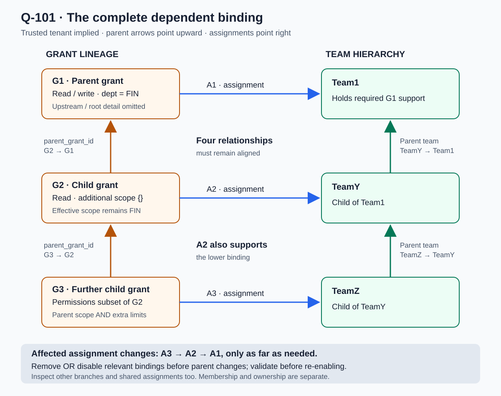
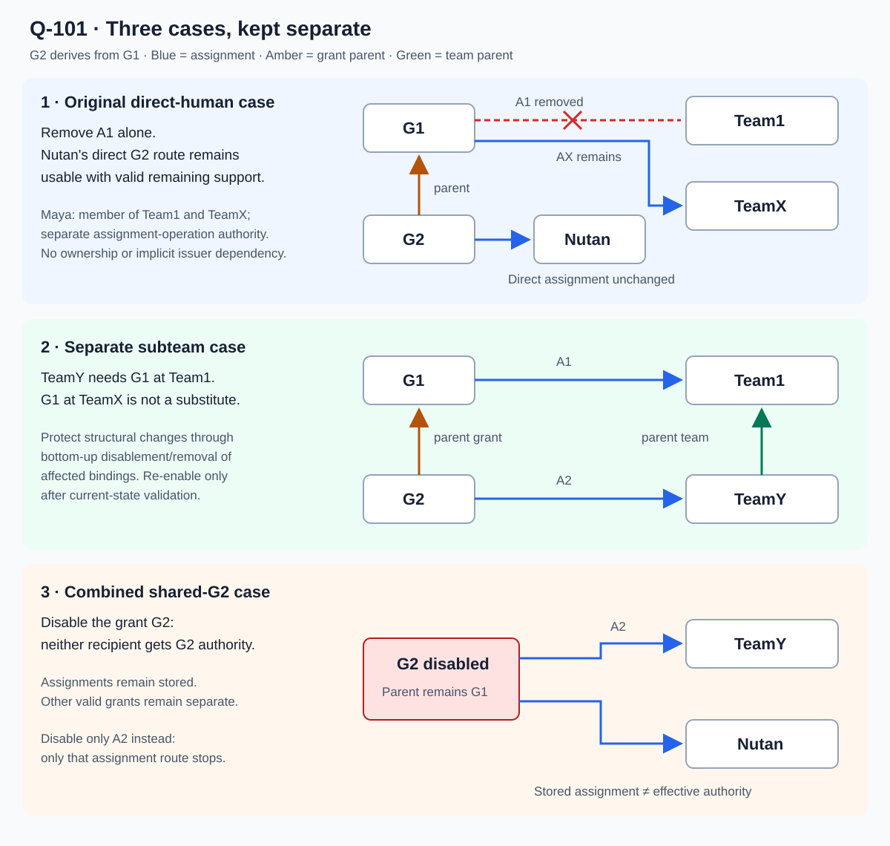
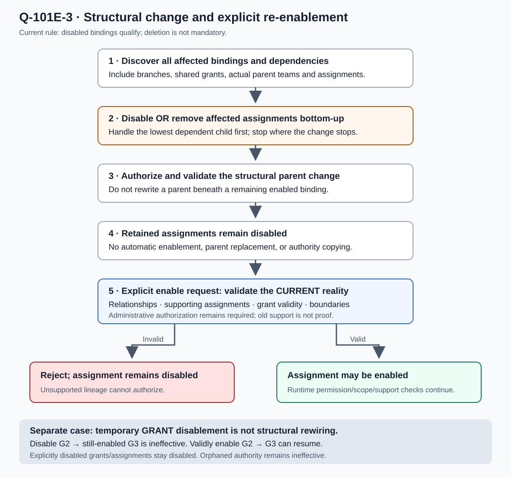

# Parent-grant lineage and dependent bindings — Q-101

**PINNED / AGREED for the discussed model, through Q-101E-3.** The user requested
promotion from the scratchpad into the lab, with diagrams and broad case coverage.
This chapter is the current explanation where older selected-assignment or
removal-only wording conflicts. It is not a runtime implementation, complete
wire schema, or proof that every lifecycle edge has been implemented.

## 1. The framing

A derived grant stores `parent_grant_id` as its explicit grant-lineage link.
Auth uses that link together with actual assignments and team parentage to
establish the required supporting authority. **No `parent_assignment_id` is
required by the cases settled here.** Assignment records and their own IDs
still exist for lookup and administration; omitting a second lineage reference
does not make those relationships optional.

Tenant is the trusted, implied outer boundary. Teams/groups contain humans;
membership, ownership/administration, team hierarchy, grant lineage, and grant
assignment are different relationships. None silently substitutes for another.

Child permissions are a subset of the parent's effective permissions. Child
effective scope is parent effective scope AND the child's additional constraints.
Each child team's complete authority must also stay within its parent team's
authority. A separate assignment cannot bypass that team ceiling.

**Rationale:** the grant link identifies the inherited authority; the team's
actual relationships establish where required support must be held. This keeps
the explicit lineage small without reducing validation to checking that a grant
definition happens to exist somewhere.

## 2. Four-part binding, repeated down the hierarchy



[Open binding diagram at full size](assets/parent-grant-bindings.svg).

For G1 / Team1 / G2 / TeamY, the four required relationships are:

| Link | Meaning |
|---|---|
| A1: G1 assigned to Team1 | Team1 holds the required parent authority. |
| G2's parent grant is G1 | G2's permission/scope ceiling derives from G1. |
| TeamY's parent team is Team1 | TeamY's authority must remain within Team1. |
| A2: G2 assigned to TeamY | Connects this child grant to this child team. |

A2 is also the supporting assignment for a lower binding when G3 is assigned
to TeamZ, TeamZ is under TeamY, and G3 derives from G2. Consequently, changing
A2 can affect both the upper binding and lower dependent bindings.

This is a **four-part binding**, not a required four-level hierarchy or a new
stored entity. The diagram's repeated pattern does not approve unlimited depth.
There is no automatic inherited human membership between the teams.

### Grant and assignment excerpts

These are versioned excerpts, not complete validity, revision, or team-hierarchy
contracts. G1's upstream/root establishment is omitted, not permission to create
arbitrary independent grants. Existing role-revision adoption rules remain.

```json
{
  "version": "1",
  "id": "G1",
  "permissions": ["hrms:payroll:payslip::read", "hrms:payroll:payslip::write"],
  "scope": {"dept": "FIN"}
}
```

```json
{
  "version": "1",
  "id": "G2",
  "parent_grant_id": "G1",
  "permissions": ["hrms:payroll:payslip::read"],
  "scope": {}
}
```

```json
{
  "version": "1",
  "id": "A2",
  "grant_id": "G2",
  "recipient": {"type": "group", "id": "TeamY"},
  "status": "enabled"
}
```

G2 can read FIN, not tenant-wide data. Adding `cert = C17` would narrow its
effective scope to FIN AND C17 when supported for the same operation. Adding
`dept = ENG` cannot overwrite FIN. Permission and scope must remain associated;
unrelated routes cannot donate a permission or a broader boundary to this route.
The endpoint still enforces the evaluated boundaries on its actual data/effects.

## 3. Assignment, enablement, and effective authority — Q-101A/B/C

| Concept | Meaning |
|---|---|
| Assignment exists | The grant is attached to a recipient; this alone does not provide effective access. |
| Assignment disabled | This assignment supplies no authority. Other valid assignments can remain usable. |
| Grant disabled | No assignment can obtain authority from this grant, including direct human assignments. |
| Grant enabled | Eligible for evaluation, not automatically an allow. Assignments, support, boundaries, and other validity still apply. |
| Lineage ineffective | Required support is not usable; affected authority cannot authorize even if its records say enabled. |
| Orphaned lineage | Required parent support is missing. Affected descendants are ineffective; records can remain. |

Disabling a grant does not write a disabled state to every descendant. If G3
remains enabled, disabling G2 makes G3 ineffective. A valid explicit enable of
G2 lets still-enabled G3 work again when every other required condition holds.
An explicitly disabled G3 or assignment does **not** automatically re-enable.

Enabling a shared grant is not partial per recipient. In the discussed example,
G2 is assigned to TeamY and Nutan; if required TeamY support is missing, the
attempt to enable G2 fails and G2 stays disabled for everyone. No exception
enables the same grant for Nutan while ignoring that required validation.

**Rationale:** stored administrative state and effective authority answer different
questions. Their separation permits reversible pauses without unnecessary
cascading writes while ensuring no assignment overrides a disabled grant.

## 4. Direct humans and shared assignments are different cases



[Open route comparisons at full size](assets/parent-grant-routes.svg).

### Original direct-human case

G1 is assigned to Team1 through A1 and TeamX through AX. Maya belongs to both
and has separate administrative authority to assign grants. G2 derives from G1
and is directly assigned to Nutan. No ownership grant is involved.

Removing A1 **alone** does not break Nutan's direct assignment in this example:
G1 remains valid with the stated remaining support. Issuance by Maya does not
invent a permanent Nutan-to-A1 or Nutan-to-Maya dependency. Explicit human-dependent
agent/service authority remains a separate, mandatory relationship.

### Separate subteam case

TeamY is under Team1 and receives G2. Required G1 support must be held by Team1.
G1 at unrelated TeamX is not substitute support for TeamY. Auth must inspect
the actual parent-team context, not any assignment of G1 anywhere in the tenant.

### Combined reuse case

If the **same G2** is assigned to TeamY and directly to Nutan, disabling G2
affects both. Disabling only A2 affects the TeamY assignment route instead.
Neither operation removes the stored assignments. This is why removal of an
unrelated parent assignment and disablement of a shared grant have different
consequences; the examples must not be silently combined.

## 5. Structural changes: bottom-up, then validate the new reality



[Open structural-change flow at full size](assets/binding-change-lifecycle.svg).

Assignments and parent-child relationships are dependent. An affected enabled
binding prevents changing/removing its bound parent beneath it. **Q-101E-3's
final correction permits the relevant binding to be removed OR explicitly
disabled.** A disabled assignment need not be deleted just to change parentage.

Process assignment removal/disablement from the bottom-most affected child
upward. In the pictured three-level chain, handle A3 before A2 before A1,
only as far as the requested operation requires. Inspect every affected branch
and reused grant assignment; a single pictured branch is not sufficient proof.
Do not automatically delete unrelated grants, memberships, or assignments.

The original controlled A1-removal discussion required explicit G2 disablement
before removing required Team1 support, not removal followed by a silent cascade.
The later four-part framing additionally makes assignment disablement/removal
and bottom-up dependency handling explicit. Temporary ancestor-grant disablement
and consequent ineffectiveness are not a substitute for explicit handling of
the affected structural bindings.

After a structural change, retained disabled assignments **stay disabled**.
Enabling one is an explicit authorized operation validated against:

- Its current grant parent and team parent relationships.
- Actual, valid supporting assignments in the required parent-team context.
- Grant/assignment enablement, validity, and applicable adopted revisions.
- Complete resulting permission/scope boundaries and team ceilings.
- The acting administrator's operation authority and applicable source bounds.

If these checks fail, reject enablement and retain disabled state. If they pass,
enablement may succeed; runtime evaluation must still enforce current validity.
No automatic parent replacement, authority copying, or repair is implied.

Example: disable A2 after handling lower dependencies, then move TeamY from
Team1 to TeamX. A2 still references G2. Enabling A2 must now establish G2's
required parent authority at TeamX. Former support at Team1 does not suffice.
Changing G2's parent from FIN-grant G1 to ENG-grant H1 is likewise an explicit
authority change: additional scope `{}` would inherit ENG, not preserve FIN.
The structural guard alone does not authorize that change or silently adopt it
for all recipients; complete-result validation and revision rules still apply.

**Rationale:** bottom-up handling respects dependencies. Disabled bindings allow
structural work without unnecessary deletion/recreation, while explicit current-
state enablement prevents old assumptions from authorizing in a changed structure.

## 6. Orphans and safeguards belong to different responsibilities — Q-101D

Q-094 already establishes that missing required parent support makes the
affected orphaned lineage and its dependent descendants ineffective. In the
last-support example, removing G1's last required valid assignment makes G2
orphaned even though G1's definition and G2's direct assignment remain stored.

A layer above canonical resolution can warn about or prevent an operation
that creates an orphan. The specific structural operation guards above do not
replace runtime orphan detection. Runtime must refuse unsupported authority
whether or not a preventive workflow ran. An unassigned reusable definition or
a legitimate parentless root is not automatically orphaned. Failed lookup is
not proof of absence and must never permit unsupported access.

This does not authorize automatic cleanup, rebinding, or a new stored orphan
status. Independent valid routes remain distinct from the broken route.

## 7. Case coverage matrix

This is **analytical coverage of the agreed rules**, not executable conformance
tests or proof of exhaustive security. Bxx references identify review cases.

| Case | Situation | Required consequence / boundary |
|---|---|---|
| B01 | G2 chooses parent permissions and adds scope constraints | Permission subset; effective scope AND. |
| B02 | Child scope is `{}` | Inherits the parent's boundary unchanged. |
| B03 | Child tries ENG over parent FIN, or adds absent write | No override or broader authority. |
| B04 | G1 assigned to Team1 and TeamX; TeamY under Team1 | Validate Team1's holding, not TeamX as substitute. |
| B05 | A1 removed in the original Nutan direct case, other required G1 support remains valid | No invented dependency on A1 or issuer Maya. |
| B06 | Same G2 assigned to TeamY and Nutan; G2 disabled | Both lose authority supplied by G2; other grants remain separate. |
| B07 | Only A2 disabled | Its route stops; unrelated assignments are not disabled. |
| B08 | Shared G2 cannot pass required enable validation | Remains disabled for everyone; no partial grant enablement. |
| B09 | G2 disabled; enabled G3 derives from it | G3 is ineffective without a persistent G3 disable write. |
| B10 | G2 validly enabled; G3 still enabled and otherwise valid | G3 can resume. |
| B11 | G3 or its assignment explicitly disabled | Restoring its parent does not enable that disabled record. |
| B12 | Change grant parent under an affected enabled subgroup binding | Reject structural change. |
| B13 | Change/remove team parent under an affected enabled binding | Reject; equivalent authority elsewhere is not an exemption. |
| B14 | Relevant bindings explicitly disabled or removed bottom-up | Structural change may proceed with required authorization/validation. |
| B15 | One relevant binding disabled but another remains enabled | Remaining binding still guards the affected parent change. |
| B16 | Remove/disable A2 while lower A3 depends on it | Handle affected bottom-most child first. |
| B17 | Only leaf TeamZ parent needs change | Handle its relevant bindings; do not dismantle unrelated upper levels. |
| B18 | Branching/shared use | Inspect all affected bindings and descendants, not one path. |
| B19 | Retained disabled assignment after parent change | No automatic enablement. |
| B20 | Enable retained assignment after team move; new parent lacks required grant | Reject; old-team support does not satisfy the new binding. |
| B21 | Enable retained assignment; current relationships/boundaries valid | Explicit authorized enablement may pass; runtime validity still applies. |
| B22 | Parent grant changes FIN to ENG with child additional `{}` | It changes inherited authority; validate the complete result, not just unchanged child JSON. |
| B23 | Last required support disappears; definitions remain | Orphaned lineage and dependent descendants cannot authorize. |
| B24 | Higher-layer orphan warning absent or bypassed | Runtime still refuses unsupported authority. |
| B25 | Owner changes, actual team-held support unchanged | No automatic authority rewrite or import of owner's personal scope. |
| B26 | Human membership changes | Affects membership-derived access, not implicit ownership or team parentage. |
| B27 | Agent/service delegation | Human ceiling remains; no independent authority is introduced. |
| B28 | Delete versus disable | Q-082 delete is permanent removal from usable authority; cannot enable a deleted grant back. |
| B29 | New role revision published | Q-089-B: no automatic adoption by existing grants. |
| B30 | Auth lookup fails or support is stale/unproven | Do not authorize from absent evidence or silently classify a timeout as an orphan. |
| B31 | Cycle, cross-tenant link, concurrent mutation | Must not defeat the invariants; concrete validation/consistency implementation still needs testing. |

## 8. What Auth must inspect

The Q-100 gate still requires separate administrative-operation evaluation and
authority-boundary validation before persistence. For these operations the
validator needs the proposed change, affected grant definitions and parent
chains, team parentage, assignments and enablement, relevant source membership/
delegation, trusted tenant, and adopted revisions/validity. It also needs reverse
dependency discovery to identify affected children and shared assignments.

`parent_grant_id` is sufficient as the declared grant-lineage reference for the
settled cases; it is **not** the entire validator input. Reverse lookup/indexing
does not require a second canonical parent-assignment link on the child grant.
Exact indexes, API payloads, limits, and transaction strategy are not prescribed.

## 9. Decision trail and preservation

| Reference | Current decision |
|---|---|
| Q-101 | Parent-grant link plus real assignment/team context; no additional parent-assignment reference for the settled cases. |
| Q-101A/B | Shared grant disablement and enablement are grant-wide; assignment eligibility is separate. |
| Q-101C | Ancestor disablement affects descendant effectiveness, not automatic persistent descendant state. |
| Q-101D | Reuses Q-094 orphan behavior; higher-layer warnings/prevention are distinct from resolution. |
| Q-101E-1/E-2 | Parent changes respect four-part binding; affected assignment changes proceed bottom-up. |
| Q-101E-3 | Final correction: disabled bindings also permit structural changes; explicitly re-enable against the new reality. |

<details>
<summary>Superseded approaches — preserved explanation, not current alternatives</summary>

- The earlier proposed `parent_assignment_id` attempted to encode a specific
  issuance source. The user clarified that Nutan's direct assignment has no
  implicit dependency on unrelated A1; subteam context establishes its own
  required parent-team support. Assignment records remain necessary.
- An automatic “on hold, possibly resume” description of the original A1
  removal was corrected: G2 was explicitly disabled before the permitted
  removal, and that explicitly disabled grant requires explicit enablement.
- Q-101E-1/E-2 initially required actual assignment removal before parent changes.
  Q-101E-3 supersedes that removal-only restriction: an explicitly disabled
  binding also permits structural changes, followed by current-state validation
  before enablement. “Disabled remains stored” does not imply a structural lock.
- The standalone subgroup-move compatibility question is answered by this
  binding procedure, not a separate exception for equivalent authority.

Earlier chapters retain their text with Q-101 supersession notices. The original
scratchpad discussion and earlier SVG remain preserved; neither is silently
edited into a different historical example.

</details>

## 10. Remaining contracts, not reopened principles

- Complete reusable-grant revision/adoption and mutation schemas, including the
  effects of approved parent changes on remaining recipients and descendants.
  Role revision principles are already agreed; exact split-record mechanics are not.
- Complete grant/assignment lifecycle, team-parent payloads, expiry representation,
  root establishment, and supported hierarchy depth.
- Atomic dependency validation and writes, concurrent enable/reparent operations,
  reverse dependency discovery, freshness, cycle/tenant checks, and runtime tests.
- Detailed orphan recovery/rebinding and cleanup contracts beyond the explicit
  disabled-binding restoration described here. No automatic replacement is approved.

No completion percentage, global security guarantee, new owner powers, business
logic, audit-system design, or runtime state migration is implied by this chapter.
