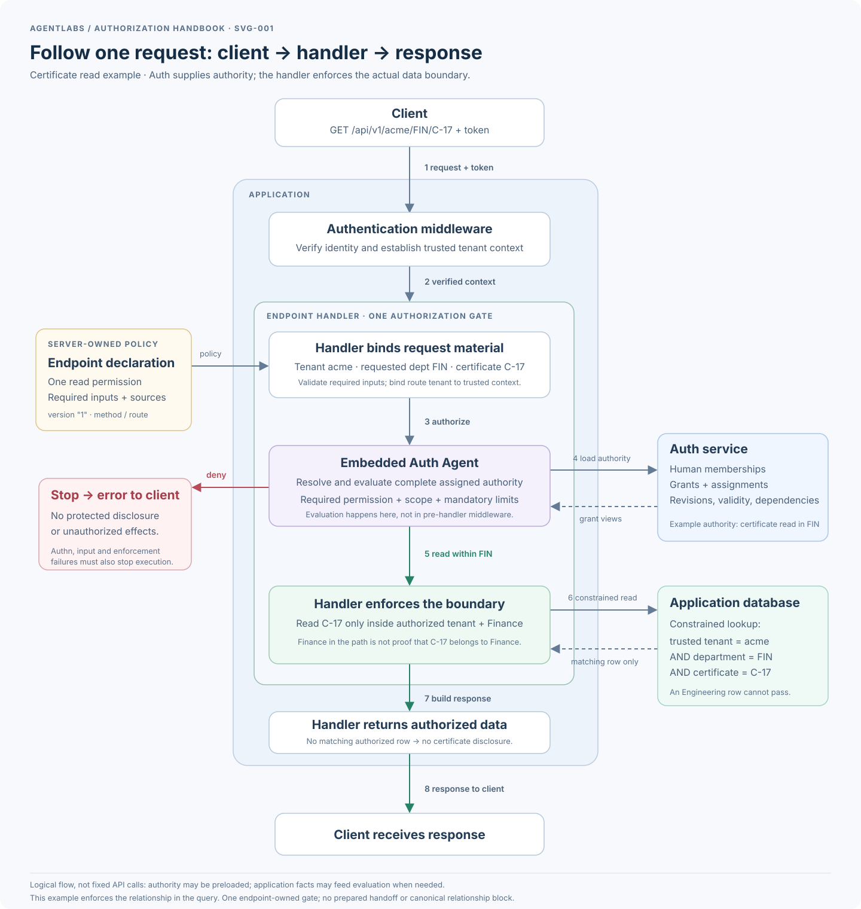

# Authorization system — canonical logical overview

The diagram depicts agreed responsibilities, not a finalized endpoint policy
JSON/YAML schema. That contract is Q-050, still open. Every published contract
must include a version under CONTRACT-009; version syntax is not yet selected.

Current declaration wording under CONTRACT-008 / Q-049: **the endpoint predeclares
one required permission, inputs, sources, and how to establish any required
relationship.** Auth mandates exactly one; invalid declarations cannot permit
execution. The diagram's singular required-permission label remains consistent.
The prior plural clarification below is preserved history, now narrowed by Q-049.

Q-047-A clarifies the endpoint-declaration block: **the endpoint predeclares
permissions, inputs, sources, and how to establish any required relationship.**
The existing diagram's permission/material-source label is shorthand for this
contract. The declaration stays fixed; the gate establishes the sufficient
trusted material needed by the relevant checks, not every possible fact.
See [the detailed request and scope examples](endpoint-authorization.md).
This clarification adds no decision location or deployment component.

TERM-005 / Q-043 aligns the current diagram and explanation with permission,
boundary checks, and request material. The [vocabulary chapter](authorization-vocabulary.md)
captures the rationale. The [previous diagram](assets/history/authorization-system-pre-q043.svg)
is preserved as deprecated history, not the current vocabulary.

This block diagram maps the agreed logical model: CHARTER-002, CONTRACT-006,
INPUT-001, ENFORCEMENT-002, and SCOPE-006/007/008. It does not introduce a new
authorization stage, deployment topology, network call count, or wire schema.
The explicit permission/material/source declaration is agreed as CONTRACT-007.

[Open the scalable SVG diagram](assets/authorization-system.svg).



## Text equivalent

```text
                            Endpoint declaration
                       Required permission + material sources
                                      |
                                      v
Request --> Authenticate --> Endpoint-owned authorization gate
            and establish             |
            trusted context           v
Auth authority -----------> Gather sufficient material <--- Application facts
                                      |
                                      v
                              Shared evaluator
                          Complete grant evaluation
                             /              \
                          allow          deny / failure
                            |                  |
                            v                  v
                     Enforce decision         Stop
                            |
                            v
                   Protected operation / response
```

The application-facts arrow feeds material gathering; it is not a direct route
to protected execution. Identity/tenant context and selected request inputs
also enter the gate. The declaration is server-owned configuration, not a
caller-controlled payload. Failures in authentication or required material
gathering likewise cannot reach protected execution, even when they occur before
the evaluator in the main-path diagram.

## Responsibilities

REGISTRATION-001 / Q-039 adds a grant-lifecycle responsibility: applications
register supported permissions and scope contracts; Auth validates grant
acceptance against them and canonical authority rules without interpreting
application-domain meaning. See [application registration](application-registration.md).
This is not another request-authorization stage. Earlier statements that all
registration remains open now apply only to the still-open format, governance,
compatibility declarations, and lifecycle mechanics.

### Two responsibility layers — ARCH-004 / Q-036, agreed

Layer 1 is the canonical authorization foundation: permissions, grants, roles,
authority dependencies, tenant and delegation limits, scope structure and
combination rules, and shared evaluation semantics. It defines rules that
applications must not reinterpret. Layer 2 supplies application-specific
operations, scope-key meanings for resources, trusted fact sources, additional
restrictions, and enforcement of the actual data operation. Together they
establish effective authorization; authentication establishes identity.

Layer 2 is not merely a filter after an independently complete Layer 1 allow.
Canonical scope evaluation may need Layer 2 meanings and facts before it can
decide. Layer 2 cannot manufacture authority absent from Layer 1 or override its
constraints. These layers preserve CONTRACT-006's single endpoint-owned gate,
not a middleware allow/prepared result followed by endpoint completion.

For example, an employee-group grant permits payslip read with scope
`{"user":"$self"}`. Layer 1 establishes grant applicability and anchors `$self`
to the authorizing human, Vinay. The application defines `user` for payslips as
their owning employee and supplies trusted ownership information for P-17,
including any employee-to-human identity mapping. Shared evaluation uses those
facts to determine whether P-17 falls inside the self boundary. The application
may additionally require that the payslip has been published. That illustrative
restriction is not a new meaning of `$self` or a mandatory platform-wide rule.

The user suggested that most Layer 1 material comes from the Auth service,
Layer 2 material comes from the application, and an application-embedded auth
agent works across both. This is a follow-up integration clarification: logical
responsibilities do not by themselves fix service placement, network calls, or
whether the shared evaluator is packaged as middleware, a library, or an SDK.
No new grant/request fields or application implementation are adopted here.

### Embedded auth agent — ARCH-005 / Q-037, agreed

Q-037 settles the integration clarification above. Auth primarily supplies
authority material such as grants, roles, memberships, and dependencies. The
application supplies operation declarations, domain meanings, trusted facts,
additional restrictions, and enforcement. The application-embedded auth agent
works across both using the shared canonical evaluation rules. Layer 1 is not
confined to the Auth service: its rules also govern the evaluator used inside
the application.

The reusable integration need not understand every application's database.
Application-provided bindings supply the necessary meanings and facts; their
exact interface remains open. For a payslip request, Auth supplies applicable
self-scoped read authority, the application establishes ownership, the shared
agent evaluates the complete requirements, and the endpoint enforces the result
before returning the payslip.

"Auth middleware" may describe this overall embedded integration. It must not
be interpreted as requiring a complete business-authorization decision in
pre-handler HTTP middleware, which may not yet have sufficient material.
CONTRACT-006's one endpoint-owned gate remains current, without an allow/prepared
handoff. Neither a new service deployment nor a fixed number of calls is implied.

### Components in the existing logical diagram

| Component | Responsibility |
|---|---|
| Endpoint declaration | Identify the required permission and relevant material/source bindings for this operation. Detailed binding schema is still open. |
| Authentication/context | Establish verified actor/human identity and trusted tenant context; do not issue a partial business-authorization result. |
| Endpoint-owned gate | Gather sufficient material and invoke the shared evaluator; do not perform protected output or mutation first. |
| Auth authority source | Supply applicable grants, roles, memberships, and delegation dependencies under the still-to-be-finalized freshness contract. |
| Application fact source | Establish resource attributes and domain relationships needed by the operation and scope, through bounded internal access. |
| Shared evaluator | Check recipient applicability, required permission, scope boundary membership, validity/conditions, and mandatory outer/dependency limits without mixing unrelated grant fields. |
| Enforcement/operation | Bind execution to the decision and its restrictions; keep check and actual use consistent. |

Auth authority may be loaded through shared infrastructure or valid caches; the
diagram does not require every handler to implement its own Auth integration or
perform a new network call. Scope has no independent network service implied by
this diagram: it owns boundary semantics, and the shared evaluation uses those
definitions. Definition storage/registration remains open.

## Declaration contract — CONTRACT-007, agreed

User approved the permission + material + source-binding requirement in Q-035.
This settles the conceptual requirement, not the declaration's JSON/API syntax.

Every protected endpoint has one authoritative declaration covering:

1. Its action/required permission, mapped from the server-owned method and route.
2. The authorization material that operation needs or may need for its supported
   scopes, with an explicit way to obtain that material.

Inputs are not just a bag of similarly named fields. The source gives each item
its provenance and role: requested identifier, proposed value, verified context,
Auth-owned authority, or trusted application fact. These are explanatory
categories, not newly adopted schema fields.

For GET /api/v1/tenant/{dept}/{cert}, an illustrative declaration's meaning is:

| Material | Where obtained |
|---|---|
| Required certificate-read permission | The method/route's server-owned action mapping. |
| Requested department | Path parameter dept. |
| Requested certificate | Path parameter cert. |
| Human/actor and tenant | Verified context, not arbitrary body fields. |
| Applicable authority | Shared Auth authority loading. |
| Actual certificate department, if needed | The application's bounded certificate fact lookup. |

For an operation with a body, only explicitly identified body inputs contribute
request material. Their meaning must distinguish proposed changes from facts
about existing data. A caller-submitted department does not prove the stored
certificate belongs to that department. Shared identity/authority infrastructure
need not be duplicated in every endpoint; the exact declaration/reference
mechanism is still open.

"Required material" does not mean eagerly load the union of every conceivable
fact. The endpoint contract must provide a defined source for what its supported
authorization needs, and the gate obtains enough to decide. It can deny for lack
of permission before fetching unnecessary resource metadata. Material collection
does not become an independent middleware authorization phase or a prepared
outcome.

## What this diagram does not finalize

- Declaration JSON, decorators, source-binding vocabulary, or resolver APIs.
- The scope-key governance branch or an automatic path-key-to-scope-key mapping.
- Freshness, caching, audit event schemas, or transaction mechanisms.
- Exact list/create/update/move/bulk request and result contracts.
- Any change to application implementation or the deprecated two-mode design.

The [discussion tree](discussion-tree.md) remains the handbook-progress mind
map. This diagram answers a different question: how the agreed system's logical
components cooperate. This source-binding sidebar returns to scope-key
definitions, then administrative bounds, then request/resolved-data contracts.
