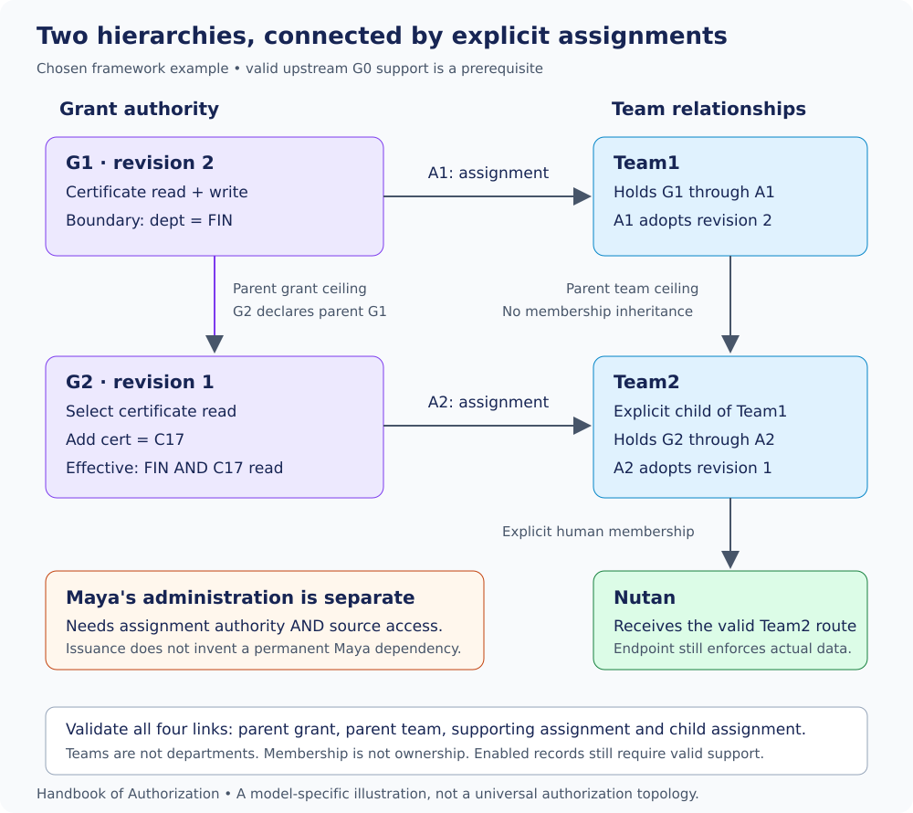

# 6. Registration, bootstrap and Auth administration

[Contents](../README.md) · [Previous](05-canonical-model.md) · [Next](07-application-integration.md)

**Framework-specific implementation guidance.** This chapter explains the agreed
logical responsibilities. It does not supply a deployed Auth engine, a complete
registration API or a new privileged bypass.

## Register meaning before accepting authority

An application registers its supported permissions and scope definitions with
Auth. Auth validates grants against those registrations and the canonical model.
The application continues to own the domain meaning and the facts needed to
enforce it. Registering `dept` does not teach Auth how to query an HRMS database,
and registering certificate-read does not grant that permission to a user.

Auth's own administrative permissions and scope definitions must also be
registered. Bootstrap is not a reason to accept unknown permissions or skip
validation. Definition management, initial authority and later business use are
different operations with different authorization questions.

An application explicitly declares whether permission/scope compatibility
validation is enabled. The feature is optional; its mode is not guessed for
individual grants. When enabled, every relevant grant must satisfy the declared
support relationships. Activating it requires the existing population to pass;
otherwise reject activation and report incompatibilities without silently
rewriting grants or grandfathering exceptions. Disabling this optional check
does not disable ordinary scope syntax, registration or authority validation.

## Platform management is not tenant business access

The existing application platform administrator publishes an application's
permission and scope definitions through its own bounded management authority.
This authority is outside the application's tenant business scope; it is not
unbounded administration of everything.

A publisher can introduce an HRMS payslip permission without holding a particular
tenant's payslip-read grant. Publication does not itself permit reading those
payslips. Auth platform administration, application platform administration,
tenant administration and business access must not be collapsed into one vague
administrator role.

## Shared catalog, separately bounded roots

The agreed model has one current application version/catalog for everyone.
There are no selective tenant release pins or catalog-adoption operations.
Each legitimate root computes its effective permission coverage from the
applicable registered catalog, while retaining its own tenant boundary and
lifecycle requirements.


If the shared catalog adds certificate-delete, otherwise valid roots reflect
that permission. A read-only child does not acquire delete: its explicit
permission selection remains read. Catalog growth does not widen scope, create
memberships, re-enable records or rewrite ordinary adopted revisions.

This is an intentional root behavior. It does not approve a stored `*`, a new
root-source field or automatic root revision/adoption churn. The exact root wire
representation is still pending. When a permission is effectively retired,
root coverage no longer supplies it; retained grant references cannot preserve
that retired permission. The full restoration and scope-evolution contracts
remain unresolved.

## Bootstrap establishes a beginning, not a permanent exception

Trusted setup creates or identifies a legitimate human, creates an administrators
group, explicitly assigns the intended root authority to that group, and
explicitly admits the human as a member. No special username is required.

The starting authority is the maximum intended authority within its established
boundary so subsequent ordinary administration can create teams and distribute
equal or narrower authority. Minimal setup means a minimal explicit arrangement,
not an artificially inadequate starting permission set.

The root is legitimate because trusted establishment occurred, not because its
JSON omits `parent_grant_id`. Ordinary bounded creation cannot manufacture root
authority by omitting a parent. After setup, the human uses normal assignments,
membership and lifecycle rules; there is no personal evaluator bypass.

Initial bootstrap authority is unavailable until the entire intended arrangement
is validated and durably established. Partial records may exist without supplying
partial access. A retry after completed setup reports the completed state without
restoring removed memberships or changing authority. An authorized incomplete
setup may continue only for the same revalidated intent, not silently substitute
a different administrator or merge conflicting attempts. Deliberate recovery
and exact trust/intent evidence remain pending.

## Two checks inside Auth's own endpoint gate

**Placement clarification — AUTH-ARCH-02:** the user names the Auth-service-side
authority-boundary validator **core Auth Validator / ABV**. API services host
the **Auth Middleware / evaluator**. Auth Service's own APIs use the same
API-side authorization and then ABV where the operation requires authority-change
validation. ABV is not deployed into every application API service by this model.
Shared canonical primitives do not merge these two responsibilities. See the
[implementation planning pin](../../implementation/plan/auth-middleware-implementation-plan.md).

Auth Service protects its administrative APIs with the same framework. The
endpoint declares one required administrative permission and its input bindings.
Its handler must establish both operation authority and the proposed authority's
boundary before the protected change takes effect.


| Responsibility | What it establishes |
|---|---|
| Administrative evaluator | The caller may perform the declared management operation within its administrative scope, including the relevant recipient boundary. |
| Authority-boundary validator | The proposed authority has valid permitted source support, preserves permission/scope limits and applicable team ceilings, and respects affected bindings. |

The first evaluator is not scope-blind: it evaluates administrative scope. The
second responsibility concerns the business or administrative authority being
distributed. Neither substitutes for the other. Shared resolution primitives
may serve both; two responsibilities do not mandate two deployed services.

## Worked assignment: Maya, Team1 and Team2

Continue Chapter 5's G1/A1 example. Team1 holds G1 revision 2, supplying FIN
certificate read/write under valid upstream support. Team2 is explicitly a child
of Team1. Maya is a valid Team1 member and separately has assignment-create
authority for Team2. Nutan is a member of Team2. None of these is an inferred
ownership relationship.

The administrative revision below is assumed validly assigned to Maya through
her administration group, with current support under G-AUTH-ROOT. It is an
approved-core-shape example, not a new owner bundle:

```json
{
  "version": "1",
  "grant_id": "G-ASSIGN-TEAM2",
  "revision": 1,
  "parent_grant_id": "G-AUTH-ROOT",
  "permissions": ["auth:assignment::create"],
  "scope": {"group": "Team2"}
}
```

The proposed child content and resulting assignment are:

```json
{
  "version": "1",
  "grant_id": "G2",
  "revision": 1,
  "parent_grant_id": "G1",
  "permissions": ["hrms:employee:certificate::read"],
  "scope": {"cert": "C17"}
}
```

```json
{
  "version": "1",
  "id": "A2",
  "grant_id": "G2",
  "grant_revision": 1,
  "recipient": {"type": "group", "id": "Team2"},
  "status": "enabled"
}
```

Assume the G2 control is enabled, revision 1 is latest for G2, both scope keys
are supported for this operation, and every required lifecycle condition holds.
The proposed assignment is not considered persisted merely because it is shown.



Auth reads Team2's real parent Team1, finds the current G1 assignment there and
uses A1's adopted revision 2. At most one current assignment may exist for a
tenant/grant/recipient combination, including disabled records. G1 held at an
unrelated TeamX does not replace the required Team1 holding.

Maya's source access and administrative authority are checked separately. Read
is a subset of G1's read/write; C17 adds narrowing to FIN. Nutan's resulting
route is therefore FIN AND C17 read, subject to all support and endpoint checks.
It is not write, all Finance, or C17 regardless of department.

Changing the submitted permission to delete fails the source-boundary check.
Changing the recipient to Team3 cannot pass the shown administrative route.
The distinctions explain the outcome without adding ownership powers.

## Validate the whole result and preserve it through the write

The validator needs current controls, selected content, actual supporting
assignments, relevant relationships, registration and affected reverse
dependencies. A grant definition found by ID is not proof of usable source
authority. Parent resolution is top-down through actual adopted support;
structural disable/removal work is bottom-up through affected bindings.

If a conflicting publication, membership change, withdrawal or binding change
invalidates the checked state before persistence, stop that attempt without a
partial assignment write. Do not silently choose a different revision or apply
stale approval. A fresh attempt must validate current authority. A transaction
or conditional-write mechanism can implement this guarantee; the handbook does
not choose a database product or new version-token field.

Membership administration is a separate authorized operation: `auth:group::write`
includes management of human members in its administrative scope. It distributes
the team's existing valid access; it does not authorize changing the team's
grants. This chapter does not add an unapproved business-permission-possession
check to membership writes or infer an ownership-transfer permission.

**Pending:** direct-human source eligibility, cross-recipient `$self` binding,
complete authority-change interfaces and root/registration evidence are tracked
in [the pending register](../appendices/pending.md). No new field or guessed
support route fills those gaps.

**Sources:** [registration](../../docs/application-registration.md),
[bootstrap](../../docs/bootstrap-authority.md), [root evolution](../../docs/root-permission-evolution.md),
[platform authority](../../docs/application-platform-authority.md),
[combined validator](../../docs/authority-boundary-validation.md),
[write consistency](../../docs/auth-write-consistency.md).

[Next: application integration](07-application-integration.md)
