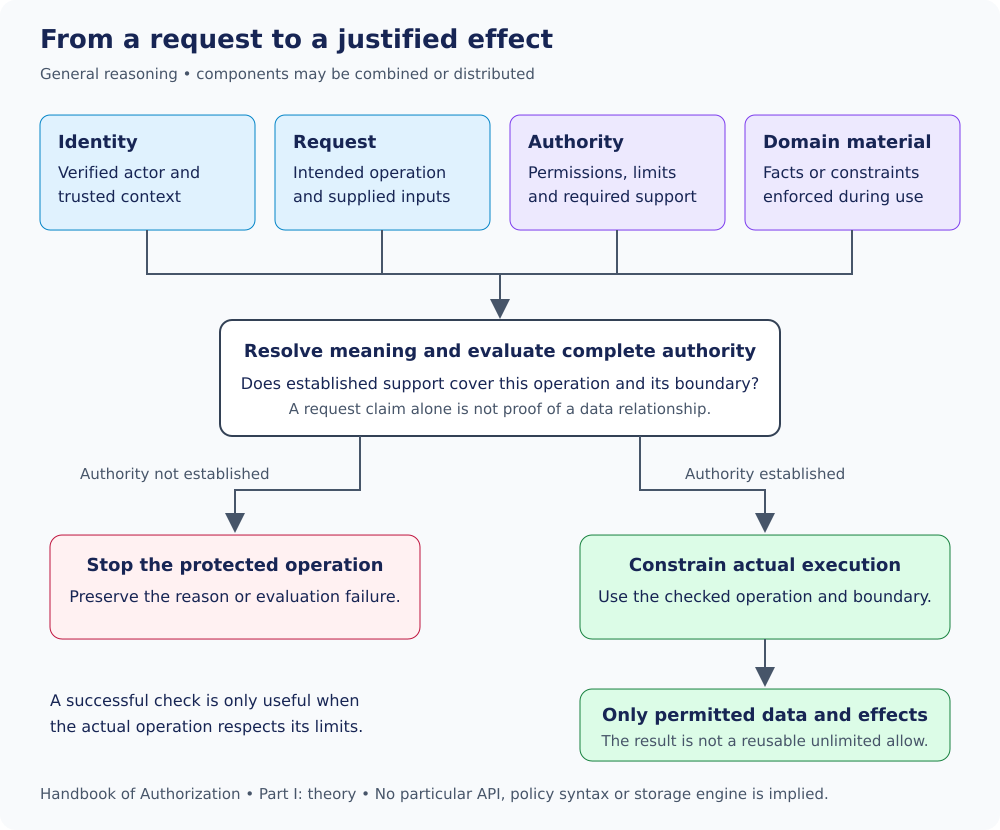

# 4. Resolution, decisions and enforcement

[Contents](../README.md) · [Previous](03-relationships-and-delegation.md) · [Next: the concrete model](../implementation/05-canonical-model.md)

**Definitions and JSON alongside this chapter:**
[endpoint policy](canonical-terms.md#endpoint-declaration),
[request/material/resolved request](canonical-terms.md#request-and-material),
[resolved grants and resolution](canonical-terms.md#resolution-and-evaluation),
[allow/deny/error](canonical-terms.md#decision-and-enforcement).
Unapproved request/resolved-view envelopes are not invented to illustrate their meanings.

## From request claims to a justified effect

An incoming request usually contains claims: a document identifier, department
name, intended update or requested tenant. Those values describe what the caller
wants. They do not automatically establish who the caller is, who owns a record,
or which authority is available.

Authorization needs material appropriate to the question being asked. Some
comes from verified identity, some from authority records, some from application
facts, and some from constraints that execution will enforce directly. The
important distinction is not simply whether a value came from a path or body;
it is what that value establishes and what remains to be proved.

This is a logical flow. It does not prescribe a central Auth service, a particular
middleware position, one network call per request or a database product.

## Request, resolved request and decision

A **request** identifies the intended operation and supplied inputs. A
**resolved request** is an evaluation-ready view in which the meanings and
required context have been established sufficiently for the checks being made.
Resolution does not mean that every imaginable application fact must be fetched.
It means that the evidence needed for the actual authorization question is
available or that execution is bound to enforce the necessary relationship.

Similarly, a **resolved grant** is an evaluation view of applicable authority,
including the restrictions and dependencies needed to interpret it. It is not a
new independent entitlement. Losing the support from which it was resolved can
matter according to the system's freshness and consistency rules.

A **decision** says whether the established authority permits the requested
operation. These three ideas should not be collapsed. Normalizing identifiers
does not itself produce an allow. Loading grants does not prove applicability.
Returning allow does not guarantee that later code obeys it.

## Two ways to establish a data boundary

Suppose a request asks for certificate C17 under Finance.

One approach is to load trustworthy information about C17, establish its actual
department, evaluate against that fact, and preserve the checked relationship
through use. Another approach is to evaluate the caller's authority within a
Finance boundary and constrain the actual lookup to both Finance and C17. In
the latter case, an Engineering certificate cannot be returned through that
lookup.

Both require the check and the effect to refer to the same intended data. A
route parameter saying Finance followed by an unrestricted C17 lookup is not
the second approach; it leaves the relationship unenforced. Fetching Finance
facts and then mutating a different row is not the first approach either.

This distinction lets application integrations stay practical. Authorization
need not require an eager extra database query when the operation itself can
enforce the boundary. But avoiding that query does not make enforcement optional.

## Completed rejection versus inability to evaluate

When sufficient evidence establishes that no complete applicable route permits
an operation, evaluation can complete with a rejection. When required evidence
cannot be obtained, the system has not established the same fact. An authority
service timeout is an example of an evaluation failure, not proof that the user
has no grant.

Both situations must prevent unchecked protected execution. They can still have
different diagnostic and operational meanings. A caller may be able to correct
an entitlement problem; a service failure may require operational recovery.
The exact result envelope, reason catalog and retry behavior are implementation
contracts. The [Foundations reference](canonical-terms.md#decision-and-enforcement)
explains the repository's minimal result JSON; Part II explains endpoint handling.

A failed candidate route also does not establish a final rejection if another
complete valid route authorizes the operation. Conversely, a successful partial
check cannot authorize an operation whose mandatory requirements remain unmet.

## Time belongs in the reasoning

Authority, membership and application data can change while a request is being
processed. A useful design names its relevant ordering points: when evidence was
established, when a decision was made, when a withdrawal became effective and
when the protected effect occurred.

“Use a cache” does not define the freshness guarantee. “Use a transaction” does
not identify which dependencies must be protected. Those mechanisms need a
stated semantic contract. A system may distinguish an operation already allowed
from a new check after withdrawal, and may require stronger consistency for
authority-changing writes than for an ordinary read.

Queued work presents the same issue over a longer interval. Permission to submit
work now is not automatically proof of authority to execute it later. Recurring
jobs and long-running streams need an explicit rule about which subsequent
effects remain covered; a single old allow is not self-explanatory evidence.

## Evidence should explain the route, not replace it

Useful decision evidence lets the recipient understand what was decided and,
where required, which authority contributed. Evidence may include grant
references or supporting context. It must not become an unrestricted reusable
capability accidentally detached from the evaluated request.

Providing evidence is also different from designing a complete audit system.
An audit consumer may record authorization outcomes, but retention, storage,
delivery and disclosure policy are separate responsibilities in this handbook.

**Chapter takeaway:** resolution prepares justified meaning; evaluation decides
applicability; enforcement constrains the actual effect. A sound integration
keeps the connection among all three visible.

[Continue to Part II: canonical records and identity](../implementation/05-canonical-model.md)
