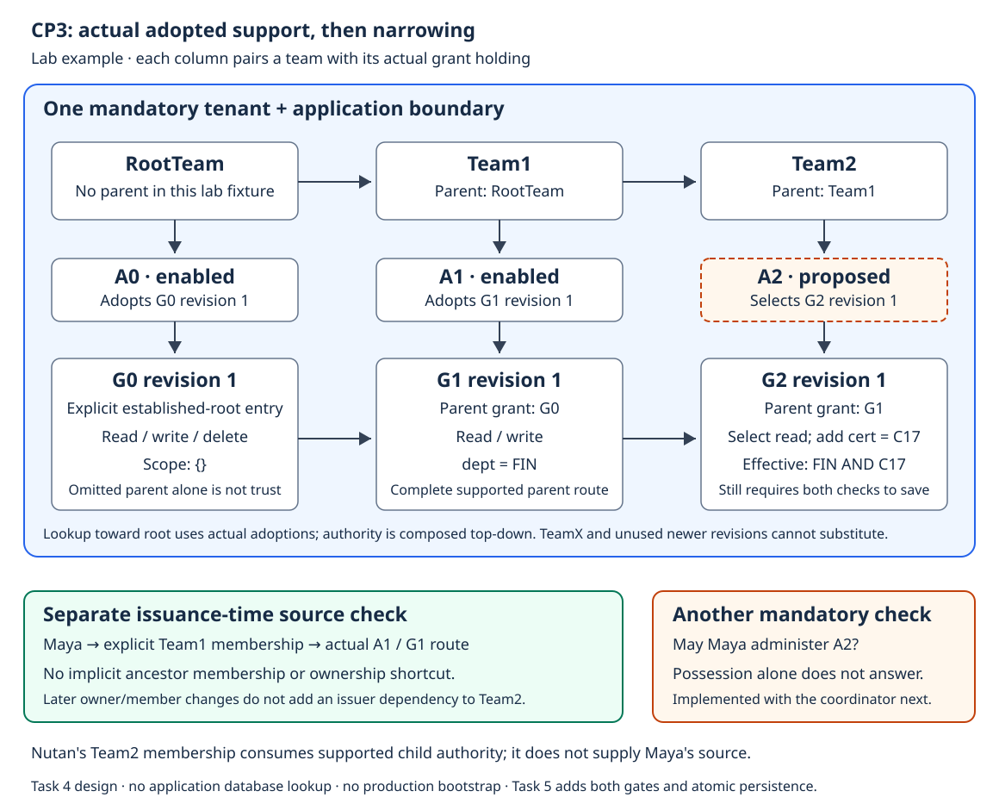

# Local ABV testing

**Task 6 implemented, verified and independently approved through `5815abf`.**
This page documents the working first-slice demo, not production Auth
administration or completion of all ABV checkpoints.

## What the example proves

Maya has source access through Team1 and a separately bounded lab premise for
assignment administration. Team1 holds G1: Finance read/write. Team2 is Team1's
child. G2 selects read and adds certificate C17. A2 assigns G2 to Team2; Nutan is
a member of Team2. Membership is not ownership or administrative permission.



The resulting boundary retains Finance AND C17. The example does not query HRMS
or prove C17 belongs to Finance; application enforcement remains responsible for
the actual data. [Protected assignment creation](assignment-creation.md) explains
why both gates and transaction ordering are required.

## Build and run

Run from `implementation/abv/`. Choose a new disposable path for each scenario;
seed refuses existing files rather than resetting them.

```sh
go build -o ./bin/abv ./cmd/abv
```

The following example uses `/tmp/abv-fin-c17-demo.db`. If that path already
exists, choose another path in every command; do not delete a database to make
the seed command succeed.

```sh
./bin/abv scenario seed team-fin-c17 --db /tmp/abv-fin-c17-demo.db --tenant acme --app hrms
./bin/abv inspect grant G1 --db /tmp/abv-fin-c17-demo.db --tenant acme --app hrms
./bin/abv inspect assignment A1 --db /tmp/abv-fin-c17-demo.db --tenant acme --app hrms
./bin/abv check assignment --file testdata/a2.json --db /tmp/abv-fin-c17-demo.db --tenant acme --app hrms
./bin/abv assign --file testdata/a2.json --fixture-context maya-team1 --db /tmp/abv-fin-c17-demo.db --tenant acme --app hrms
./bin/abv inspect assignment A2 --db /tmp/abv-fin-c17-demo.db --tenant acme --app hrms
./bin/abv grant disable G2 --fixture-context maya-team1 --db /tmp/abv-fin-c17-demo.db --tenant acme --app hrms
./bin/abv inspect grant-control G2 --db /tmp/abv-fin-c17-demo.db --tenant acme --app hrms
./bin/abv grant enable G2 --fixture-context maya-team1 --db /tmp/abv-fin-c17-demo.db --tenant acme --app hrms
```

Each invocation opens the selected database independently. The final inspection
therefore checks persistence across process restarts, not an in-memory result.
Grant/assignment/control inspection prints approved core JSON. `inspect grant`
still means immutable grant content; `inspect grant-control` reads its separate
enable/disable record. Permission, scope, role,
team and membership inspection uses labeled internal tables; those are not new
canonical JSON contracts. Tenant/application is explicit command context, not
an added inner grant scope.

`check assignment` is read-only boundary diagnosis. It neither establishes
administrative authority nor issues a save ticket. `assign` rereads current
evidence and runs both gates under the protected write transaction. Repeating
the same assignment is not an implicit upsert; disabled bindings count for
duplicate detection too.

## Negative example

```sh
./bin/abv scenario run team-fin-c17 --case unsupported-permission --db /tmp/abv-fin-c17-negative.db --tenant acme --app hrms
```

This case requests the registered delete permission outside Team1's actual
read/write ceiling. The expected result is a rejection with A2 absent. A scenario
command may complete successfully because it observed that expected rejection;
this does not mean the assignment succeeded.

## Lab identity is not authentication

Only the known `maya-team1` fixture context is supported. Grant status is further
limited to G2 and Maya's current direct membership in `AssignmentAdmins`; this
separate lab capability does not follow from assignment administration. A distinct internal
scenario marker binds the lab database to its scenario and tenant/application.
The generic ABV database marker alone is insufficient. Ordinary opening never
creates or repairs the lab marker, and a failed seed is not usable as a successful
lab setup. Existing files are retained on error, not deleted or overwritten.

The marker guards accidental use of an ordinary ABV database. It is not protection
against a hostile database owner, authenticated identity, or a real Auth grant.
The lab administrative premise is bounded to Maya, Team2 and the exact operation;
ABV separately checks her current source membership and complete grant lineage.
Do not deploy this composition as a production administration interface.

CLI parsing is reusable through the application adapter. The reusable library
does not import CLI or lab code. Real authenticated administration remains CP5;
PostgreSQL remains CP6. Neither requires moving SQL into the CLI or interpreting
application business facts inside ABV.

## Verification record

The compiled binary completed seed, inspect, check, assignment and independent
reopen inspection against a new SQLite file. The final stored record was:

```json
{"version":"1","id":"A2","grant_id":"G2","grant_revision":1,"recipient":{"type":"group","id":"Team2"},"status":"enabled"}
```

The negative scenario reported `observed expected rejection; assignment was not
created`. A new inspection process then returned exit 3 with A2 absent. These
checks ran independently of the implementer's automated binary tests.

Full Go tests, race checks, vet and build pass on `5815abf`. Tests additionally
cover unmarked databases, wrong marker format/context, unknown fixture identity,
both isolation dimensions, existing seed paths, malformed JSON, missing files,
input bounds, output failures and once-only connection cleanup. Subsequent
Task 7 source-case acceptance and bounded-graph benchmarks are independently
approved at `5b81b84`; see [acceptance evidence](acceptance.md) for measurements
and remaining limits, which are not implied by the demo alone.

## Exit status and output

| Code | Meaning |
|---|---|
| 0 | Command completed; a scenario may have observed its expected rejection. |
| 2 | Malformed command or input. |
| 3 | Rejected operation or requested record not found. |
| 4 | Unavailable, conflict, cancellation or I/O failure. |
| 5 | Unsupported prototype operation or context. |

These are CLI statuses, not a new public authorization error schema. Core JSON
output stays on stdout; warnings and errors stay on stderr. Output failure must
not be reported as success, and a prior receipt must never authorize another write.
