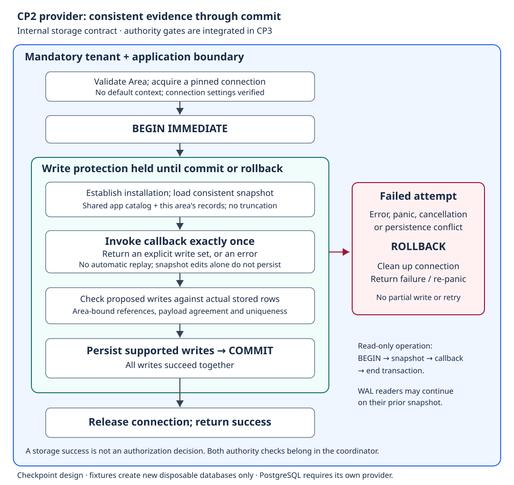

# CP2 — SQLite provider

**CP4-B update (Task 4/final independent review pending):** the existing
conditional assignment-status write is now reached by the protected facade and
lab CLI. It updates one exact assignment after both gates and commit, preserves
all other fields and records, and never cascades dependent status writes. The
provider schema, fixture counts, snapshot limit and 256-step lineage bound are
unchanged.

**CP4-A Task 1 extension — `f4a781c`, independently approved:** the internal
write set now also supports one conditional existing grant-control status update,
separate from assignment creation. Exact stored `Before` must match; only the
status and its canonical JSON are updated inside the existing area-bound
transaction. Mixed assignment/control writes fail before effects. No migration,
revision adoption or authority-content rewrite. This is persistence plumbing,
not a public authorized enable/disable operation; that requires the next two-gate
coordinator task. The CP2-only coverage statements below describe the earlier
checkpoint and are preserved as history.

The new provider-neutral cases cover success/failure after reopen, both isolation
dimensions, stale/missing/malformed controls, mixed writes, cancellation and
competing writers with zero callbacks. Focused tests, provider race tests and
the full Go suite pass; coordinator verification also passed full tests and vet.
Rationale: reuse the established transaction and record instead of introducing
a second storage path or a new lifecycle schema.

**Complete and independently approved at `8ac7593` on 8 September 2026.**
This checkpoint adds persistence, not production Auth integration. The source
requirements are [Task 3](../../plan/abv-implementation-plan.md) and the
[provider design](../../plan/abv-design.md).

## Responsibility boundary

The provider stores and retrieves authority records within a mandatory tenant
and application context. It supplies one consistent snapshot and commits one
explicit write set. It does not decide whether Maya may administer assignments
or whether a proposed grant fits a valid parent route: CP3's coordinator will
run the authorization evaluator and ABV before producing a write set.

No CLI command calls raw storage. The provider port is internal to the Go module;
there is no SQL object in its interface and no public `authorized: true` flag.
CP2's storage tests are not evidence that the two authorization gates exist yet.

## Required transaction flow



For a write, acquire a connection and transaction protection before reading
authority evidence. Establish the tenant/application installation, then load
its application-owned catalog and area-owned records. Invoke the callback once.
Only its explicit supported write set may persist; changing the returned
snapshot's maps does not itself change the database.

A successful return follows commit. Failure before commit must leave no partial
write; rollback and connection cleanup also apply to callback panics and cancelled
contexts. A lock conflict is a distinguishable failure, not a callback retry or
evidence that the parent is absent. An external caller cannot save an earlier
validation result as a reusable authorization ticket.

SQLite's write transactions serialize writers; starting with `BEGIN IMMEDIATE`
obtains that protection before validation reads. WAL permits concurrent readers
to continue with their prior snapshot. These behaviors are the basis of the
provider tests, not assumptions that every database shares the same SQL.
[SQLite isolation documentation](https://www.sqlite.org/isolation.html).

Foreign-key enforcement is connection-specific, so provider connections must
enable and verify it. [SQLite foreign-key documentation](https://www.sqlite.org/foreignkeys.html).
Neither database locks nor foreign keys establish current-time grant validity;
the later protected coordinator (now implemented) performs that authorization check.

## Isolation and data ownership

The current migration separates these record families:

| Ownership | Tables |
|---|---|
| Provider metadata, not authority | `abv_metadata` |
| Shared application definitions | `applications`, `permissions`, `scope_definitions`, `supported_scope_keys` |
| Tenant/application installation and authority | `installations`, `roles`, `grant_controls`, `grant_contents`, `assignments`, `teams`, `memberships`, `trusted_roots` |

The provider's ordinary write set currently supports only new assignments.
Other families are supplied by controlled test setup until their authorized
mutation operations are implemented. `Open` and `Close` manage storage resources;
all record reads and writes require the explicit area.

Application catalog definitions are shared by that application. Tenant-specific
authority records and relationships carry composite tenant/application keys.
The installation check precedes catalog access; there is no global grant-ID
search to infer missing context and no independently editable per-tenant catalog.

Persist grant control separately from immutable content and assignments. The
same grant/recipient binding cannot be duplicated merely because its existing
assignment is disabled. Indexed columns and their canonical JSON payload must
agree. Corrupt stored evidence is an evaluation/storage error, not a valid empty
authority set.

Do not use cascading deletion to erase dependent authority. References whose
absence represents canonical orphanhood must remain representable; foreign keys
must not make an orphan impossible to preserve. Physical deletion/lifecycle
policy remains later work.

## Controlled fixtures

Test setup may create coherent typed fixtures in a **new disposable database**.
It must refuse an existing path, conflicting shared catalogs or an unrelated
database. Ordinary provider operations cannot call a seed-into-live-database
method. The fixture's explicit established-root evidence is not inferred from
a missing parent field and is not a production bootstrap trust procedure.

The provider may use internal JSON for non-canonical projections such as team
and catalog records. That is a storage encoding, not publication of a new
canonical authorization API. Approved grant/control/assignment representations
keep their version and adopted revision fields.

## Acceptance checklist

| Required evidence | Status |
|---|---|
| Full-value persistence and reopen for all planned record families | Pass: provider conformance round trip |
| Same IDs in different tenants and different applications remain isolated | Pass: isolated read/write cases |
| Unknown installation and zero context never invoke callbacks | Pass: zero callback assertions |
| Shared application catalog, not independent tenant copies | Pass: shared reads and conflicting fixture rejection |
| Duplicate grant/recipient rejection includes disabled bindings | Pass: across both status and revision |
| Two-row failure rolls back both rows, including after reopen | Pass: duplicate batch and second-insert rejecting trigger |
| Callback snapshot mutation cannot bypass persistence checks | Pass: inert edits and actual-row reference checks |
| Callback error, panic and cancellation release the transaction | Pass: rollback and subsequent usable connection |
| Two independent providers: write ordering/conflict and consistent reads | Pass: concurrent commit between catalog and assignment reads; no callback replay |
| WAL and foreign keys verified on provider connections | Pass: four acquired connections and actual FK rejection |
| Corrupt evidence is an error, never a partial successful snapshot | Pass: payload/index disagreement, malformed catalog flag/token list, zero callbacks |
| Configured snapshot bound errors rather than truncating proof | Pass: aggregate limit, no callback |
| Provider-neutral conformance separate from SQLite-specific tests | Pass: SQL-free conformance factory |
| Full tests, race detector, vet and build | Pass |
| Independent review | Pass: all findings resolved; final spec/quality/merge approval at `8ac7593` |

Initial verification at implementation commit `e43be35`, repeated successfully
after review fixes through `8ac7593`:

```text
go test ./internal/storage/... -v -count=1  PASS
go test ./... -count=1                     PASS
go test -race ./... -count=1               PASS
go vet ./...                               PASS
go build ./...                             PASS
go mod verify                              PASS
git diff --cached --check                  PASS
```

The [provider-neutral suite](../internal/storage/contracttest/suite.go) is run
by the [SQLite tests](../internal/storage/sqlite/provider_test.go). These tests
exercise storage semantics, not grant authorization. The default aggregate
snapshot limit is 10,000 loaded records; `OpenWithOptions` can configure it.
Exceeding it returns `ErrSnapshotLimit` (an unavailable error), never a partial
snapshot. Unknown preexisting files return `ErrNotABVDatabase` (unsupported);
operation cancellation preserves the standard Go context error for `errors.Is`.
These are internal provider errors and prototype limits, not new public contracts.

## Review findings and rationale

The initial review of `e43be35` found four issues requiring fixes:

- A cancelled transaction-start call can have started the SQL transaction even
  when the driver reports failure. Cleanup must cover that uncertain outcome,
  not only failures after a confirmed start; otherwise the connection may retain
  a transaction when returned to the pool.
- Checking database ownership must distinguish missing/unsupported metadata
  from a timeout, lock conflict or I/O failure. Operational failure is not
  evidence that a database is unsupported.
- Malformed catalog flags and token lists must fail before the callback. A
  corrupted flag must never silently disable permission/scope compatibility.
- A stable materialized callback value does not prove that several SQL reads
  used one snapshot. A concurrent commit must be coordinated between evidence
  queries to exercise that guarantee directly.

These are implementation corrections to already-required guarantees. They do
not change canonical grant, scope, assignment or authorization semantics.

The fix wave registers cleanup before attempting `BEGIN`, uses the same protected
transaction runner for migration, preserves marker-query operational failures,
validates catalog flags/token lists on load and fixture ingress, and adds a
deterministic cross-query read test. Focused regressions and the full/race/vet/build
checks pass. A subsequent scoped review found a double-classification regression
in migration: an already-classified conflict became unavailable at `Open`.
Commit `8ac7593` preserves existing typed categories and joined errors; its
regression holds a real SQLite writer lock through the migration opening path.
Independent re-review approved all fixes, with no findings remaining.
Provider-specific test coverage after the final correction is 72.6%; this is
not a completion or security score.

Delivery commits: `e43be35` (provider and conformance), `badb2fd` (four review
corrections), `8ac7593` (migration error classification). The transaction SVG was
rendered and visually checked; its XML and this document's local links validate.

Engineering choices retained: the existing isolated worktree was reused on a
new checkpoint branch to preserve prior evidence; no user files were removed.
Fixtures remain restricted to new disposable database paths to avoid a live-data
seed bypass. PostgreSQL will need its own fixture adapter and conformance run.

At this historical CP2 checkpoint, PostgreSQL, actual lineage resolution,
lifecycle mutation and working CLI commands were not yet claimed. Real
Auth-service integration is outside the ABV build's scope.
