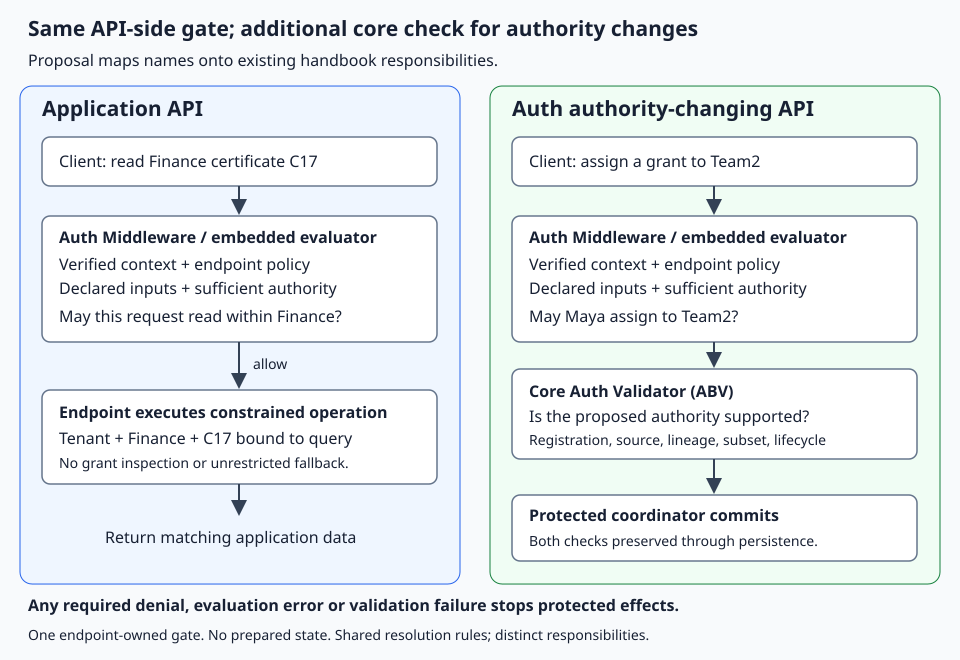

# Auth middleware local checkpoint

From `implementation/abv`, create the existing lab database (the command refuses
an existing path):

```sh
go run ./cmd/abv scenario seed team-fin-c17 --db /tmp/authority.db --tenant acme --app hrms
```

Evaluate Maya's existing A1 authority for FIN:

```sh
go run ./cmd/auth-evaluate --db /tmp/authority.db --tenant acme --application hrms --human maya --permission hrms:payroll:payslip::read --boundary dept=FIN
```

The same command with `--boundary dept=ENG` prints canonical deny JSON. The
program's exit codes are: allow 0, malformed flags 2, deny 3, read/evaluation/output
errors 4. `go run` reports nonzero program codes as `exit status N`; build the
command to observe those exit codes directly:

```sh
go build -o /tmp/auth-evaluate ./cmd/auth-evaluate
```
Use repeatable `--boundary key=value` for exact selections and `--all key` for
all-values selections.

These flags are trusted **test context**, not authentication or HTTP permission
selection. The adapter supports literal SQLite scope values only, reads a bounded
full snapshot, and has no JWT verification or production freshness mechanism.
The reusable HTTP wrapper and bounded application demonstration are also
available. They remain local proof, not an Auth-service integration.

To exercise Nutan's narrower Team2 grant through the existing protected lab flow:

```sh
go run ./cmd/abv assign --db /tmp/authority.db --tenant acme --app hrms --fixture-context maya-team1 --file testdata/a2.json
/tmp/auth-evaluate --db /tmp/authority.db --tenant acme --application hrms --human nutan --permission hrms:payroll:payslip::read --boundary dept=FIN --boundary cert=C17
```

Expected allow: `{"version":"1","decision":"allow","grant_ids":["G0","G1","G2"]}`.
Changing FIN to ENG or C17 to C18 denies. `--all dept` also denies this route.
Grant/assignment changes are observed on the next read; no allow cache is used.
These decisions do not prove certificate ownership: the HTTP demo below shows
the required endpoint/handler enforcement. Runtime `$self` is tested using resolved fixtures;
the current SQLite lineage adapter explicitly rejects it rather than guessing.

## In-process HTTP application demo

Using the same seeded database, run the HTTP walkthrough without opening a
network listener:

```sh
go run ./cmd/auth-http-demo --db /tmp/authority.db --tenant acme --application hrms --human maya
```

Maya's expected highlights are `GET /api/v1/acme/FIN/C17` → 200,
`GET /api/v1/acme/FIN/C18` → 404, and `GET /api/v1/acme/certificates` → 403.
The PUT policy selects `department_id` as authorization input; the application
also validates `title` as a business field from the same parsed JSON body. It
updates FIN/C17 in the in-memory application store and returns the revised
title through the FIN collection. A FIN body claim cannot move or rename ENG/C18.



The diagram is architectural context. This demo does not deliver production
identity/freshness transport, JWT verification, proxy support, direct-user
integration, or Auth-storage writes. Literal scopes and between-request control
changes are proven with SQLite; `$self` and timeout behavior use complete trusted
fixtures because the SQLite adapter intentionally supports literal scopes only.
HTTP statuses are local-example conventions.
