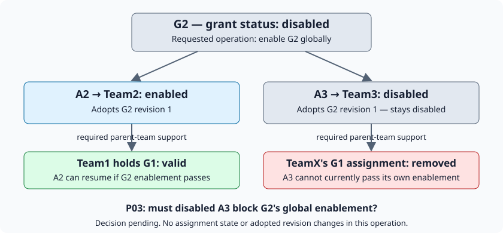

# CP4-A — grant enable/disable design

Status: CP4-P01 scope approved; CP4-P02 approach recorded. CP4-P03 below needs
a user decision before the enablement algorithm or an executable task plan is
finalized. This document is not approval of a new canonical rule or runtime code.

## 1. Approved scope and rationale

Implement only grant-wide enable and disable, reusing the existing in-process
facade, administrative adapter, ABV checks and transactional provider. The
tenant/application pair remains mandatory outer context. Assignment controls,
revision adoption, content and parentage remain unchanged by these operations.

Disabling G2 makes dependent authority ineffective without writing disabled
flags to descendants. Validly enabling G2 can restore still-enabled descendants
when their remaining requirements hold; explicitly disabled records stay
disabled. A shared grant cannot be enabled only for recipients whose required
checks happened to succeed. No automatic upgrades, parent replacement or repair.

This is the first CP4 slice, not the entire lifecycle checkpoint. Assignment
enable/disable, deletion, reparenting, publication and explicit upgrades remain
separate required slices. Real Auth integration remains CP5; the lab adapter is
still an explicitly bounded testing premise, not authentication.

## 2. Existing implementation to reuse

| Component | Current evidence | Planned extension |
|---|---|---|
| Facade | `implementation/abv/abv.go` composes protected operations and rejects absent/mismatched Area. | Expose grant-control operations without raw provider access. |
| Administrative gate | `internal/mutation/service.go` and `internal/lab/administration.go` separate administration from source authority. | A distinct operation-specific check; assignment-create permission must not imply grant-control permission. |
| ABV | `internal/mutation/assignment.go`, `internal/lineage/resolve.go` validate actual adopted support and preserve AND constraints. | Validate the proposed status transition and its required binding set. Do not reuse latest-only assignment creation as re-enablement. |
| Provider | `internal/storage/provider.go` supports snapshots and assignment-only write sets. | Add a narrow grant-control update, not generic CRUD. |
| SQLite | `internal/storage/sqlite/update.go` takes `BEGIN IMMEDIATE` before reading evidence and commits after callback validation. | Update the existing control's status and canonical JSON consistently in that transaction. No new schema is needed just to change stored status. |
| CLI | `application/api.go`, `cli/run.go` and the lab connector preserve parsed Area/database binding. | Add commands through the same adapter; never write SQL from CLI. |

Existing public adapters must not silently acquire grant-control authority.
The exact extension method signatures and compatibility treatment belong in
the executable plan after the binding-set decision; no new wire fields are
introduced by this design note.

## 3. Intended transaction sequence

1. Validate explicit Area, trusted identity, exact grant ID and requested status.
2. Acquire the existing provider mutation transaction and read complete evidence.
3. Run operation-specific administration against an isolated evidence copy.
4. Independently validate the transition with ABV. For enablement, evaluate the
   proposed enabled state without mutating stored evidence or losing the original
   state. Preserve each assignment's adopted revision, not the newest publication.
5. Reject incomplete evidence, failed required checks or a snapshot/traversal
   limit. Do not partially enable recipients or continue with a partial graph.
6. Recheck cancellation and applicable time eligibility before the write set.
7. Persist only the grant-control change; return success only after commit.

The enablement validation set in step 4 is the unresolved item below. There is
no implementation authorization to choose its semantics by convenience.

## 4. CP4-P03 — does a disabled broken assignment block global enablement?



The records below use approved core formats. Tenant `acme` and application
`hrms` are implied outer context here, not scope fields.

G2 has immutable revision 1, derived from G1. Its current grant-wide control:

```json
{"version":"1","id":"G2","status":"disabled"}
```

Two assignments retain that same revision:

```json
{"version":"1","id":"A2","grant_id":"G2","grant_revision":1,"recipient":{"type":"group","id":"Team2"},"status":"enabled"}
```

```json
{"version":"1","id":"A3","grant_id":"G2","grant_revision":1,"recipient":{"type":"group","id":"Team3"},"status":"disabled"}
```

- Team2 is under Team1. Team1 has valid assigned G1 support; A2's required route
  would be valid if G2 were enabled.
- Team3 is under TeamX. TeamX's required G1 assignment has been removed after
  the applicable structural safeguards. A3 remains stored and explicitly disabled.
- An otherwise authorized administrator requests global enablement of G2.

**Question:** must A3's missing parent support keep G2 disabled globally, even
though A3 is explicitly disabled and the operation will not enable A3?

**Recommendation, not yet approved:** retain A3 in the inspected dependency
inventory but do not require its inactive route to become eligible merely to
enable G2. Validate every route required for this operation; A2 may resume only
if all those checks pass. A3 stays disabled, and a later explicit enable of A3
must fail until its actual parent support is valid. Do not treat an enabled
assignment with broken support as equivalent to an explicitly disabled one.

**Alternative:** every retained assignment, including A3, must pass current
support validation before G2 can be enabled. This keeps the global enable check
stricter, but makes a deliberately disabled route block otherwise valid use of
the shared grant. Neither option permits partial changes to G2's global status.

### Why a decision is required

[Binding lifecycle, section 3](../../docs/parent-grant-bindings.md#3-assignment-enablement-and-effective-authority--q-101abc)
defines separate grant/assignment controls and grant-wide failure when required
enable checks fail. Its shared-grant example does not specify that the broken
assignment is explicitly disabled. [Section 5](../../docs/parent-grant-bindings.md#5-structural-changes-bottom-up-then-validate-the-new-reality)
permits retained disabled bindings during structural changes and requires later
explicit revalidation of those bindings. The [operation matrix](../../docs/authority-boundary-validation.md#6-operation-coverage)
says to check required affected bindings, without enumerating whether inactive
bindings belong to the enablement eligibility set.

The recommendation follows the separation between assignment state and grant
state, but adopting that selection rule is an interpretation—not an already
recorded answer. Requiring every inactive route to be healthy is also a policy
choice, not automatically implied by fail-closed behavior. No code should choose
either silently.

### Core-philosophy check

- Tenant/application isolation: unchanged; no support from another Area.
- Non-expansion: permissions, scope and adopted revisions are not edited.
- Explicit controls: A3 stays disabled; no automatic enablement or repair.
- Parent lineage: later activation of A3 still requires its actual valid support.
- Two gates: administrative authority alone cannot bypass enablement validation.
- Global status: G2 changes once or not at all; there is no per-recipient grant status.
- Canonical restraint: this is a proposed validation-set rule, not a new field,
  new status, permission name or grant format.

## 5. Acceptance requirements already fixed by approved rules

| Case | Required result |
|---|---|
| Disable G2 while G3 remains enabled | G3's dependent authority is ineffective; no descendant status rewrite. |
| Restore G2 with valid required support | Otherwise eligible, still-enabled descendants may resume. |
| Descendant grant or assignment explicitly disabled | Remains explicitly disabled after G2 restoration. |
| Shared grant has a failing required enable check | Whole enable fails; G2 remains disabled for all recipients. |
| Required support missing, expired, outside Area or unsupported | No successful enable from incomplete or invalid proof. |
| Revision 2 published while an assignment adopts revision 1 | Enabling does not change that adoption. |
| Administration missing | No control write, even if business source authority exists. |
| Concurrent change or cancellation | Existing transaction ordering, rollback and no-success-on-failure guarantees hold. |
| Snapshot or traversal bound exceeded | Explicit failure; no partial validation or write. |
| CP4-P03's disabled broken assignment | Expected outcome must follow the user's decision, not a guessed test assertion. |

## 6. Bounded continuation

The current work stops at this concrete decision; no coding, speculative fallback
or repeated research loop is needed. After CP4-P03 is decided, finalize exact
operation payloads and affected-binding traversal in `implementation/plan/`, then
execute small tested tasks with Sol-medium coding agents. Each dispatch needs a
scope, exit criterion and time/retry budget. Preserve existing reviewed tests,
history and source decisions. CP1–CP3 remain complete.
