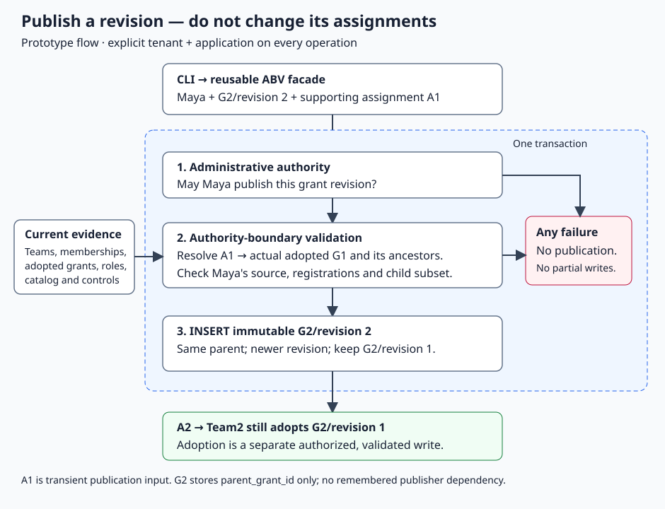

# CP4-C Grant Revision Publication Implementation Plan

> **For agentic workers:** REQUIRED SUB-SKILL: Use superpowers:subagent-driven-development. User override: no review passes; retain test-first verification.

**Goal:** Publish a newer immutable revision of an existing non-root grant through ABV/SQLite/CLI, without adoption.

**Architecture:** Resolve an existing parent-team assignment as temporary publication
evidence, independently establish the publisher's source membership and administrative
authority, validate complete candidate content, then insert atomically. The grant
still stores only parent_grant_id; publication source input is not persisted.

**Tech Stack:** Go 1.25-compatible, existing SQLite/schema/CLI; no dependencies.

**Spec:** [Q-102–106](../../docs/grant-revisions.md), [Q-107](../../docs/grant-revision-format.md),
[C01 support/containment](../../docs/authority-boundary-validation.md), and
[Q-093](../../docs/assignment-authority.md). This plan fixes internal prototype
operation boundaries, not a new canonical request envelope or grant field.

## Global Constraints

- Mandatory tenant/application Area; no default context or cross-area lookup.
- Existing non-root grant only. No new grant controls, root operations, parent changes or adoption.
- Complete version1 GrantContent input; exact direct permissions or pinned role variant.
- New revision must be greater than the maximum stored revision; no overwrite or automatic number allocation.
- Source assignment ID is transient request material: locate actual held parent route,
  validate it, never store a parent_assignment_id, recipient or remembered issuer dependency.
- Administrative permission and source-boundary checks are separate and both required.
- Existing source route uses actual adopted parent revisions, never newest published alternatives.
- Child permission selection must fit source; scope/validity restrictions compose by AND.
- Reject unsupported direct-human/proxy/$self binding paths; do not infer safe cross-recipient binding.
- Parent control/assignment/current validity must support publication. Publishing does
  not activate the candidate: candidate future/expired validity and disabled own
  control remain stored as supplied/current; no implicit enablement or time reset.
- No new policy rejecting contradictory scope: retain AND predicates, no overwrite.
- No Auth integration, PostgreSQL, deletion, reparenting, adoption or unrelated lifecycle work.
- No review dispatches; Sol-medium coding, apply_patch, exact-file commits; controller pushes.
- Per-task caps: Task1 15min, Task2 15min, Task3 15min; at most one8min correction
  per task, then report/reassess. Whole-slice reassessment50min from first dispatch.

## Flow / acceptance ownership



```text
grant publish: existing G2 + revision2 + source assignment A1
  -> administrative publication gate for G2 and selected source context
  -> A1 actually holds parent G1 in this Area
  -> resolve A1 and ancestors; verify publisher's current source membership
  -> validate complete G2/2 selection within resolved G1 scope/permissions
  -> INSERT immutable G2/2 in same transaction

A2 keeps G2/1. No assignment/control/parent is changed.
Future adoption must validate A2's actual parent-team context again;
the publication source is not an adoption authorization or permanent dependency.
```

### Task 1: Existing-route resolver and immutable content insertion

**Files:** modify `implementation/abv/internal/lineage/source.go`, create
`internal/lineage/assignment_route_test.go`; modify `internal/storage/provider.go`,
`internal/storage/sqlite/update.go`; create `internal/storage/sqlite/grant_revision.go`
and `grant_revision_test.go`, all under implementation/abv. Read resolve.go,
source.go, role persistence, codec/content.go and snapshot.go before coding.

**Interfaces produced:**

```go
func ResolveTeamAssignment(storage.Snapshot, string, time.Time) (domain.Route, error)
// Added single optional category on storage.WriteSet:
NewGrantRevision *domain.GrantContent
```

- [x] **1. RED:** expose existing route resolution through assignment ID (A1
  resolves G1 read/write FIN). Test unique actual team holding, Area mismatch,
  invalid/missing ID, malformed projection, disabled assignment/control, expiry,
  cycles, root trust, unsupported user recipient and input immutability.
  Provider tests insert G2/2, reopen, retain G2/1 and all controls/assignments; reject
  duplicate/lower revision, missing grant, root, changed parent, mixed categories,
  unknown permission/scope/role, malformed content and callback-forged registrations.
  Include concurrent duplicate insertion, callback error/cancellation, bounded
  snapshots and cross-tenant/app same-ID isolation. Assert no partial rows on errors.

```go
route, err := lineage.ResolveTeamAssignment(f.Snapshot, "A1", now)
if err != nil { t.Fatal(err) }
if route.GrantID != "G1" || !slices.Equal(route.Permissions, []string{lab.PayslipRead, lab.PayslipWrite}) {
    t.Fatalf("wrong actual source: %#v", route)
}
```

- [x] **2. Run RED:** `go test ./internal/lineage ./internal/storage/sqlite -run 'TeamAssignment|GrantRevision' -count=1`.
- [x] **3. Implement:** extract/reuse existing unique-assignment/team-chain/
  routeResolver logic from HasSource; keep HasSource behavior and public signature.
  ResolveTeamAssignment validates snapshot Area/catalog, exact assignment map key,
  group recipient, unique holding, team chain and existing route eligibility.
  Do not change ResolveParentTeam or infer issuer membership during pure resolution.
  Add the provider's new write category to mixed-write rejection. Under the same
  Update transaction, query persisted current control/trust/latest content, enforce
  existing non-root identity and same latest parent, greater revision, strict codec
  roundtrip, then registered content validation against authoritative catalog/roles.
  Use existing bounded snapshot-reader helpers for catalog+roles, not mutable
  callback maps. INSERT canonical JSON only. No source/admin claim at provider level.

```go
// SQL insertion uses existing schema and conflict classification:
// INSERT INTO grant_contents(tenant_id,application_id,grant_id,revision,canonical_json)
// VALUES(?,?,?,?,?)
// Existing controls and assignments receive no UPDATE.
```

- [x] **4. GREEN:** focused command; full `go test ./...`;
  `go test -race ./internal/lineage ./internal/storage/sqlite`; `go vet ./...`; diff check.
- [x] **5. Commit task files:** `feat(abv): persist immutable grant revisions`.
  Report RED/GREEN, SHA, exact produced APIs and concerns; no review/push.

### Task 2: Protected grant revision publication

**Files:** create `implementation/abv/internal/mutation/grant_revision.go`,
`grant_revision_test.go`, public `grant_revision.go`, `grant_revision_test.go`.
Optional capability may be declared in mutation/service.go following existing pattern.
Read Task1 report, mutation/assignment.go clone helpers, role.go, lineage/source.go,
codec/content.go and validation/narrow.go first.

**Interfaces:** consumes ResolveTeamAssignment and NewGrantRevision above; produces:

```go
type GrantRevisionAdministration interface {
    CheckGrantRevisionPublication(context.Context, storage.Snapshot, domain.Identity,
        string, domain.GrantContent, time.Time) error
}
// Public capability uses abv.Evidence in place of storage.Snapshot.
// Service and facade signature; string is sourceAssignmentID:
PublishGrantRevision(context.Context, domain.Area, domain.Identity, string,
    domain.GrantContent) (domain.GrantContent, error)
```

- [x] **1. RED:** real SQLite successful publication using A1/G1 and Maya,
  both direct and exact role source. Assert old content and every assignment/control
  unchanged after reopen. Reject missing admin, wrong Area, bad identity/input,
  source ID pointing to unrelated grant/team holding, lost membership, disabled/
  expired source, oversized permission selection, cycle through own grant, unknown
  registrations/role revision, root, changed parent, lower/duplicate revision,
  cancellation/provider error and hostile admin map/slice mutation. Zero result
  on failed write. Test disabled own G2 control stays disabled; candidate future
  validity remains unchanged; contradictory scope predicates remain AND, not replaced.

```go
got, err := svc.PublishGrantRevision(t.Context(), area, f.Issuer, "A1", candidate)
if err != nil { t.Fatal(err) }
if got.GrantID != "G2" || got.Revision != 2 { t.Fatalf("bad content: %#v", got) }
// Independent persisted assertion: A2 still adopts revision1, G2/1 untouched.
```

- [x] **2. Run RED:** `go test ./internal/mutation . -run PublishGrantRevision -count=1`.
- [x] **3. Implement:** validate context/identity/source ID and strict canonical
  content, clone candidate, require optional operation-specific admin. In Update,
  establish existing non-root grant, max revision and unchanged parent; call admin
  with isolated snapshot/proposal. Validate registered candidate and reject $self
  as unsupported. Resolve actual source assignment, require route.GrantID equals
  candidate.ParentGrantID, reject own grant anywhere in source route; HasSource
  verifies publisher membership. Narrow complete candidate against source. Check
  source route eligibility at final clock and cancellation; return NewGrantRevision.
  Candidate own future validity is not current access and must not be mistaken for
  unusable source. No staging candidate as an adopted assignment or enabling G2.

```go
// Parent/source must be eligible now. Candidate is merely published:
if err := eligibleRoute(parent, s.clock.Now()); err != nil { return storage.WriteSet{}, err }
return storage.WriteSet{NewGrantRevision: &candidate}, nil
```

- [x] **4. GREEN:** focused/full Go; `go test -race ./internal/mutation .`;
  `go vet ./...`; `git diff --check`.
- [x] **5. Commit exact files:** `feat(abv): protect grant revision publication`.
  Report evidence/SHA/limits; no review/push.

### Task 3: Publication CLI and bounded lab premise

**Files:** create `implementation/abv/application/grant_revision.go`,
`cli/grant_revision.go`, `cli/grant_revision_test.go`, `internal/lab/grant_revision.go`,
`internal/lab/grant_revision_test.go`; modify `cli/run.go`, `cli/scenario.go`,
`internal/lab/application.go`, `cmd/abv/main_test.go`, `docs/local-testing.md`.
Read current file loading/dispatch and role-admin wrapper first.

**Interface:**

```go
type GrantRevisionAPI interface {
    PublishGrantRevision(context.Context, domain.Area, domain.FixtureContext,
        string, []byte) (domain.GrantContent, error)
}
```

**CLI:**

```sh
abv grant publish --file g2-v2.json --support-assignment A1 --tenant acme --app hrms --db lab.db --fixture-context maya-grant-publisher
```

Input is existing version1 GrantContent JSON with G2/revision2/parentG1,
read+write permissions and cert C17 scope. No added JSON field. Use existing
bounded file/stdin reading and strict DecodeContent; print committed canonical
GrantContent JSON. Existing grant enable/disable syntax stays intact.

Lab wrapper embeds existing RoleAdministration; new explicit publication premise
permits only Maya's version1 direct identity, exact Area, G2, A1 and current direct
AssignmentAdmins membership. Actual parent/source/permission ceiling is checked by
ABV, not assumed by the fixture. Verify marker; require maya-grant-publisher, reject
maya-team1/application-publisher/maya-role-publisher for this operation. No production
permission names, root bootstrap or new ownership relationship. Publication does not
need A2 to exist and does not create it.

- [ ] **1. RED:** seed, create A2/revision1 using existing assign command, publish
  G2/2 via compiled CLI, reopen and inspect G2/2 and unchanged A2/revision1. Include
  missing/nil/typed-nil capability, malformed JSON/flags, missing Area/file/source,
  wrong fixture/marker, missing DB remaining absent, rejected source and permission
  overflow, duplicate revision, canceled operation, output/close error and no
  success output on rejection. No partial record or implicit adoption.
- [ ] **2. RED command:** `go test ./cli ./internal/lab ./cmd/abv -run 'GrantRevision|GrantPublication' -count=1`.
- [ ] **3. Implement:** parser+optional interface+strict lab decode+facade call;
  no SQL or source-resolution logic in CLI. Warn lab-only and keep existing error
  codes. Document exact JSON/command and transient source-context semantics.

```go
return a.facade.PublishGrantRevision(ctx, area, TeamFINC17(area).Issuer, sourceAssignmentID, proposed)
```

- [ ] **4. GREEN:** focused/full Go; race CLI/lab/cmd; vet/build/diff checks and
  actual compiled publish/reopen demo on a disposable DB.
- [ ] **5. Commit exact files:** `feat(abv): expose grant revision publication CLI`.
  Report RED/GREEN/demo/SHA, no review/push.

## Final exit

Controller runs full Go/full race/vet/build/module checks and site checks, records
evidence/rationale and pushes a scoped checkpoint. All three tasks complete means
grant revision publication only. Explicit assignment adoption and advisory upgrade
candidates remain next; parent changes and root/new-grant creation remain outside
this unit. No whole CP4 or ABV completion claim.
