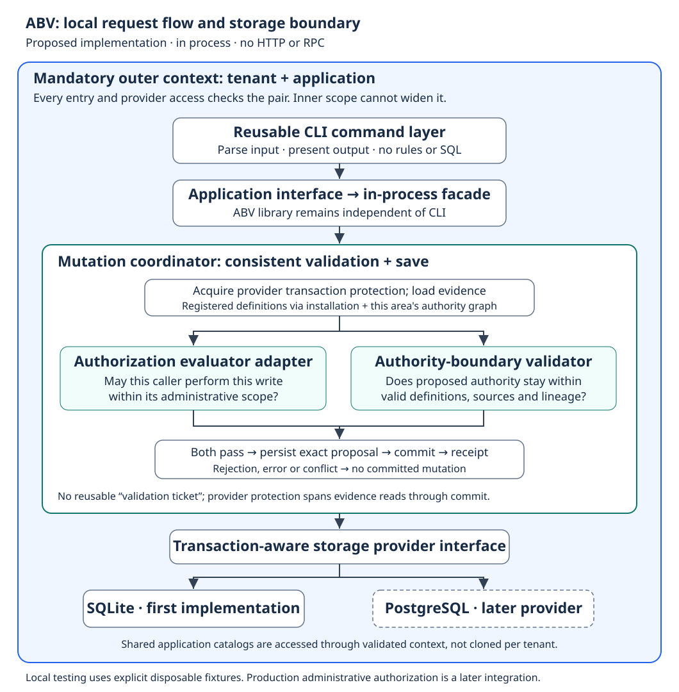

# ABV design — SQLite first, replaceable persistence

**ABV-PLAN-001/002 · 8 September 2026 · Design for implementation review**

**Execution update:** the user has approved implementation, starting with CP1,
and verified commit/push checkpoints. Track actual delivery in
[checkpoint progress](progress.md). Planning-only statements below preserve the
original stage; they do not override that subsequent authorization.

**Scope correction — 9 September 2026:** the user excludes production Auth-service
integration from this build. CP5 is ABV definition management only. Prior real
adapter/integration requirements are superseded; retain a replaceable administrative
port and honest lab limitations without making an external service a completion
dependency. SQLite-first ABV and in-process CLI remain the requested deliverables.

The user approved planning an isolated reusable Go component for the
Authority-Boundary Validator (ABV), with SQLite storage and a provider boundary
allowing PostgreSQL later. The detailed internal contracts below are engineering
proposals for review, not new canonical public authorization schemas.

This document and its [task plan](abv-implementation-plan.md) are planning
deliverables. No module, database, Auth-service integration, commit or push is
created by writing them. Remaining handbook decisions remain pending.

**ABV-PLAN-003 — user refinement:** provide a CLI for testing, calling ABV
in-process, with modular source. Both CLI and ABV remain reusable. No HTTP server,
RPC transport or separate ABV process is needed now. The reusable CLI command
layer talks to an application interface; its initial adapter is the ABV library.
Validation rules and SQL do not move into command parsing. This is part of the
first implementation slice, not parked until production integration.

**ABV-PLAN-004 — user refinement:** tenant/application is the mandatory outer
boundary for this component now. Every library call, CLI operation and provider
query/write must carry an explicit valid pair. No missing-context fallback,
wildcard context, global lookup, cross-application lineage or cross-tenant search
is exposed. An inner scope never replaces or widens the pair.

## 1. Outcome and component boundary

Build a Go library that validates proposed authority changes against registered
definitions, eligible parent support, permissions, scope and applicable team
ceilings. Surround the validator with a mutation coordinator and persistence
provider so only a change passing all required checks can be saved.

The library is not a replacement for the authorization evaluator. The evaluator
answers whether the caller may perform the administrative operation within its
administrative scope. ABV answers whether the proposed authority stays within
valid sources and boundaries. Both checks govern protected Auth writes.



**Local organization:** implementation work belongs under `implementation/`;
all implementation plans belong under `implementation/plan/`. Keep the handbook
focused on the authorization guide, not the software delivery workspace.

**Proposed local code location:** `implementation/abv/` in the lab repository, with
its own Go module. This isolates build dependencies from the website and permits
future extraction without creating a GitHub repository now. Use provisional
module name `agentlabs.local/abv`; do not claim a published import path. At
execution time, use an isolated worktree without moving or discarding the
uncommitted handbook and presentation. The existing Auth service remains unchanged.

## 2. Evidence from the existing code

Read-only inspection found:

- `agentlabs-auth-local/go.mod` declares Go 1.25.0 and uses PostgreSQL/pgx.
  The available local toolchain reports Go 1.26.0.
- `internal/authorizationregistry/repository.go` holds `*pgxpool.Pool`, performs
  transaction-controlled mutations and uses application/tenant registry records.
- `internal/authorizationregistry/repository_assignments.go` uses existing
  subject role/permission/artifact bindings, not the handbook's complete
  recipient-free grant lineage model.
- `internal/authorizationregistry/service.go` and `handler.go` supply existing
  service/HTTP surfaces that cannot be assumed to match the new contracts.

Consequently, do not convert that repository to SQLite, replace its APIs, import
its policy-language/artifact model, or treat it as an already implemented ABV.
Reuse lessons and eventually write a deliberate adapter after a compatibility
review. Existing PostgreSQL support there does not implement the new provider.

## 3. Architecture choices and rationale

| Approach | Trade-off | Selection |
|---|---|---|
| Put SQL and validation together | Quick initially, but ties authority reasoning and tests to a database. | Not selected. |
| Independent ABV library + mutation coordinator + provider | Keeps rules testable and lets databases implement the same consistency contract. | Recommended starting design. |
| Separate network ABV service | Adds deployment, authentication and distributed check/write coordination before they are needed. | Not selected for the first implementation. |

Separate *logical responsibilities* do not require separate deployed services.
The provider is an infrastructure port, not a public raw-write endpoint. A
database owner can always change storage directly; filesystem/database permissions
are part of deployment security. The library cannot promise to resist a hostile
administrator with unrestricted database write access.

## 4. Responsibilities

| Unit | Owns | Must not own |
|---|---|---|
| Canonical decoder | Parse approved core records, retain required fields, reject malformed/duplicate keys and unsupported forms. | Invent unapproved defaults or make a well-formed grant automatically authorized. |
| Definition checks | Registered permission/scope references, role expansion, declared compatibility, supported syntax. | Infer application business semantics from arbitrary names. |
| ABV core | Eligible support, permission subsets, accumulated restrictions, team ceilings, dependency/lifecycle invariants. | HRMS queries, endpoint business workflows, issuer-history shortcuts. |
| Administrative evaluator adapter | Trusted actor/context and authorization of the actual operation/recipient. | A caller-supplied `authorized: true` flag or authority-distribution proof by itself. |
| Mutation coordinator | Bind exact proposal, obtain consistent evidence, invoke both checks, save or roll back. | Reuse a prior validation result or silently retry against new authority. |
| Storage provider | Consistent reads, conditional/transactional writes, uniqueness, migrations and storage error translation. | Permission policy, scope interpretation or dynamic SQL supplied by callers. |
| Test harness | Controlled fixtures and reproducible expected outcomes. | Production bootstrap, real identity verification or an unprotected public write server. |
| CLI adapter | Parse commands/files, call an application interface, print results and set exit status. | SQL, lineage rules, raw persistence, or treating a supplied actor ID as authentication. |

Registration of a permission/scope definition and issuance of a grant are
different operations. Definition registration is subject to its application
platform-management authority; it does not require the publisher to possess
tenant business access. A role definition is a bundle, not a scoped grant.
Validate its structure and registered members, then validate expanded permissions
against the applicable boundary when the role is used in grant authority.
Do not invent a standalone role's parent scope simply to reuse a grant check.

## 5. Scope of the first working slice

**The first deliverable is a bounded local prototype, not full ABV completion.**

It includes:

1. Provider storage/retrieval of registered definitions, role content, canonical
   grants/assignments and internal team/membership relationships.
2. Exact core grant/assignment decoding and reference checks.
3. Deterministic resolution for the approved parent-team route.
4. Safe creation of an assignment of existing valid child content to a child
   team, with a trusted administrative-evaluator port and SQLite transaction.
5. Reopen/persistence tests, multi-connection conflict tests and no-write failures.

A clearly labeled CLI lab scenario supplies coherent registered definitions and
test root/administrative support in a new disposable database. It is not ordinary
production bootstrap or an HTTP API. Normal CLI mutation commands still pass
through the coordinator and both checks; no generic skip-validation exists.
The prototype cannot ship as production Auth while the evaluator is a test
fixture or root establishment lacks a reviewed trust adapter.

All unsupported mutations return an explicit internal unsupported-operation
failure without writes. Unsupported is an implementation limit, not a new
canonical denial policy or removal of those operations from intended v1.

### Canonical gaps must not become invented authority

| Gap | First-slice treatment | Requirement before broader support |
|---|---|---|
| Competing direct-human parent support | Detect the unsupported case; no inferred eligible parent and no write. | Review the recorded support-discovery contract. |
| Cross-recipient `$self` source binding | Do not accept literal string equality as containment. | Establish a reviewed binding-preserving issuance rule. |
| Unsatisfiable scope publication | Retain conflicting predicates; no overwrite. Do not select a new publication rejection policy. | Resolve that publication policy before implementing it. |
| Role/membership/team/root wire schemas | Use explicitly internal typed records and test seeds, not published JSON APIs. | Review exact external contracts before exposing them. |
| Root recovery and catalog publication | No ordinary mutation route in the initial prototype. | Complete trusted platform/bootstrap integration and mutation consistency. |
| Additional conditions | Unsupported evidence is not silently dropped or assumed satisfied. | Define supported authorization-only restrictions; do not build a business engine. |

These limits implement fail-closed behavior honestly. They do not mark the
corresponding handbook criteria complete.

## 6. Data ownership and persistence model

Use explicit internal tenant/application keys even though tenant is implied in
canonical grant JSON. Storage isolation keys are not new grant-scope fields.
Identifiers are opaque strings; do not normalize case, trim IDs or choose a new
public ID grammar. Exact public value rules remain separate contract work.

Use a required internal `Area` value holding both tenant ID and application ID.
Reject zero/blank values at every entry point, including provider methods; a
constructor alone does not prevent a zero-value Go struct from being passed.
Do not discover context by searching for an unqualified grant or team ID.
Read/list commands are bounded too. Test the same ID in another tenant, another
application, and both. None may satisfy support or appear in a result.

Application definitions/catalogs are application-owned and shared. Do not create
independently editable catalog copies or release pins per tenant. Ordinary
authority rows and relationships are tenant/application-partitioned.

The first provider establishes the tenant/application installation before
reading its application-owned shared catalog. The physical catalog can be shared
without creating a context-free application API. Platform-wide publication and
cross-tenant administration stay outside this initial component surface; this
does not repeal their separately recorded system-level responsibilities.

Proposed logical tables; actual SQL is provider-specific:

| Data | Logical key / uniqueness | Important constraint |
|---|---|---|
| Catalog state | application ID | One shared catalog state; authority-affecting edits participate in mutation ordering. |
| Permissions | application ID + permission ID | Registration identity and active/retired meaning; no identifier repurposing. |
| Scope definitions and compatibility | application ID + scope key / supported pair | Mode is application-wide, not per-grant. |
| Role contents | tenant/application context + role ID + content revision for the prototype | Internal representation; no universal standalone-role scope policy is inferred. |
| Grant controls | tenant + application + grant ID | Live grant-wide enablement, separate from content. |
| Grant contents | tenant + application + grant ID + revision | Immutable payload; original parent and constraints retained. |
| Assignments | tenant + application + assignment ID | Unique current grant/recipient pair, including disabled assignments. |
| Teams and team parents | tenant + application + team ID | Explicit hierarchy; no implied human membership. |
| Human memberships | tenant + application + team ID + human ID | Human-only, separate from ownership and grant assignment. |
| Storage concurrency state | provider-owned scope key | Internal consistency metadata, not a new authority field. |

The initial internal role namespace is an isolation boundary for the local
prototype, not approval of the unfinished public role-registration contract.
The adapter must not convert a future shared role into tenant copies silently.

Do not use `ON DELETE CASCADE` to erase dependent authority or history. Use
foreign keys where existence is a true invariant, not to destroy evidence that
an affected support route became orphaned. Logical deletion may retain internal
tombstones for reference integrity without adding a canonical `deleted` status.
Physical retention and production cleanup need their own explicit design.

Preserve canonical payloads and projected lookup columns together in a single
transaction. Validate agreement between them when decoding. Keep inherited
scope as ordered/conjoined predicates with provenance in memory, not a merged
key/value object that loses conflicts. The resolved form is internal, not a
published resolved-grant JSON contract.

## 7. Proposed provider boundary

The initial abstraction is a transaction-scoped domain snapshot and an explicit
write set. Loading the relevant application catalog and tenant authority graph
as one snapshot favors reviewability over large-tenant scalability. Set and test
an explicit configurable bound; exceeding it is an error, never truncated proof.
The first default is a proposed engineering limit of 10,000 authority records
per snapshot. Benchmark it before production; do not call it a canonical limit.

The task plan defines exact internal Go signatures. Semantically:

```text
Read(context, area, callback(snapshot))
Update(context, area, callback(snapshot) -> validated writes)
Close()
```

`Read` supplies a consistent snapshot, not independently timed table reads.
`Update` calls its callback exactly once after acquiring the provider's mutation
protection. It holds required catalog/tenant state stable until commit, or
reports a conflict and rolls back. No successful result escapes before commit.

The coordinator invokes the administrative evaluator and ABV using that same
snapshot. The evaluator must also establish any Auth-admin source from its
actual namespace. The first prototype uses a trusted test port; production
integration must enlist or revalidate external administrative evidence through
the same write boundary. A callback interface alone does not make an external
Auth lookup transactionally consistent.

No SQL, `*sql.DB`, `*sql.Tx`, SQLite result code or PostgreSQL type appears in
the ABV core. The provider must return distinguishable not-found, conflict,
unavailable and cancellation failures. ABV must not interpret database failure
as proof that support is absent.

### SQLite provider

- Use Go 1.25.0 module compatibility, `database/sql`, and `modernc.org/sqlite`
  v1.58.0; its published module declares Go 1.25.0. Resolve and retain its module
  checksums/transitive versions during implementation, without changing the
  website's dependencies. Driver implementation stays below the provider port.
  [Driver source documentation](https://pkg.go.dev/modernc.org/sqlite@v1.58.0).
- Use a pinned connection and `BEGIN IMMEDIATE` for mutation before reading
  validation state. Execute read, callback, writes and commit on that connection.
  Roll back on every rejection/error, cancellation or panic.
- Enable and verify foreign keys for every connection. Enable WAL for the
  local file-backed harness and verify the chosen settings at startup.
- Start with a single writer per process, but test with two independently opened
  providers against one file. An in-process mutex alone is not sufficient.
- A competing write ordered before acquisition must be visible; one ordered
  after commit is a later operation. A lock/conflict failure returns without
  silently replaying the validation callback.
- Recheck time eligibility immediately before issuing the validated write;
  define that eligibility point in the provider contract. Do not promise that
  locking database rows stops wall-clock expiry.

SQLite permits one writer at a time; `BEGIN IMMEDIATE` acquires the write
transaction before the validation reads. These are implementation choices,
not a guarantee from using the word “transaction” alone.
[SQLite isolation](https://www.sqlite.org/isolation.html).
Foreign-key enforcement must be enabled for each connection.
[SQLite foreign keys](https://www.sqlite.org/foreignkeys.html).

### PostgreSQL provider, later

It must implement the same observable contract, not reuse SQLite SQL with
placeholder substitutions. Use explicit catalog/tenant lock ordering or
serializable transactions with dependency validation, and return conflicts
without automatically replaying a changed proposal. Default Read Committed
does not establish the required multi-read/write guarantee.
[PostgreSQL isolation](https://www.postgresql.org/docs/current/transaction-iso.html).

Run the provider contract and ABV scenario suites unchanged against PostgreSQL,
including shared-catalog writes versus tenant writes. PostgreSQL migrations,
database privileges and import/export verification are later provider work;
provider replaceability is not data migration. Actual Auth integration is outside
this build's scope.

## 8. Operation sequence and results

```text
Trusted actor and administrative request
    → canonical decoding / supported-operation check
    → provider mutation protection
    → consistent catalog and authority snapshot
    → administrative evaluator for the exact operation/recipient
    → ABV for the complete proposed result and affected dependencies
    → time/state-preserving write
    → commit
    → mutation receipt
```

Any failed mandatory check prevents the write. Malformed input, insufficient
authority, unsupported implementation cases, storage unavailability and conflicts
remain distinguishable internally. Internal Go errors are not approval of a
public error-code catalog. A mutation receipt is not an application allow result,
nor a reusable validation ticket that can authorize a later save.

The first public library surface has retrieval, diagnostic validation and safe
typed mutation methods. Diagnostic validation cannot supply a later save ticket.
Provider raw writes stay internal to the library composition. There is no CLI
`--skip-abv`, no `allow_all` constructor, and no ordinary seed/root write method.
Testing scenarios belong under `internal/lab`, used by the explicitly lab-only
CLI composition and tests. They initialize only new files with a lab-purpose
marker; they cannot overwrite authority or point at a live Auth database. The
marker prevents accidental misuse, not a hostile database owner.

## 8A. Reusable CLI and reusable ABV

```text
CLI parsing / rendering → application interface → in-process ABV facade
                                                    ↓
                                         coordinator + validator + provider
```

The CLI imports the application interface and receives its implementation at
startup. It does not import SQLite or validation internals. A future remote
adapter can implement that interface if needed; no network transport is built
now. A future Auth handler can embed ABV without importing CLI packages.

Proposed local testing commands:

```text
abv scenario seed team-fin-c17 --db /tmp/my-abv-lab.db --tenant acme --app hrms
abv inspect grant G1 --db /tmp/my-abv-lab.db --tenant acme --app hrms
abv inspect assignment A1 --db /tmp/my-abv-lab.db --tenant acme --app hrms
abv check assignment --file A2.json --db /tmp/my-abv-lab.db --tenant acme --app hrms
abv assign --file A2.json --fixture-context maya-team1 --db /tmp/my-abv-lab.db --tenant acme --app hrms
abv scenario run team-fin-c17 --case unsupported-permission --db /tmp/another-new-abv-lab.db --tenant acme --app hrms
```

Seed and scenario-run commands require a new database and never overwrite.
The initial CLI composition says **local test harness, not authenticated Auth
administration**. `fixture-context` selects a fixed lab administrative test
context, not an arbitrary production identity. It works only with the known
lab scenario. The lab evaluator checks explicit administrative permission and
recipient scope; ABV separately verifies source access in the snapshot. There
is no always-allow evaluator. Production admin use requires the later trusted
identity/evaluator adapter; command reuse does not turn fixture identity into trust.

`check` diagnoses proposed authority without writing and does not claim
administrative permission. `assign` repeats both checks under mutation protection;
it never consumes a prior check result. Read commands inspect records, definitions,
roles, teams and memberships with explicit context. Approved records may be
printed as canonical JSON; internal relationship formats remain labeled tables.

Exit codes: `0` completed requested action, `2` malformed CLI/file input,
`3` established rejection, `4` unavailable/conflict/cancelled evaluation,
`5` unsupported prototype case. These are local CLI conventions, not the public
API error-code catalog. Success output goes to stdout, diagnostics to stderr.
Do not print credentials or arbitrary database connection details.

`cmd/abv/main.go` only wires dependencies and exits with the command result.
`cli.Run` accepts context, arguments, input/output streams and an application
interface. It is testable and reusable without process exit or a database.
An in-process application adapter and a separate lab-scenario runner implement
those interfaces. Test both injected command execution and the compiled binary.

## 9. Delivery checkpoints and acceptance

| Checkpoint | Deliverable | What passing proves |
|---|---|---|
| CP1 | Internal types, decoder, pure definition/containment primitives | Chosen supported inputs can be interpreted without losing restrictions. |
| CP2 | SQLite store + provider tests | Consistent isolated storage/retrieval, rollback and persistence. |
| CP3 | Team-lineage resolver + safe assignment creation | The approved team case works through both gates without stale/partial writes. |
| CP4 | Explicit lifecycle/structural operations | Enablement, validity, dependency guards and affected-branch checks are implemented, not just documented. |
| CP5 | ABV definition management | Permission/scope/role operations obey registration and dependency/boundary rules through the component's protected path. External Auth integration is excluded. |
| CP6 | PostgreSQL provider + migration rehearsal | The same behavior is verified on both databases, with a tested transfer path. |

CP1–CP3 are the detailed first implementation slice. CP4–CP6 have defined entry
conditions and outcome matrices in the task plan, but are not falsely presented
as executable against unapproved external contracts. Scope/catalog and role
management are visible work, not “minor checks” silently skipped.

### Security acceptance examples

- G1/Team1 grants Finance read/write; G2/Team2 selects read and adds C17: valid
  assignment succeeds with current administration/source support.
- Delete permission absent from parent: rejected, not trimmed.
- Parent Finance plus child `{}`: Finance retained.
- Parent Finance plus child Engineering: both predicates retained; no ENG escape.
- Parent held only at unrelated TeamX: not substituted.
- Missing membership needed for issuance: no write; later owner rotation alone
  is not a new permanent dependency for a team-held route.
- Disabled grant + enabled assignment: no effective authority.
- Duplicate grant/recipient assignment, even if old binding disabled: rejected.
- Another tenant's IDs, an expired parent, a cycle or a lost required branch:
  cannot supply authority.
- Database timeout: failure, not “orphan proven”; no write.
- Conflicting update before the protected attempt's ordering point: no stale
  authorization; no automatic content substitution.
- A test double permitting administration does not prove a real evaluator works.
  Such external integration is out of scope, not a CP5 acceptance requirement.

Sources: [ABV working contract](../../docs/authority-boundary-validation.md),
[Q-100](../../docs/auth-service-authority-gate.md),
[Q-110 write consistency](../../docs/auth-write-consistency.md),
[grant records](../../docs/grant-record-reference.md),
[four-part bindings](../../docs/parent-grant-bindings.md),
[pending register](../../handbook/appendices/pending.md).
