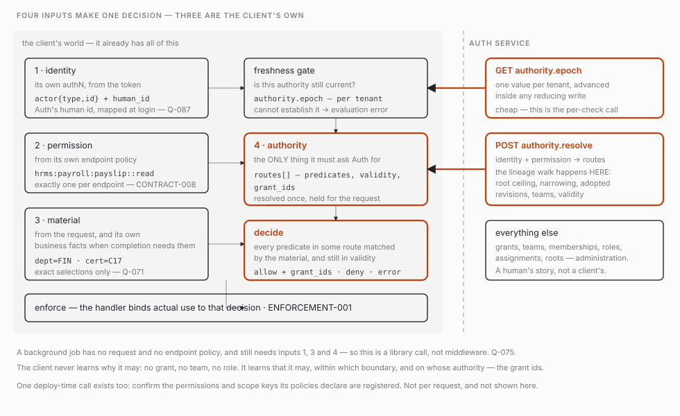

# The four terms

**Settled.** Written down because everything else hangs on it. These are the words we use for the parts of authorization, and the line
between the third and the fourth is where the architecture is decided.

---

| | what it does | where it runs |
|---|---|---|
| **administration** | changes authority — grants, assignments, teams, roots | Auth service |
| **authority loading** | supplies what a human holds — the routes | Auth service → client |
| **resolution** | decides *this request*, under that authority plus request material | **the client** |
| **enforcement** | binds actual execution to the decision | **the client** |

---

## The split that matters

The tempting version of this has three terms, with resolution described as
*"what a human is entitled to do."* That collapses two different things, and the
collapse decides the architecture in the wrong direction.

**What a human is entitled to do is authority loading** — SVG-001's step 4,
*"valid human memberships, direct/group assignments, their reusable grant
definitions, permissions from adopted role revisions, validity/conditions, and
dependencies."* It is about the human, and it is the same answer whatever the
request is.

**Resolution is about the request.** CONTRACT-005 —
*"whether application facts are still needed to determine authorized access, or
whether the handler is applying complete restrictions already determined."* It
needs material Auth does not have and must not have: the department the
certificate is in, the employee a human maps to.

### Why the line has to fall there

If resolution ran inside Auth, the client would ask **"may this human do this?"**
That moves the decision across the wire, and CONTRACT-006 forbids it —
*evaluation and enforcement remain inside one endpoint-owned authorization gate.*

Because resolution runs in the client, Auth is only ever asked **"what does this
human hold?"** Which is why:

- Auth has no decision endpoint, and must not grow one.
- The client never needs grants, teams or memberships — it needs the *result* of
  loading, not its inputs.
- The gate is embeddable at all: it carries the rules, not a round trip.

---

## Captured

[Demo 20](../records/demos/demo-20-a-decision.md) is the first capture of a
decision: a human asks, and the answer returns with the chain of grants that
authorized it. Everything above is visible in it — administration built the
chain, authority loading supplied the routes, resolution matched them against the
request's material, and the exit code is enforcement's to honour.

It also found that `$self` had never been implemented past the chain walk, which
refused any content carrying the token — and refused it at every step, so one
self-scoped grant killed every grant below it too. SELF-001 settles the opposite
and GROUP-004 calls it the preferred practice: *"An Employees group may receive
one self-scoped payslip-read grant… The scope rule is shared; the resolved reach
is specific to the human being authorized."* The refusal is gone and the demo now
shows one grant reaching a different person for each member who asks.

## Resolution and enforcement do talk to each other

**There are not two modes, and there is no prepared state.** An earlier draft of
this document said there were, on the strength of CONTRACT-002 in the
authorization-flow chapter. `endpoint-authorization.md` carries a deprecation map
that retires it:

> *"CONTRACT-002 and CONTRACT-003's two modes and mode validation — **Deprecated**;
> there is one endpoint-owned authorization gate."*
> *"ENFORCEMENT-001's prepared/middleware-allow wording — **Deprecated**;
> ENFORCEMENT-002 retains the safety invariant without prepared."*

So the conversation runs one way. Resolution decides; enforcement binds execution
to that decision. Where an endpoint needs application facts to decide, it gathers
them first — ENFORCEMENT-002 — and the safety rule survives the deprecation
intact: *"Do not perform the protected mutation, disclose protected output, or
trigger business side effects while gathering material."*

The lesson for this document is worth keeping beside the rule: a chapter can
describe a contract that a later chapter has retired, and the deprecation map is
where that is recorded.

---

## What this settles

| question | answer |
|---|---|
| Does Auth decide? | No. It loads. |
| Does the client see grants, teams, memberships? | No. It sees routes — loading's result. |
| Where does request material enter? | Only in the client, only at resolution. |
| Who may call authority loading? | An enforcing client. Administration is a separate surface and a separate story. |
| What does the composition root serve? | Two things: administration, and authority loading. Not resolution — that ships to the client. |
