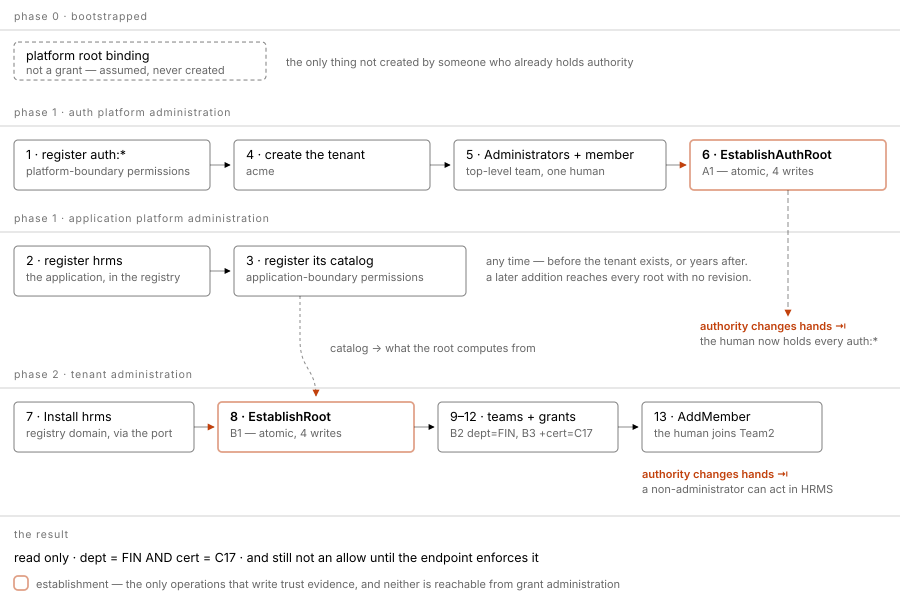

# Proposal — the root grant: shape, permission source, and trust

**For approval.** Three questions only. It does not touch the grant record's key
layout, the fold, or assignments.

The handbook settled the *mechanism* and left the *representation* open, in its
own words: **"That is an encoding gap, not an undecided computation mechanism."**
This proposes the encoding, and the one procedure Q-113 requires and leaves
undefined.

---

## 1 · What a root grant looks like

### Today

```json
{
  "version": "1",
  "grant_id": "G0",
  "revision": 1,
  "permissions": [
    "hrms:payroll:payslip::read",
    "hrms:payroll:payslip::write",
    "hrms:payroll:payslip::delete"
  ],
  "scope": {}
}
```

**That permission list is a lie of omission.** It is never read. `rootRoute`
discards it and rebuilds the list from the catalog, so the row can say `read,
write, delete` while the root actually supplies four permissions. A reader of the
record cannot tell, and the row is the thing an operator inspects.

### Proposed

```json
{
  "version": "1",
  "grant_id": "G0",
  "revision": 1,
  "scope": {}
}
```

**`permissions` is omitted, exactly as `parent_grant_id` already is.** Both
absences then mean one thing: *not supplied by this content — the trusted
establishment supplies it.* One root encoding, one convention, and no reader can
mistake a stale list for the truth.

| What is kept | Why |
|---|---|
| `scope` | genuinely stored, genuinely read — `{}` is the whole tenant and the only thing that bounds a root |
| `version`, `grant_id`, `revision` | identity and format, unchanged |

**Not proposed:** a wildcard `"*"`, a `permission_source` field, or a root flag in
the content. Q-119 and Q-122 refuse all three, and this needs none of them — an
omission is not a new field.

### The cost, stated plainly

`codec/content.go:67` requires either `permissions` or the role pair; omitting
both is `ErrMalformed` today. **That rule relaxes for trusted roots only** — the
same shape, in the same place, as the parent-omission rule it sits beside. A
non-root content omitting `permissions` stays malformed.

> **The role alternative, and why not.** A role holding the complete catalog and
> referenced by the root was considered and rejected. Role adoption is pinned
> (Q-089-B): publishing a role revision does not change the grant. Adding one
> permission would take three gated steps — publish role revision, publish root
> revision adopting it, re-adopt in the assignment — which is exactly what Q-122
> was approved to avoid, and it would freeze the automatic growth Q-120A requires.
> Retirement (Q-125) would break the same way. And the catalog already *is* the
> complete list: a role would be a second copy needing re-sync, with nothing
> enforcing it.

---

## 2 · Where the permissions come from

**Unchanged — this is Q-122 and it is already implemented.** Stated here only
because §1 removes the field that made it look otherwise.

```
effective root permissions = every Active permission
                             in the registered catalog
                             of the root's own application
```

| Rule | Source | Consequence |
|---|---|---|
| computed, never stored | Q-122 | registering a permission widens every root for that application — no new revision, no re-adoption |
| `Active` only | Q-125 | retiring one narrows them immediately, even where grants still reference it |
| one catalog per application, shared across tenants | Q-123 | no per-tenant release pin, no catalog adoption step |
| the root's **own** application's catalog | Q-122 | not every permission registered anywhere in Auth |

**Scope is not computed and must not be.** Permissions grow with the
application's capabilities; a boundary must not. `{}` means no predicates, which
is the whole tenant and never more — the tenant is the envelope's boundary, not a
predicate that could be dropped.

This is the asymmetry the whole model rests on, and the root is where it starts:

| | at the root | downward |
|---|---|---|
| permissions | computed ceiling, grows with the catalog | **selected** — each child states its own, checked against the parent's set |
| scope | stored, `{}` = the tenant | **inherited whole**, child may only AND more on |

---

## 3 · How trust is established

Q-113 is agreed at rule level and explicitly leaves the procedure open: *"The
trusted operator/procedure, exact seed bounds, ... proof of root establishment,
repeated initialization, root changes, and recovery still need discussion."*

This proposes the procedure, and nothing beyond it.

### Establishment is its own operation, in one transaction

**It is not a grant operation.** That is the whole point of it. Q-113's
requirement is that ordinary grant administration can never confer root
authority, and the way to guarantee that is not a check inside grant creation —
it is that **no grant operation writes root evidence at all.** Maya may
administer grants and still cannot establish a root, because the operation that
establishes one is not in her vocabulary.

**Who may call it, and the full precondition list, are in §5** — they differ
between the Auth root and an application root, which is the one thing this
section cannot settle on its own.

**A root's scope must be empty, and this is new.** Today `scope` is merely stored
and turned into predicates, so `{"dept": "FIN"}` on a root would be accepted and
would create a pre-narrowed root — a ceiling lower than the region it is the
ceiling *of*. A root defines the whole `(tenant, application)` region; narrowing
is the children's job, and a narrowed root is just a grant with no parent.
Establishment refuses anything but `{}`.

**Writes, atomically — all four or none:**

```
abv.grant            the head, status=enabled
abv.grant_revision   revision 1, parent omitted, permissions omitted, scope {}
   trust evidence    this grant is a trusted root for this tenant+application
   the assignment    to the holder team, adopting revision 1
```

**Atomicity is the mechanism, not a workflow.** Q-117 requires that incomplete
setup provide no authority. One transaction gives that for free: there is no
moment where a root exists without its evidence, or evidence without a root. A
half-established root cannot be observed because it cannot be committed.

### Why installation is the moment

The registry made this available and it was not before. `Install` is when a
tenant acquires an application — the first instant at which a root is meaningful
and the last at which it is missing. The port already answers the question
(`Installed(tenant, application)`), so the precondition costs nothing new.

**`EstablishRoot` stays a separate call, not a side effect of `Install`.** The
registry must not reach into Auth-AL — that is the seam the port exists to keep
one-directional. Install enables; establishment is a separate, gated act in the
other domain.

### What this does not claim

Q-113 also lists **root changes, repeated initialization, and recovery** as open.
This proposal covers **establishment only**. Rotating a root, re-establishing
after a failed setup, and withdrawing one are not answered here, and the add-only
rule above deliberately refuses rather than guessing.

---

## 4 · The complete field rules

Everything above, as one table. **Root** means trusted-root content; **child**
means content with a `parent_grant_id`.

| Field | Root | Child |
|---|---|---|
| `version` | required, `"1"` | required, `"1"` |
| `grant_id` | required | required |
| `revision` | required, `> 0` | required, `> 0` |
| `parent_grant_id` | **must be omitted** | **required** |
| `permissions` | **must be omitted** — computed from the catalog | **required**, non-empty … |
| `role_id` + `role_revision` | **must be omitted** | … **or** both of these instead |
| `scope` | required, and **must be `{}`** | required as a field; **may be `{}`** |
| `validity` | optional | optional |

Four rules carry the weight, and two of them are the asymmetry:

1. **A child must state its permissions.** Empty is `ErrMalformed` today
   (`PermissionList` rejects `len == 0`), and Q-118 requires either
   `permissions` or both role fields, never a mixture or neither. Nothing flows
   down implicitly — the parent's set is a **ceiling, not a default**.
2. **A child need not state a scope.** `{}` is valid and ordinary: it means *add
   no narrowing*, so the child keeps the parent's boundary exactly. Q-095:
   *"adding scope `{}` does not require artificial narrowing."* Everything flows
   down — a child may only AND more on, never drop one.
3. **A root states neither permissions nor a parent**, because both are supplied
   by the trusted establishment rather than by the content.
4. **A root's scope is `{}` and nothing else**, because it is the ceiling for the
   whole region.

### What is already enforced, and what is new

| Rule | Today |
|---|---|
| child permissions non-empty | **enforced** — `codec/content.go:94` |
| permissions XOR role | **enforced** — `codec/content.go:67` |
| child scope may be `{}` | **works** — `Narrow` clones the parent's predicates first |
| root omits `parent_grant_id` | **enforced** — `rootRoute`, plus the trust check |
| root permissions computed | **enforced** — `rootRoute` discards the stored list |
| root **omits** `permissions` | **new** — `ValidateContent` rejects it today |
| root scope **must be** `{}` | **new** — nothing checks it today |

---

## 5 · Who establishes a root — two roots, two lineages, two actors

**This section replaces an earlier draft that said the platform establishes every
root. That was wrong**, and it was wrong because it treated "the root" as one
thing. There are two, and only one of them is circular.

| | The **Auth root** | An **application root** |
|---|---|---|
| what it anchors | the tenant's authority over Auth itself — create users and teams, assign grants, enable and disable applications | a tenant's authority inside one application |
| established by | **Auth platform administration**, trusted setup | **the tenant administrator** |
| when | tenant creation | after that application is installed |
| once per | tenant | `(tenant, application)` |
| circular? | **yes** — it is what makes someone a tenant administrator | **no** — the administrator already exists |

### The two lineages


Read the diagram bottom-up on the left and top-down on the right: the tenant
administrator is the **result** of lineage A and the **actor** of lineage B.
That one person is the entire connection — no grant in B has a parent in A, so
the two ceilings never merge.

```
platform admin
  └── the tenant's Auth root                      platform-established, once
        └── tenant administrator's grant          auth:application::enable, …
              └── narrower administrative grants

tenant administrator   (authority from the lineage above)
  └── the HRMS root                               tenant-established, per application
        └── ordinary business grants
```

The tenant administrator sits at the **bottom** of the first and the **top** of
the second. That is the whole structure, and the two never meet: an application
root's lineage terminates at itself, not at the Auth root.

### Why the tenant administrator is the right actor, and why it is safe

The objection to be answered is *a ceiling you author is not a ceiling.* It does
not apply, because **the tenant administrator triggers establishment without
authoring any of its contents**:

| | set by | not theirs |
|---|---|---|
| permissions | computed from that application's catalog | the **application** platform administrator owns the catalog |
| scope | `{}` by rule | refused otherwise |
| tenant | implicit from their own area | cannot name another tenant |

There is nothing to inflate. Establishing an application root is closer to
*acknowledging* a ceiling than to setting one — the contents were decided
elsewhere, and the operation only brings the record into existence.

**And the platform cannot be the actor here.** It would put Auth platform
administration in the loop every time any tenant installs any application —
the platform reaching into tenant business, the mirror of what Q-121 refuses in
the other direction. It also does not scale.

### Finding — the catalog union collapses the two lineages

`snapshot.go:118` builds an application's catalog as its own permissions **union
every platform permission**:

```sql
WHERE tenant_id='' AND key1='abv' AND key2='permission'
  AND ((boundary='application' AND key3=?) OR boundary='platform')
```

`rootRoute` then computes a root's permissions from that whole set. So an HRMS
root would carry every `auth:*` platform permission, and establishing a second
application's root would re-issue Auth administration.

For the **Auth root** that union is correct — Q-114 wants Auth's own
administrative contracts in the initial authority. For an **application root** it
is wrong: it merges the two lineages above into one.

**Proposed:** the computation is filtered by boundary, the same rule sliced two
ways.

| Root | Computes from |
|---|---|
| Auth root | `boundary='platform'` permissions |
| application root | `boundary='application' AND key3=<app>` — that application only |

The union stays correct for *evaluation* — a request in HRMS may legitimately
require a platform permission. It is only the **root's computed ceiling** that
must be sliced, so this is a change to `rootRoute`, not to `catalog()`.

### Preconditions, revised

| `EstablishRoot` requires | Because | Else |
|---|---|---|
| the tenant's **Auth root exists** | the acting authority has to come from somewhere | `ErrRejected` |
| the acting identity resolves authority **through it** | checkable, not assumed | `ErrRejected` |
| the application is **installed** for this tenant | otherwise it is authority over something the tenant lacks | `ErrRejected` |
| that application's catalog has ≥ 1 registered permission | Q-114: registration precedes grant acceptance | `ErrRejected` |
| the holder team exists and has **no parent** | a root under a ceiling is not a root | `ErrRejected` |
| no root exists for this `(tenant, application)` | add-only | `ErrConflict` |
| `scope` is `{}` | it is the ceiling for the whole region | `ErrMalformed` |

The **Auth root** is the one case that cannot satisfy the first two, which is
precisely why it is platform-established through trusted setup instead.

### The format

**The grant id is a base-36 Snowflake, issued and never accepted.** This is the
rule roles already hold, and it matters more here: accepting a caller-supplied
root id would let a caller *name* a root, which is one short step from claiming
one. `EstablishRoot` returns the id it issued.

```
G0            the handbook's illustrative id
fi8c8111kow0  what EstablishRoot issues
```

The record format is §1's, unchanged, and the trust evidence records the pair
`(tenant, application) → grant id`.

---

## 6 · The operations

Seven, and the split is deliberate: **two establish, five operate.** Only the
first two write trust evidence, and neither is reachable from grant
administration.

### Establishment — two, by boundary

```go
EstablishAuthRoot(ctx, tenantID, identity, holderTeamID) (Grant, GrantContent, error)   // platform
EstablishRoot    (ctx, area,     identity, holderTeamID) (Grant, GrantContent, error)   // tenant
```

Both issue the id and write head, revision 1, trust evidence and the holder
assignment atomically. They differ in exactly three things, and nothing else:

| | `EstablishAuthRoot` | `EstablishRoot` |
|---|---|---|
| gate | Auth platform administration | tenant administration |
| computes from | platform-boundary permissions | that application's own permissions |
| precondition | trusted setup context | the Auth root, plus installation |

Both add-only.

### Grant administration — tenant boundary

```go
CreateGrant   (ctx, area, identity, parentGrantID, content) (Grant, GrantContent, error)
PublishGrantRevision(ctx, area, identity, sourceAssignmentID, content) (GrantContent, error)
SetGrantStatus(ctx, area, identity, grantID, status)                   (Grant, error)
DeleteGrant   (ctx, area, identity, grantID)                            error
```

| | |
|---|---|
| `CreateGrant` | Q-082's `create`. Issues the id, writes head **and revision 1** in one transaction — revision 1 cannot go through the publish path, which demands a predecessor. Requires a parent; a parentless create is not a root, it is `ErrRejected`. |
| `PublishGrantRevision` | **exists.** Amendment only — see the preconditions in the record document. Refuses roots by design. |
| `SetGrantStatus` | **exists.** `enabled \| disabled`, reversible, never creates. |
| `DeleteGrant` | Q-082's `delete`, superseding revoke. **Refuses while any assignment adopts any of its revisions** — the rule teams settled. A root additionally refuses while its trust evidence stands. |

### Reads — tenant boundary

```go
GetGrant          (ctx, area, identity, grantID, revision) (Grant, GrantContent, error)
ListGrants        (ctx, area, identity, filter)            (GrantPage, error)
ListGrantRevisions(ctx, area, identity, grantID, filter)   (RevisionPage, error)
```

`revision = 0` on `GetGrant` means the head alone. Listings take offset paging
and the same cap the other listings carry. `ListGrants` filters on status and on
`root` so "which grant is this tenant's root for this application" is one call.

> **`EstablishRoot` is the only operation that writes trust evidence, and no
> grant operation can.** That is the whole of Q-113's requirement, expressed as
> vocabulary rather than as a check: an administrator who may call every
> operation in the second and third groups still cannot establish a root.

---

## 7 · The validation rules, in full

Five layers. A rule passing at one layer is never permission at the next — the
package comment says it outright: *"A passing check is NOT permission to save,
proof of lineage, or an allow result."*

### 7.1 · Shape — `codec.ValidateContent`

Pure, no database. Applies to every content, root or child.

| Rule | Fails with |
|---|---|
| `version` present and valid UTF-8 | `ErrMalformed` |
| `version == "1"` | `ErrUnsupported` |
| `grant_id` non-blank; `revision > 0`; `scope` **non-nil** | `ErrMalformed` |
| `parent_grant_id`, if present, non-blank | `ErrMalformed` |
| `permissions` present ⟹ no `role_id`/`role_revision` | `ErrMalformed` |
| `permissions` present ⟹ non-empty, no duplicates, no `*` | `ErrMalformed` |
| `permissions` absent ⟹ `role_id` non-blank **and** `role_revision > 0` | `ErrMalformed` |
| every scope key and value non-blank and not `*` | `ErrMalformed` |
| `validity`, if present, has at least one bound | `ErrUnsupported` |
| `validity` with both bounds ⟹ `not_before < expires_at` | `ErrMalformed` |

**Proposed additions:** trusted-root content omits `permissions` **and** the role
pair (today the last-but-four rule rejects it), and a root's `scope` must be `{}`.

> `scope` must be **present but may be empty**. `nil` is malformed; `{}` is
> valid. That distinction is the whole of the child-scope rule — a child says
> `{}` to add no narrowing, and cannot say nothing at all.

### 7.2 · Definition — `validation.CheckContent`

Needs the area and that application's catalog.

| Rule | Fails with |
|---|---|
| the area is valid | `ErrMalformed` |
| the catalog belongs to the area's application | `ErrRejected` |
| every selected permission is **registered and `Active`** | `ErrRejected` |
| every scope **key** is registered | `ErrRejected` |
| no `$`-prefixed scope value except `$self` | `ErrRejected` |

Permissions resolve through `selectedPermissions`: the direct list, or the
**exactly adopted** role revision — a role that is not present at that exact
revision is `ErrRejected`, never a fallback to another revision.

### 7.3 · Non-amplification — `validation.Narrow`

The ceiling. This is where the asymmetry lives.

| Rule | Fails with |
|---|---|
| parent and child share the same area | `ErrRejected` |
| the child's `parent_grant_id` **is** the resolved parent | `ErrRejected` |
| **every** selected permission is in the parent's effective set | `ErrRejected` |

and then, without a check because it is structural:

```
permissions ← the child's selection            (replaces — nothing inherited)
predicates  ← the parent's, then the child's   (accumulates — nothing droppable)
validities  ← the parent's, then the child's   (accumulates)
```

### 7.4 · Route — `lineage.resolve`

Per assignment, walking up.

| Rule | Fails with |
|---|---|
| depth budget not exhausted | `ErrUnavailable` |
| the grant is not already on the current path — **cycle** | `ErrRejected` |
| the assignment is `enabled` | `ErrInactive` |
| stored content matches the adopted `(grant_id, revision)` **exactly** | `ErrRejected` |
| the control exists, `version == "1"`, status valid | `ErrRejected` |
| the control is not `disabled` | `ErrInactive` |
| the content is within its validity window | `ErrInactive` |
| no `$self` in a *supporting* route's scope | `ErrUnsupported` |
| the holder team exists | `ErrRejected` |
| **root:** trust evidence present **and** holder team has no parent | `ErrRejected` |
| **child:** holder team has a parent | `ErrRejected` |
| **exactly one** supporting assignment of the parent grant to the parent team | `ErrRejected` (0 ⟹ `ErrInactive`) |

### 7.5 · Authority — the administrative gate

Outside these packages, checked before any write. `CheckGrantRevisionPublication`
is the existing one; `CreateGrant`, `DeleteGrant` and `EstablishRoot` each need
their own, and `EstablishRoot`'s is at the **platform** boundary rather than the
tenant's.

### What none of this is

A passing route is **eligible authority**, not an allow. The endpoint still
enforces its one required permission against trusted request material, and the
scope predicates against actual data. The handbook is blunt: *"Root definition
existence alone gives nobody access."*

---

## 8 · The two lineages, end to end

**Both must work, and they are not the same exercise.** One reaches *what a
tenant administrator may do*; the other starts there and reaches *what a human
may do inside an application*. A proposal that demonstrates only the second has
not shown that the first is possible, and the first is where the viability is
actually decided.

### Lineage A — platform administration down to the tenant administrator

```
platform root                       trusted setup, outside all of this
  │
  └── the tenant's Auth root        boundary=tenant, computed from PLATFORM permissions
        │                           established at tenant creation
        └── administrators team assignment
              └── the tenant administrator, by membership
                    │
                    ├── auth:tenant:member::write      create humans and teams
                    ├── auth:tenant:application::install
                    ├── auth:tenant:application::admin
                    └── auth:tenant:authorization::admin   may establish application roots
```

Everything after the Auth root is **ordinary**: ordinary child grants, ordinary
assignments, ordinary membership. Only the Auth root itself is established, and
only once per tenant.

### Lineage B — the tenant administrator down to a human in an application

```
the tenant administrator            authority from Lineage A
  │
  └── EstablishRoot(acme, hrms)     boundary=tenant, computed from HRMS's permissions
        │                           requires: Auth root, installation, catalog
        └── root assignment to the top-level team
              └── child grant: read+write, dept=FIN      ← permissions SELECTED
                    └── child grant: read, cert=C17      ← scope ACCUMULATES
                          └── assignment to Team2
                                └── the human, by membership
```

**The two never meet.** Lineage B terminates at the HRMS root, not at the Auth
root. That is what keeps `auth:*` administration and HRMS business authority from
being the same ceiling — and it is exactly what §5's boundary filter enforces.

### What the Auth service already does — the same two arms

This is not a new idea; it is the shape `agentlabs-auth` already ships, which is
the strongest evidence that it is the right one.

| Our model | `agentlabs-auth` |
|---|---|
| the platform trust anchor | `platform_admin_bindings.binding_type IN ('root', 'delegated', 'break_glass')` — the anchor is **literally called `root`** |
| two administration arms | `adminauthz`: `kindPlatform` / `kindTenant`, built by separate constructors from separate binding reads |
| umbrella platform authority | `CapabilityPlatformRoot = "platform.root"`, `CapabilityPlatformAdmin = "platform.admin"` |
| tenant administrator capabilities | `internal/tenantcapability` — 17 of them, including `tenant.application.install`, `tenant.application.admin`, `tenant.authorization.admin` |
| the tenant administrator installs, then administers | `tenant.application.install` → a `tenant_applications` row → `tenant_application_admins` bound to **that installation** |
| a root requires its installation | **every** `authorization_*` table is keyed by `tenant_application_id`. The installation *is* the container for a tenant's authority in an application |
| the application declares its capabilities | `application_bootstrap_releases` — a signed, versioned manifest per `application_definitions` row |

Two things fall out of that last pair and both support this proposal:

1. **Installation before authority is already the service's rule**, not something
   invented here. `tenant_application_admins` references `tenant_applications`,
   so an application administrator cannot exist for an application that is not
   installed. §5's precondition mirrors it.
2. **The tenant administrator is already the actor** for both installing and
   administering an application. `tenant.application.install` and
   `tenant.application.admin` are tenant capabilities, not platform ones.

### Where we deliberately differ, and why

Stating these so adoption is a decision rather than a surprise.

| | `agentlabs-auth` | this model | why |
|---|---|---|---|
| catalog location | `authorization_permissions` per `tenant_application` | one catalog per **application**, shared across tenants | Q-123, the user's own correction: "the application has one version for everyone. Selective tenant updates do not exist" |
| release selection | `application_bootstrap_releases` versioned per definition | no per-tenant release pin | Q-123 rejected exactly this branch |
| slug shape | `^[a-z][a-z0-9-]{1,127}$` | `^[a-z][a-z0-9-]{1,63}$` | registry charter — worth reconciling before adoption, and cheap to widen |
| optimistic locking | `version` on nearly every table | not in the envelope | deferred, and the grant does not need it |

The first two are the same decision seen twice: the service lets a tenant sit on
a release; Q-123 says it must not. Adopting this model **simplifies** the service
rather than requiring it to grow.

---

## 8A · Every grant, both lineages, as records

**Proposed records, not captured output** — they describe what the operations in
§6 would write, and none of them exists yet.

One tenant, `acme`. One human who administers it, `fi7io4lvjqio`. One installed
application, `hrms`.

### Where the map starts — and why not higher

**The platform administrator is not a grant.** Their authority is the trust
anchor Auth-AL takes as given, the way `agentlabs-auth` holds it in
`platform_admin_bindings` rather than in the authorization tables. Nothing in
`abv_l1_records` represents them, and nothing should: a grant that conferred
platform administration would be a grant that could establish roots, which is
the one thing §3 exists to prevent.

So the map starts at the first thing Auth-AL stores.

### The team tree, because the grant tree cannot move without it

`rootRoute` requires a root's holder team to have **no parent**, and a child's
holder team to **have** one, with the supporting assignment held by that parent
team. So the two trees are parallel by construction, not by convention:

```
Administrators   fibggi2jur5s   no parent   ← holds BOTH roots
  └── Team1      fibggi2juubk               ← holds the FIN grant
        └── Team2 fibggi2juxhc              ← holds the C17 grant
```

| boundary | tenant_id | key1 | key2 | key3 | key4 | value |
|---|---|---|---|---|---|---|
| tenant | acme | abv | team | fibggi2jur5s | Administrators | `{}` |
| tenant | acme | abv | team | fibggi2juubk | Team1 | `{"parent":"fibggi2jur5s"}` |
| tenant | acme | abv | team | fibggi2juxhc | Team2 | `{"parent":"fibggi2juubk"}` |
| tenant | acme | abv | membership | fibggi2jur5s | fi7io4lvjqio | `{}` |

---

### Lineage A — Auth

`key3` is `auth`, the **platform namespace**. Auth is not a registered
application, so there is no installation and no `applications` row — `key3`
answers *which catalog do these permissions come from*, and for Auth that is the
platform catalog.

#### A1 · the tenant's Auth root — established by platform administration

```json
{ "version": "1", "id": "fi8c8111kow0", "status": "enabled" }
{ "version": "1", "grant_id": "fi8c8111kow0", "revision": 1, "scope": {} }
```

No parent, no permissions, empty scope. Its effective permissions are **every
`Active` platform-boundary permission**:

```
auth:tenant:member::read        auth:tenant:application::read
auth:tenant:member::write       auth:tenant:application::install
auth:tenant:team::write         auth:tenant:application::admin
auth:tenant:authorization::admin   …
```

#### A2 · a narrower administrator — an ordinary child

The Administrators team already holds everything through A1. A2 exists because
not every administrator should: a helpdesk team that manages members and nothing
else.

```json
{
  "version": "1",
  "grant_id": "fi8c81a7q4sg",
  "revision": 1,
  "parent_grant_id": "fi8c8111kow0",
  "permissions": ["auth:tenant:member::read", "auth:tenant:member::write"],
  "scope": {}
}
```

**Both halves of the asymmetry are visible here.** `permissions` is stated — two
of the many the parent has, and nothing is inherited implicitly. `scope` is `{}`
— inheriting the parent's boundary and adding no narrowing.

#### The rows

| boundary | tenant | key1 | key2 | key3 | key4 | key5 | value |
|---|---|---|---|---|---|---|---|
| tenant | acme | abv | grant | auth | fi8c8111kow0 | | `{"status":"enabled","trusted_root":true}` |
| tenant | acme | abv | grant_revision | auth | fi8c8111kow0 | 0000000001 | `{"scope":{}}` |
| tenant | acme | abv | grant | auth | fi8c81a7q4sg | | `{"status":"enabled","trusted_root":false}` |
| tenant | acme | abv | grant_revision | auth | fi8c81a7q4sg | 0000000001 | `{"parent_grant_id":"fi8c8111kow0","permissions":[2],"scope":{}}` |
| tenant | acme | abv | assignment | auth | *(A-id)* | | `{"grant_id":"fi8c8111kow0","grant_revision":1,"recipient":{"type":"group","id":"fibggi2jur5s"},"status":"enabled"}` |

> The root revision's value is **`{"scope":{}}`** and nothing else. That is the
> whole of §1: no stored permission list to go stale, no parent, no flag.

---

### Lineage B — HRMS

`key3` is `hrms`, a registered application. There **is** an installation, and it
is a precondition.

#### B1 · the HRMS root — established by the tenant administrator

```json
{ "version": "1", "id": "fi8c81m2xk3o", "status": "enabled" }
{ "version": "1", "grant_id": "fi8c81m2xk3o", "revision": 1, "scope": {} }
```

Byte-identical in shape to A1. What differs is `key3`, and therefore which
catalog it computes from:

```
hrms:payroll:payslip::read   hrms:payroll:payslip::write   hrms:payroll:payslip::delete
```

**and no `auth:*`** — that is §5's boundary filter, and without it this root
would also confer Auth administration.

#### B2 · Finance — permissions selected, scope narrowed

```json
{
  "version": "1",
  "grant_id": "fi8c81r9v8w4",
  "revision": 1,
  "parent_grant_id": "fi8c81m2xk3o",
  "permissions": ["hrms:payroll:payslip::read", "hrms:payroll:payslip::write"],
  "scope": {"dept": "FIN"}
}
```

Two of the parent's three permissions — `delete` is **not** taken, and would have
been available. Scope narrows to FIN.

#### B3 · Certificate C17 — scope accumulates

```json
{
  "version": "1",
  "grant_id": "fi8c81wgt2yc",
  "revision": 1,
  "parent_grant_id": "fi8c81r9v8w4",
  "permissions": ["hrms:payroll:payslip::read"],
  "scope": {"cert": "C17"}
}
```

Effective authority: **`read` only**, within **`dept=FIN` AND `cert=C17`**. The
child said only `cert`; `dept=FIN` arrived from the parent and cannot be dropped.

#### The rows

| boundary | tenant | key1 | key2 | key3 | key4 | key5 | value |
|---|---|---|---|---|---|---|---|
| tenant | acme | abv | grant | hrms | fi8c81m2xk3o | | `{"status":"enabled","trusted_root":true}` |
| tenant | acme | abv | grant_revision | hrms | fi8c81m2xk3o | 0000000001 | `{"scope":{}}` |
| tenant | acme | abv | grant | hrms | fi8c81r9v8w4 | | `{"status":"enabled","trusted_root":false}` |
| tenant | acme | abv | grant_revision | hrms | fi8c81r9v8w4 | 0000000001 | `{"parent_grant_id":"fi8c81m2xk3o","permissions":[2],"scope":{"dept":"FIN"}}` |
| tenant | acme | abv | grant | hrms | fi8c81wgt2yc | | `{"status":"enabled","trusted_root":false}` |
| tenant | acme | abv | grant_revision | hrms | fi8c81wgt2yc | 0000000001 | `{"parent_grant_id":"fi8c81r9v8w4","permissions":[1],"scope":{"cert":"C17"}}` |

---

### The whole map, one table

| | lineage | key3 | grant | parent | permissions | scope | holder team |
|---|---|---|---|---|---|---|---|
| A1 | Auth | `auth` | root | — | *computed:* platform catalog | `{}` | Administrators |
| A2 | Auth | `auth` | child | A1 | `member::read`, `member::write` | `{}` → inherits | Team1 |
| B1 | HRMS | `hrms` | root | — | *computed:* HRMS catalog | `{}` | Administrators |
| B2 | HRMS | `hrms` | child | B1 | `payslip::read`, `::write` | `dept=FIN` | Team1 |
| B3 | HRMS | `hrms` | child | B2 | `payslip::read` | `+cert=C17` | Team2 |

**Five things this table is meant to show at a glance:**

1. **Roots are the only rows with no parent**, and the only ones whose
   permissions are blank — because they are computed.
2. **A1 and B1 are the same shape.** Different `key3`, different catalog,
   different establishing actor — one mechanism.
3. **The two lineages never join.** No row in B has a parent in A. Auth
   administration and HRMS business authority are separate ceilings.
4. **Permissions shrink downward and are always stated.** Never blank below a
   root, never inherited.
5. **Scope accumulates downward and may be blank.** `{}` at A2 keeps the
   parent's boundary; `cert=C17` at B3 is added *to* `dept=FIN`, not instead of.

### What is still not access

Every row above can exist and nobody can do anything. A request also needs: an
enabled assignment, the human's membership in the holder team, every control
`enabled`, validity satisfied, and the endpoint's own enforcement against real
data. *"Root definition existence alone gives nobody access."*

---

## 8B · Control flow — who creates what, and in what order

Three actors, and the phase boundaries are where authority changes hands.



### Phase 0 — bootstrapped, outside Auth-AL

| # | Who | What | Where it lives |
|---|---|---|---|
| 0 | trusted setup | the platform root binding | **not a grant.** `platform_admin_bindings.binding_type='root'` in the service; nothing in `abv_l1_records` |

This is the only thing that is *assumed*. Everything below is created, by someone
who already holds authority.

### Phase 1 — platform administration

| # | Who | Operation | Writes | Requires |
|---|---|---|---|---|
| 1 | Auth platform admin | `RegisterPlatformPermission` × n | `auth:*` at `boundary=platform` | — |
| 2 | application platform admin | `RegisterApplication` *(registry domain)* | the application, `status=active` | — |
| 3 | application platform admin | `RegisterPermission`, `RegisterScope` × n | HRMS's catalog at `boundary=application` | step 2 |
| 4 | Auth platform admin | create the tenant | the tenant | — |
| 5 | Auth platform admin | `CreateTeam` "Administrators", `AddMember` | a top-level team, one human in it | step 4 |
| 6 | Auth platform admin | **`EstablishAuthRoot(acme, Administrators)`** | **A1** head + revision + evidence + assignment, atomically | steps 1, 4, 5 |

> **Step 5 is platform-performed and looks wrong until you see why.** A tenant
> has no administrator yet, so the first team and the first membership cannot be
> tenant operations. Q-115 says exactly this: trusted setup creates the human and
> the administrators group, then assigns initial authority to the **group**.
>
> **Step 1 before step 6** is Q-114: an empty platform catalog would compute an
> empty root, and a root with no permissions is not a ceiling.

**⇥ Authority changes hands here.** After step 6 the human in Administrators
holds every `auth:*` permission through the root assignment. Nothing further
requires the platform.

### Phase 2 — tenant administration

| # | Who | Operation | Writes | Requires |
|---|---|---|---|---|
| 7 | tenant admin | `Install` *(registry domain)* | the installation | `auth:tenant:application::install`, step 2 |
| 8 | tenant admin | **`EstablishRoot(acme, hrms, Administrators)`** | **B1** head + revision + evidence + assignment, atomically | A1, step 7, step 3 |
| 9 | tenant admin | `CreateTeam` Team1, Team2 | the team tree | A1 |
| 10 | tenant admin | `CreateGrant` B2 under B1 | head + revision 1 | step 8 |
| 11 | tenant admin | `CreateAssignment` B2 → Team1 | the assignment | steps 9, 10 |
| 12 | tenant admin | `CreateGrant` B3 under B2, assign → Team2 | head + revision 1 + assignment | step 11 |
| 13 | tenant admin | `AddMember` the human → Team2 | membership | step 9 |

**⇥ Authority changes hands again.** After step 13 a human who is not an
administrator can act in HRMS, within `dept=FIN AND cert=C17`, read only.

### The same table, by who

| Actor | Creates |
|---|---|
| **trusted setup** | the platform root binding — and nothing else |
| **Auth platform admin** | `auth:*` platform permissions · the tenant · the first team and membership · **the Auth root** |
| **application platform admin** | the application · its permissions and scopes |
| **tenant admin** | the installation · **the application root** · teams · child grants · assignments · memberships |

**Read that column for the tenant admin against the column above it.** Everything
a tenant administrator creates is either ordinary, or an establishment whose
*contents* were decided by one of the two platform actors. They never author a
ceiling; they only bring one into existence, or narrow one.

### Two orderings that are not negotiable

1. **Register before establish** — steps 1→6 and 3→8. A root computes from a
   catalog; an empty catalog is an empty ceiling. Q-114.
2. **Install before establish** — step 7→8. A root is authority inside an
   application; without the installation the tenant does not have that
   application. This crosses the domain seam and is answered by the existing
   `Registry` port.

### And one that is

**Steps 2 and 3 can happen at any time** — before the tenant exists, or years
after. A catalog addition reaches every existing root with no revision and no
re-adoption (Q-122/Q-123). That is the payoff for computing instead of storing,
and it is why the flow above has no step for "update the roots."

---

## 9 · Demonstration plan — both lineages

> **Deferred to the assignment slice.** Both demonstrations below need a human to
> act, which needs an assignment and a membership. They are planned here so the
> design is complete; §10 says what is demonstrated *now*. Nothing in this
> section is withdrawn — only scheduled.

Captured CLI output, the way every record so far has been demonstrated. Two
demonstrations, because there are two lineages and showing one proves nothing
about the other.

### Demo 1 — Lineage A: platform to tenant administrator

| Step | Shows |
|---|---|
| `authority establish-auth-root --tenant acme --team <admins>` **before** registering Auth's platform permissions | refused — Q-114, registration precedes acceptance |
| register the `auth:*` platform permissions, then establish | the root, its id issued not accepted |
| `authority inspect --tenant acme` | root permissions = the **platform** catalog, `scope {}` |
| the same call by a **tenant** identity | refused — establishment is platform-gated |
| create the administrator's child grant, assign, add the human | ordinary operations from here on |
| `authority check` for `auth:tenant:application::install` | allowed, through membership |
| establish a **second** Auth root for `acme` | `ErrConflict` — one per tenant |

### Demo 2 — Lineage B: tenant administrator to a human in HRMS

| Step | Shows |
|---|---|
| `authority establish-root --tenant acme --app hrms` **before** `registry install` | refused — the installation gate, across the domain seam |
| `registry install hrms --tenant acme`, then establish | the HRMS root appears |
| `authority inspect` the HRMS root | permissions = **HRMS's** catalog only — **no `auth:*`**, the boundary filter working |
| establish with `--scope dept=FIN` | `ErrMalformed` — a root is the whole region |
| child grant selecting `read`+`write` with `dept=FIN` | permissions selected, scope narrowed |
| grandchild selecting `read` with `cert=C17` | scope accumulated: FIN **and** C17 |
| grandchild attempting `delete` | `ErrRejected` — not in the parent's set |
| grandchild with `scope {}` | accepted — inherits FIN, adds nothing |
| register a new HRMS permission, re-inspect the root | the root grew; **no revision, no re-adoption** |
| retire it, re-inspect | the root shrank |
| the tenant administrator attempts `establish-root` for a tenant they do not administer | refused |

The last-but-two pair is the one that has to be seen rather than described: it is
the whole argument for computing from the catalog instead of storing a list, and
for refusing the root role.

---

## 10 · Implementation plan — the grant slice only

**Scope: the grant record and its operations. Nothing that needs a route.**

Assignments are a separate record and come next; resolution, establishment and
the end-to-end demonstrations wait for them. Everything in §§1–9 remains the
design record — this section only says what gets built now.

### Why this line and not another

`insertGrantRevision` already validates a publication against **the catalog and
the previous revision**, never against the parent's resolved route. The subset
check lives at resolution, not at write. So "grants without assignments" is not a
compromise cut — **it is the seam the code already has.**

### In this slice

| # | Step | Touches |
|---|---|---|
| 1 | `abv.grant` and `abv.grant_revision` records — key layout, codec, storage | the record document |
| 2 | Relax `ValidateContent` for trusted-root content: `permissions` **and** the role pair both omitted | `internal/codec/content.go` |
| 3 | A root's `scope` must be `{}` — refused otherwise | `internal/codec/content.go` |
| 4 | `CreateGrant` — issues the id, writes head **and revision 1** atomically, requires a parent | facade + storage |
| 5 | `GetGrant`, `ListGrants`, `ListGrantRevisions` — typed reads, offset paging, the usual cap | facade + storage |
| 6 | `DeleteGrant` — **head and all revisions, add-only's mirror**; the dependency refusal is deferred (see below) | facade + storage |
| 7 | Fold `grant_controls` and `grant_contents` into `abv_l1_records`; assert both stay gone | storage + a test |
| 8 | CLI verbs for 4–6, with a Go test against the compiled binary | `cli/`, `cmd/` |
| 9 | One demonstration: create → publish → list revisions → status → delete, and the rows | captured SVG |

`PublishGrantRevision` and `SetGrantStatus` already exist and are not rewritten —
step 7 moves their storage underneath them.

### Deferred to the assignment slice, and why

| | Why it cannot land now |
|---|---|
| `EstablishAuthRoot`, `EstablishRoot` | each writes four things and the fourth is the holder assignment. Three-now-four-later destroys the atomicity that makes Q-117 true: a root without its assignment **is** incomplete setup. Trusted roots stay fixture-seeded, where they already are. |
| the boundary filter on the root computation | it is four lines in `rootRoute`, which is resolution. It can be written against the existing fixtures, but it is not this record's work and belongs with what it protects. |
| `Narrow` and `lineage.resolve` — layers 7.3, 7.4 | they walk assignments. Untouched. |
| `DeleteGrant` refusing while an assignment adopts a revision | the dependants are assignments. **Until then `DeleteGrant` refuses any grant that has more than its own revisions** — the conservative direction, and it is loosened rather than tightened later. |
| both end-to-end lineage demonstrations | a human acting requires an assignment and a membership. |

> **One thing to keep honest.** With establishment deferred, a trusted root still
> cannot be created by any operation — §3's finding stands unfixed through this
> slice. That is a known gap carried deliberately, not an oversight, and it is
> the first thing the assignment slice closes.

### Where these rows live

Every grant record is a **tenant** record, in one application:

```
boundary = tenant        tenant_id = acme        key3 = hrms
```

`Area{tenantID, applicationID}` is on every operation, every storage read is
`WHERE tenant_id=? AND key3=?`, and the envelope's CHECK requires a non-empty
`tenant_id` at the tenant boundary. A grant cannot exist outside a
`(tenant, application)` pair, and cannot be read from another one — which is why
`Narrow` refusing a cross-area parent costs nothing: there is no way to express
one.

The Auth lineage is the same rule with `key3 = auth`, the platform namespace
whose catalog it computes from. Auth is not a registered application, so there is
no installation — but its records are still the tenant's.

### Alignment check against the handbook

Every claim above traced to a decision, so nothing here is invention:

| This proposal | Handbook |
|---|---|
| root omits `parent_grant_id` | Q-119 agreed |
| root permissions computed from the registered catalog | Q-122 approved |
| one shared catalog per application | Q-123 agreed as corrected |
| retirement withdraws root coverage | Q-125 approved |
| trusted establishment required, and not by ordinary grant operations | Q-113 agreed |
| registration precedes acceptance | Q-114 agreed as corrected |
| authority assigned to a **group**, human as explicit member | Q-115 |
| incomplete setup yields no authority → one transaction | Q-117 approved |
| application platform admin publishes capabilities, no tenant business access | Q-121 approved |
| three records: control, immutable revision, assignment | Q-107 approved |
| no recipient on a grant | Q-090 |
| permissions subset, scope AND | Q-095, `authority-lineage.md` |
| **root omits `permissions`** | **not approved — §1, this proposal** |
| **root scope must be `{}`** | **not approved — §3, this proposal** |
| **boundary filter on the root computation** | **not approved — §5, this proposal** |
| **the tenant administrator establishes an application root** | **not approved — §5, this proposal** |

Four new decisions. Everything else is existing handbook, and the four are
exactly what §11 asks.

### Which answers gate the slice

| Question | Gates |
|---|---|
| 1 · root omits `permissions` | **this slice** — step 2 |
| 3 · root scope must be `{}` | **this slice** — step 3 |
| 7 · the seven operations, `CreateGrant` writing head + revision 1 | **this slice** — steps 4–6 |
| 2 · computation confirmed | design only, nothing to build |
| 4 · establishment procedure | the assignment slice |
| 5 · two roots, two actors | the assignment slice |
| 6 · boundary filter on the root computation | the assignment slice |

Three answers unblock the work. The other four can settle while it proceeds,
provided none of them is contradicted by what gets built — and none is, because
the slice writes no trust evidence and resolves no routes.

---

## 11 · What is being asked

1. **Shape** — does a root omit `permissions` as it omits `parent_grant_id`, with
   `ValidateContent` relaxed for trusted roots only?
2. **Source** — confirm Q-122 computation is the answer and §1 merely stops the
   record from implying otherwise.
3. **Scope** — must a root's scope be `{}`, refused otherwise?
4. **Trust** — is establishment the trusted procedure Q-113 requires: outside
   grant administration, preconditioned, and atomic?
5. **Actor** — two roots, two actors: the **Auth root** by Auth platform
   administration at tenant creation, an **application root** by the **tenant
   administrator** after install?
6. **Boundary filter** — should the root computation slice the catalog by
   boundary, so an application root does not carry platform permissions?
7. **Operations** — are the seven in §6 the complete set, and `CreateGrant`
   writing head and revision 1 together the right shape?

> **One of these is not merely an encoding choice.** Q-122's representation
> section says *"No stored `*`, new permission-source field, root flag, or
> **implicit omitted-field behavior** is approved."* Question 1 asks for exactly
> that omitted-field behaviour. The same section says the root source encoding
> "still needs review", so this is a candidate for that review rather than a
> contradiction — but it is a **handbook decision**, not an implementation
> detail, and it does not become settled by being written here.
