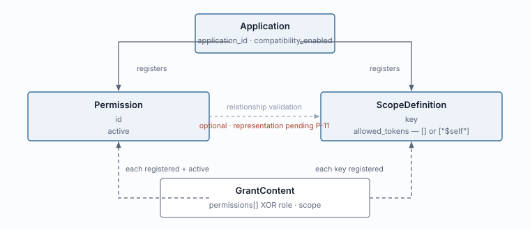
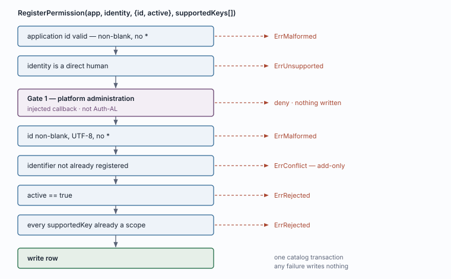
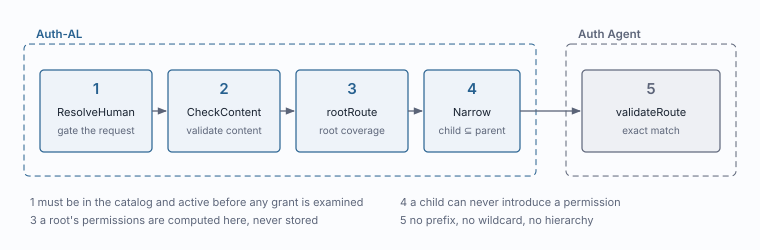
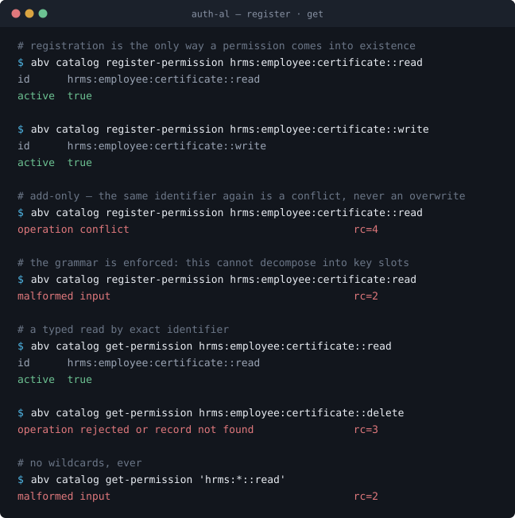
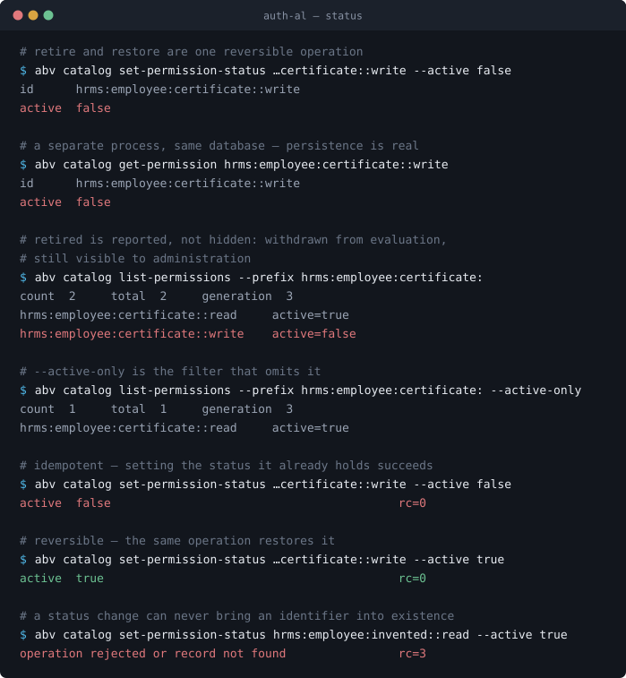
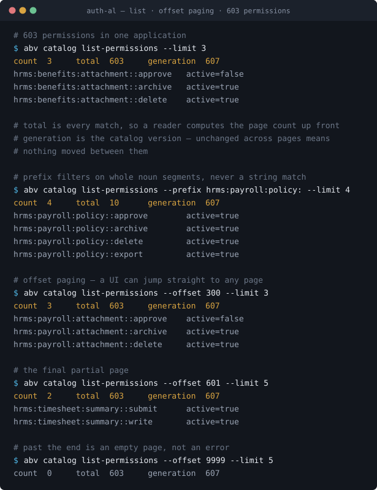
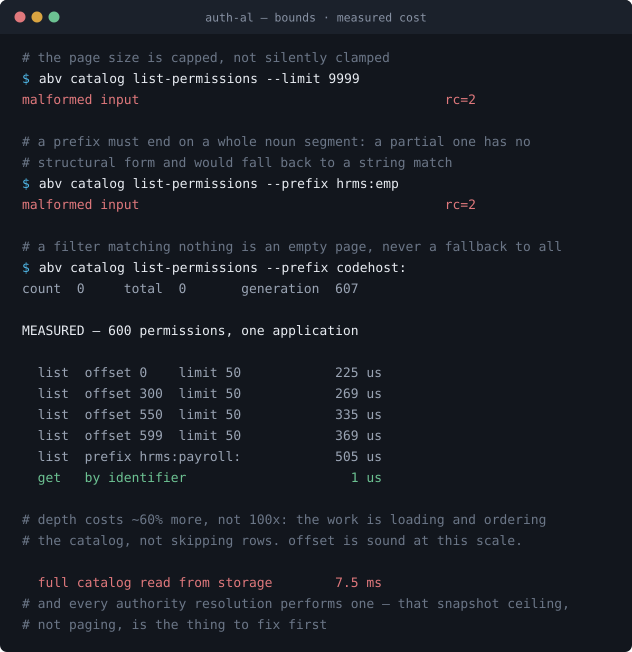

# `abv.permission` — canonical record

What a permission is, the functions that operate on it, how it is stored, and
where it is consulted.

**Draft for review.** Behaviour marked *implemented* is read from
`implementation/abv`. Storage layout is proposed; see `20-storage-encoding.md`.

---

## 1 · Canonical definition

> A **permission** names an operation that authority can cover. It says what may
> be done — never who may do it, and never which records it reaches.

### Identifier

```
<noun>[:<noun>…]::<verb>

hrms:employee:certificate::read
codehost:repository:branch:protection:rule::write
```

A noun path of one or more segments, then `::`, then exactly one verb. The
namespace may be any depth. A shared prefix confers nothing — there is no
inheritance, no aliases and no wildcards.

Under Q-126 an identifier can never be repurposed for a different authorization
meaning, even after retirement. That permanence is why the record is add-only and
never deleted.

### The complete canonical path

A permission's full canonical path, from the domain down to the verb:

```
abv.permission:hrms:employee:certificate::read
└┬┘ └───┬────┘ └┬─┘ └───┬──┘ └────┬─────┘  └┬─┘
 │      │       │       │         │          │
 │      │       └───────┴─────────┘          │
 │      │            noun path               │
 │      │          key3 … key9               │
 │      │                                    │
 │      └─ record type · key2                └─ verb · key10
 └──────── domain namespace · key1
```

`.` separates the domain namespace from the record type. `:` separates the
segments of the identifier. `::` separates the noun path from the verb.

This string is a **rendering**, not a stored value. The row holds the segments in
their slots; the wrapper renders this form on the way out and parses it on the
way in. Nothing inside Auth-AL ever concatenates them, which is why there is no
escaping — see `20-storage-encoding.md`.

### Canonical key layout

The identifier is **decomposed across key slots**, never stored as one string.
The noun path runs left to right from `key3`; the verb is pinned to `key10` so it
never moves regardless of how deep the noun path is.

| Slot | Holds | Example |
|---|---|---|
| `key1` | domain namespace | `abv` |
| `key2` | record type | `permission` |
| `key3` | noun 1 — **the application** | `hrms` |
| `key4` | noun 2 | `employee` |
| `key5` | noun 3 | `certificate` |
| `key6` … `key9` | nouns 4 – 7, unused → `''` | `''` |
| `key10` | **verb — always this slot** | `read` |
| `revision` | unused for permissions | `0` |

**Seven slots for nouns.** Three of ten are spoken for: two by the canonical type
path and one reserved for the verb.

**`key3` is the application, in every record type.** Here it arrives as the
leading noun of the identifier — settled below — rather than being written from
`application_id`, but it answers the same question a scope record's `key3`
answers. A reader of the store never has to know which record type a row is to
know which application owns it.

Why decomposed rather than one string: a query over a whole string slot is a
lexical prefix match, which on PostgreSQL uses an index only under a special
operator class and otherwise silently degrades to a sequential scan. Decomposed,
the same query is structural — equality on leading index columns, free at any
depth. See `20-storage-indexing.md`.

Why the verb is last rather than first: whatever sits in `key3` gets the free
queries. Browsing a domain — *every employee permission* — is the common
interactive question, so the noun path is left-anchored. Asking for *everything
that can write* then costs a scan bounded to one application's catalog, which is
the rarer, usually audit-side question.

### Worked example

```
hrms:employee:certificate::read

boundary        = application      ← no tenant; shared by every tenant
tenant_id       = ''               ← not NULL: a NULL is distinct in a unique index
application_id  = hrms
key1            = abv
key2            = permission
key3            = hrms
key4            = employee
key5            = certificate
key6 … key9     = ''
key10           = read
revision        = 0
value           = {"active": true}
state           = enabled
```

A deeper identifier, `codehost:repository:branch:protection:rule::write`, fills
`key3` through `key7` and still lands its verb in `key10` — five of the seven
noun slots used.

**Settled — the leading noun is the application name, and that duplicates
`application_id`.** Accepted. Dropping it would free a slot but would assume an
identifier's first segment always equals its application id, which is convention
and enforced nowhere. Keeping it means the noun path renders as the identifier
its author wrote, with no reconstruction step and no assumption to violate.

> **Open — is `key1` earning its place?** The store is already the `abv` L1
> record table, so the domain namespace in `key1` restates what the table says.
> Dropping it would give eight noun slots. Kept for now because the payroll
> envelope uses the same shape, and consistency across domains is worth a slot.

> **Open — should `key3` be the application as its own slot?** Today the leading
> noun lands there and *happens* to be the application name; a scope record writes
> `application_id` there directly. Making it a dedicated slot for every record
> type would make `key3` mean one thing by construction rather than by convention,
> at the cost of one noun slot (seven → six) and a code change to
> `codec.PermissionSlots`. Worth deciding before the next record type is added,
> since every type inherits the answer.

### Where it lives

A permission belongs to an **application**, never a tenant. Under Q-123 there is
one shared catalog per application. Adding a permission gives every tenant a new
*word*, never new access.

It is **not** authority, **not** a boundary, **not** hierarchical, **not**
revisioned, and **not** deletable.

### Independent from scope



Two validation loops that never consult each other: a grant's permissions must
each be registered and active, its scope keys must each be registered. Neither
asks anything of the other. The single exception is section 5.

## 2 · The contract

Four functions. Nothing else is exposed for this record.

```go
RegisterPermission (ctx, app, identity, def)             (PermissionDefinition, error)
GetPermission      (ctx, app, identity, id)              (PermissionDefinition, error)
ListPermissions    (ctx, app, identity, filter)          (PermissionPage, error)
SetPermissionStatus(ctx, app, identity, id, active bool) (PermissionDefinition, error)
```

```go
type PermissionDefinition struct {
    ID     string
    Active bool
}
```

**No tenant argument anywhere** — a permission has no tenant dimension.
**Identity on every call, including reads**, so each function runs the injected
administrative check itself rather than assuming a caller did; an application's
catalog is its capability surface. **Returns are self-contained** — nothing
implies a further call.

Shared errors: `ErrMalformed` shape · `ErrUnsupported` identity or provider ·
`ErrRejected` a failed rule · `ErrConflict` identifier exists · `ErrNotFound`
missing read. An error is never a denial, and nothing writes on either.

### 2.1 · `RegisterPermission` *(implemented)*

The only way a permission comes into existence. Add-only.

| Parameter | |
|---|---|
| `app` | which application's catalog |
| `identity` | acting human; version `"1"`, actor type `user`, actor id = human id |
| `def.ID` | non-blank, valid UTF-8, no `*` |
| `def.Active` | must be `true` — no pre-retired registration |

```go
app, _ := domain.NewApplication("hrms")
def := domain.PermissionDefinition{ID: "hrms:employee:certificate::read", Active: true}

f.RegisterPermission(ctx, app, identity, def)
```



Validation and write share one transaction; any failure writes nothing. Gate 1 is
the injected application-platform check, not Auth-AL's. Re-registering is
`ErrConflict` — there is no update.

### 2.2 · `GetPermission` *(proposed)*

Typed, application-scoped read of one identifier. No wildcard, no prefix.

```go
def, err := f.GetPermission(ctx, app, identity, "hrms:employee:certificate::read")
// {ID: "...", Active: true}
```

Retired permissions return with `Active: false` rather than being hidden — a
caller asking for a specific identifier is entitled to learn it exists and is
retired. That is how Q-126's permanence is observable.

### 2.3 · `ListPermissions` *(proposed)*

```go
type PermissionFilter struct {
    Prefix     string // "hrms:employee:" — whole noun segments only
    ActiveOnly bool
    Offset     int    // rows to skip; ordering makes this stable
    Limit      int    // server caps it
}

type PermissionPage struct {
    Permissions []domain.PermissionDefinition // ordered by the key slots
    Total       int                           // every match, not this page
    Generation  int64                         // the catalog's version at read time
}
```

**Paging is by offset, not a cursor.** A catalog is browsed in a UI where a
reader jumps between pages rather than walking one, and a cursor cannot answer
*page 20* without walking there. Ordering by the key slots is what makes an
offset mean the same thing on every call.

`Total` is every record matching the filter, so a reader can compute the page
count up front instead of discovering the end by walking into it.

`Generation` is the catalog's version at the moment of the read. Read it before a
walk and again after: unchanged means nothing moved between pages; changed means
retry. That is what makes an offset walk safe for cache warming, where a row
shifted past a page boundary would otherwise be silently missed. A UI can ignore
it — a row shifting while someone browses is cosmetic.

```go
f.ListPermissions(ctx, app, identity, domain.PermissionFilter{Limit: 100})
f.ListPermissions(ctx, app, identity, domain.PermissionFilter{Prefix: "hrms:employee:", Limit: 100})
f.ListPermissions(ctx, app, identity, domain.PermissionFilter{ActiveOnly: true, Limit: 100})
f.ListPermissions(ctx, app, identity, domain.PermissionFilter{Offset: 100, Limit: 100})
```

> **Prefix confers nothing.** It groups identifiers for a human reading a
> catalog. A shared prefix grants no descendant permission, and evaluation never
> matches on a prefix. Keeping this filter out of the authorization path is what
> keeps that true.

**Absent:** mid-string wildcards, regular expressions, query language, any sort
order but identifier, unbounded results. A list matching nothing returns an empty
page, never a fallback.

> **Open.** On PostgreSQL a `LIKE 'x%'` prefix uses a btree index only under the
> `C` collation or a `text_pattern_ops` index. Otherwise it silently degrades to
> a sequential scan — correct results, passing tests, and a catalog that slows as
> it grows. Decide at checkpoint 2.

### 2.4 · `SetPermissionStatus` *(proposed)*

Retirement is reversible, so this is live state, not a one-way transition — the
same shape as `SetGrantStatus` and `SetAssignmentStatus`.

```go
f.SetPermissionStatus(ctx, app, identity, "hrms:employee:certificate::read", false) // retire
f.SetPermissionStatus(ctx, app, identity, "hrms:employee:certificate::read", true)  // restore
```

Idempotent — setting the status it already holds succeeds. The argument is a
`bool` because the record's own field is `Active bool`, unlike the
enabled/disabled strings grants use.

**Nothing cascades in either direction.** Grants and assignments referencing the
identifier are never rewritten, deleted or disabled; they simply stop resolving,
and resume when it is restored. The row itself always stays, because Q-126 makes
the identifier permanent.

**Restoring resumes every route silently.** Nothing is revalidated, because the
record has no dependencies of its own. That is accepted: requiring each affected
grant to re-adopt would make retirement destructive while pretending to be a
flag. The safeguard is that setting the status is itself protected.

### Not in this contract

**`Inspect` is excluded.** The facade's `Inspect(area, kind, id)` does return a
permission today, but it is a generic dispatcher over eight kinds, takes an
`Area` requiring a tenant a permission does not have, returns display rows rather
than a typed definition, and — decisively — **one function covering eight kinds
cannot carry one fixed permission per endpoint**, which ABV-123-05/06 requires.
It stays a CLI and diagnostic tool. `GetPermission` replaces it here.

Also absent: no update, no delete, no bulk register, and no supported-keys
argument — see section 5.

---

## 3 · Queries

The row is shown in section 1, and it is **live**: permissions are stored in
`abv_l1_records` today, not in a table of their own. What matters here is that
every access is **structural** — equality on leading key columns — rather than a
string match inside a slot.

`tenant_id` is `''` rather than NULL for an application-scoped record. SQLite and
PostgreSQL both treat NULLs in a unique index as distinct, which would let
duplicate catalog rows coexist; an empty string is comparable, and the `boundary`
column already names which case applies.

```sql
-- fetch one: every slot constrained, a unique hit
get     boundary = 'application' AND tenant_id = ''
        AND application_id = $1
        AND key1 = 'abv' AND key2 = 'permission'
        AND key3 = $2 AND key4 = $3 AND key5 = $4
        AND key6 = '' AND key7 = '' AND key8 = '' AND key9 = ''
        AND key10 = $5

-- every permission in an application
list    ... AND key1 = 'abv' AND key2 = 'permission'
        ORDER BY key3, key4, key5, key6, key7, key8, key9, key10

-- one domain: hrms:employee:  → two whole noun segments
        ... AND key3 = 'hrms' AND key4 = 'employee'

-- one resource: hrms:employee:certificate:
        ... AND key3 = 'hrms' AND key4 = 'employee' AND key5 = 'certificate'

-- every write verb in an application
        ... AND key10 = 'write'
```

All of these except the last are left-anchored on the identity index and need no
index of their own. The verb query is not left-anchored, so it narrows to the
application's permission catalog and filters within it — bounded, and the reason
the verb sits last rather than first.

### The contract's filter, translated

`PermissionFilter.Prefix` stays a string at the API boundary — callers should not
have to think in slots. The wrapper splits it on segment boundaries and emits
slot equality:

```
Prefix "hrms:employee:"            →  key3 = 'hrms' AND key4 = 'employee'
Prefix "hrms:employee:certificate" →  key3 = 'hrms' AND key4 = 'employee'
                                      AND key5 = 'certificate'
```

> **Open — partial segments.** A prefix ending mid-segment, `"hrms:emp"`, has no
> structural form: it is a lexical match on `key4` and carries the operator-class
> problem decomposition exists to avoid. Two options — reject a prefix that does
> not end on a segment boundary, or accept it and pay a bounded scan within the
> application. Rejecting is the more honest contract, since a caller then never
> silently gets a slow query. Recommend rejecting.

### Ordering and offset

Ordering is by the slot tuple, which reconstructs to identifier order exactly.
An offset past the end returns an empty page rather than an error, so a reader
that jumps beyond the last page sees nothing instead of failing.

**Measured at 600 permissions in one application:** offset 0 costs 225µs and
offset 599 costs 369µs. Depth is not the bottleneck, because the cost is
dominated by loading and ordering the catalog rather than skipping rows. A single
`GetPermission` is 1µs.

The bottleneck is elsewhere and worth recording: a full catalog read from storage
is 7.5ms, and every authority resolution performs one. That is the snapshot
ceiling, not paging.

---

## 4 · Where it is consulted



| | Point | What it checks |
|---|---|---|
| ① | `ResolveHuman` | The requested permission is in the catalog and **active**, before any grant is examined. |
| ② | `CheckContent` | Every permission in a grant revision — listed directly or via an adopted role — is registered and active. |
| ③ | `rootRoute` | A root's permissions are **computed** as every currently active permission, never stored (Q-122). |
| ④ | `Narrow` | A child grant's permissions each appear in the parent's. A child can never introduce one. |
| ⑤ | `validateRoute` *(Agent)* | Route permission equals request permission **exactly**. No prefix, no wildcard, no hierarchy. |

① is why retirement works without touching a grant: the flag is read before
anything else, so flipping it stops every future evaluation across every tenant
immediately.

---

## 5 · Permission–scope relationship validation

The handbook records the feature and nothing else:

> An application explicitly declares whether permission/scope compatibility
> validation is enabled. The feature is optional; its mode is not guessed for
> individual grants. When enabled, every relevant grant must satisfy the declared
> support relationships.
> — `handbook/implementation/06-auth-service.md`

**How the support relationships are represented is not canonical.** No record,
no field and no format is approved. Appendix P-11 lists *optional declared
compatibility checking* as pending, so the representation was left open
deliberately.

The prototype carried `Catalog.SupportedKeys` and a `supported_scope_keys` table,
consulted only when `CompatibilityEnabled` was set. That was implementation ahead
of the model, not a settled shape — and it is a relationship *between*
permissions and scopes, so hanging it off the permission record was itself an
unapproved modelling choice. **Both are removed** by the scope change; see
`record-scope.md` section 5.

**Nothing about it belongs in this document until P-11 is decided.** The four
functions above are unaffected: registration does not take supported keys, and
`PermissionDefinition` does not carry them.

> **Gap for the model, not for this record.** Q-041 requires the mode to be
> declared upfront per application, and Q-042 requires the entire existing grant
> population to pass before it can be enabled — rejecting activation and
> reporting incompatibilities rather than rewriting or grandfathering. No
> operation does that. Belongs with the application record and the relationship
> contract, wherever P-11 settles it.

---

## 6 · Open questions

1. **Grammar choice** — this form, the Auth registry's
   `<namespace>:<resource-path>:<action>`, or `adminauthz` typed constants.
   Settle before any identifier is registered: Q-126 makes them permanent.
2. **Grammar enforcement** — Auth-AL accepts identifiers the Agent rejects.
3. **Prefix index** — `C` collation or `text_pattern_ops`, at checkpoint 2.
4. **P-11 — relationship representation.** The feature is canonical, its shape
   is not. Until it is decided, no permission-side field or record exists.
5. **`key3` as a dedicated application slot** — one meaning by construction
   instead of by convention, costing one noun slot. Every record type inherits
   the answer, so settle it before the next one.

**Settled:** retirement is reversible, so status is one operation. The contract
is four functions.

---

## 8 · Demonstrated

Real CLI output against a real SQLite store, captured after the contract was
built. Layout is reconstructed for legibility; no value is altered.









The measurements in the fourth are from
`permission_scale_test.go` and `catalog_scale_test.go`, which run at 600
permissions in one application and assert the catalog read stays within budget.
