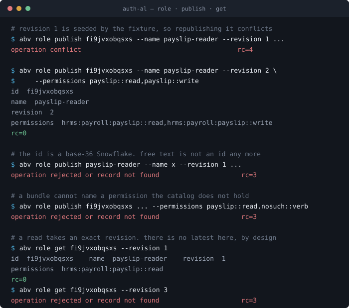
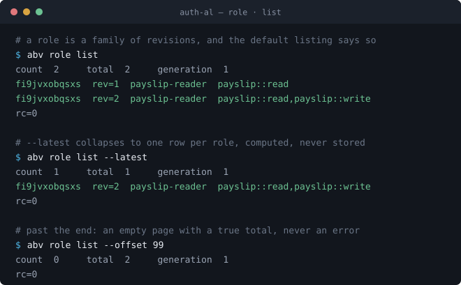
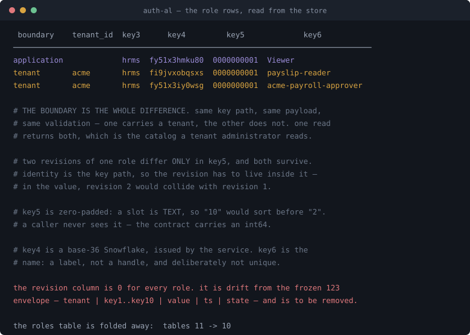

# `abv.role` — canonical record

What a role is, the functions that operate on it, how it is stored, and where it
is consulted.

**Implemented.** Behaviour marked *implemented* is read from
`implementation/abv`. Mirrors `30-record-permission.md` and `30-record-scope.md`,
both merged.

---

## 0 · What is already approved, and what is not

This record is different from the two before it: a publication path **already
exists in the code**, so the question is not what to design but what to accept.
The handbook draws the line precisely.

| | Status | Source |
|---|---|---|
| The role **content shape** — `id`, `revision`, `permissions[]` | **approved** | Q-118, `docs/role-grant-contract.md`: *"Existing approved role-revision shape"* |
| The role **reference** in grant content — `role_id` + `role_revision` | **approved** | Q-118 |
| One permission source per grant revision — direct **or** role pair, never both | **approved** | Q-118 |
| A role revision is **immutable bundle content** | **approved** | `theory/02-authority-and-boundaries.md` |
| The **operations** — read, list, the publication contract's details | **pending** | P-04 excludes *"complete CRUD/error schemas"* |

The handbook's warning —

> The role reference is approved; the full standalone role-publication schema
> remains pending. **Do not invent that schema merely because a role is
> referenced here.**

— is about the operations, not the content. The content shape is published:

```json
{
  "version": "1",
  "id": "R-PAYROLL-READER",
  "revision": 1,
  "permissions": ["hrms:payroll:payslip::read"]
}
```

**So `RoleContent{ID, Revision, Permissions}` in the code is not an invention.**
It mirrors the approved shape, minus `version`, which `domain/records.go` marks as
an internal projection rather than a wire contract. That is the same position the
permission record was in before its contract: registration existed and was
approved, and the reads were the proposal.

---

## 1 · Canonical definition

> A **role** is a reusable permission bundle. A **role revision** identifies
> immutable bundle content. It says *which operations travel together* — never who
> holds them, and never what they are bounded to.

A role does not identify recipients, confer membership, or replace a grant's
scope. A grant adopting a role names both `role_id` and `role_revision`, and
there is **no implicit latest-role fallback**.

### The bundle is one record, not one per permission

This is the shape decision, and two things settle it.

**The handbook settles it directly.** A `role_revision` names *immutable bundle
content* — one published object, selected whole. The approved JSON carries
`permissions` as a list inside a single record. Split across rows and a reader
mid-publication can see half a bundle, which would break the handbook's own
counterexample:

> Publishing a role revision that adds write must not silently give write to
> assignments adopting this unchanged reader grant.

That guarantee needs the revision to be indivisible.

**The envelope forbids the alternative anyway.** With the role id in `key4`, only
`key5`…`key10` remain — six slots. A permission identifier needs up to eight of
its own, seven nouns plus the verb. It does not fit, so a per-permission row
would have to collapse the identifier into one string in one slot, which is
exactly the lexical-versus-structural problem the permission layout exists to
avoid.

**What this gives up, stated plainly.** The reverse query — *which roles grant
`hrms:payroll::delete`?* — becomes a bounded scan of the tenant's role records
rather than an index hit, and that is a real audit question. It is the same trade
already accepted for the verb in `key10`, which is not left-anchored either.
Consistent with a decision already made, not a new concession.

### Canonical JSON — the approved wire form

This is what a role revision **is**, independent of any database. A real bundle,
not a one-line example:

```json
{
  "version": "1",
  "id": "fi8c8111kow0",
  "name": "R-PAYROLL-ADMIN",
  "revision": 3,
  "permissions": [
    "hrms:payroll:payslip::read",
    "hrms:payroll:payslip::write",
    "hrms:payroll:payslip::delete",
    "hrms:payroll:run::execute",
    "hrms:payroll:run::approve",
    "hrms:employee:certificate::read",
    "hrms:employee:bank-account::read"
  ]
}
```

Seven permissions, one record. The handbook publishes `version`, `id`, `revision`
and `permissions` as *"Existing approved role-revision shape"* under Q-118.
**`name` is our addition**, not the handbook's — it exists because a generated id
is unreadable, and it is flagged as ours wherever it appears.

| Field | | |
|---|---|---|
| `version` | `"1"` | The format these rules interpret. A missing or unsupported version is **never guessed**. |
| `id` | `fi8c8111kow0` | Base-36 Snowflake. Names the bundle, stable across revisions, never renamed. |
| `name` | `R-PAYROLL-ADMIN` | The human label. Editable, **not unique**, and never an identifier. |
| `revision` | `3` | Names *this* content. Immutable once published; a new bundle is a new number. |
| `permissions` | seven identifiers | The bundle itself. One or more registered, active identifiers, no duplicates. |

Notice the list spans two different noun paths — `payroll` and `employee` — and
mixes depths and verbs freely. **A role bundles across the catalog; it is not a
subtree.** Nothing requires the members to share a prefix, and a shared prefix
would confer nothing if they did.

**What is deliberately *not* in the JSON:** the tenant and the application. Those
are the record's **address**, not its content — they say where the role lives, and
the operation already carries them in its `Area`. Putting them in the payload
would let a document claim an address different from the one it was written to.
The same reasoning keeps a recipient out: a role is a bundle, not a holding.

Also absent: no `active` flag, no validity window, no scope. A role revision is
immutable content, so there is no live state to carry; boundaries belong to the
grant that adopts it.

### The `id` is a base-36 Snowflake — settled

**Decided.** A record id is a Snowflake, rendered base 36.

```
2040983371680583680   the Snowflake, as agentlabs-auth generates it
fi8c8111kow0          base 36 — 12 characters, 13 at the int64 ceiling
```

| | |
|---|---|
| **Why Snowflake** | `agentlabs-auth` already generates them — `go-common/id` over `bwmarrin/snowflake`, 64-bit, time-sortable, node id from a reserved per-service block. Auth-AL adopting the same generator means one id scheme across the service, not two. |
| **Why base 36** | 12–13 characters against 19 for the decimal `NewString()` emits, and the whole alphabet is URL- and path-safe. Base 32 is the same length; base 36 keeps every digit and letter meaningful. |
| **Why not free text** | `Payroll-Admin` and `payroll-admin` were two roles that read as one. A generated id has no such ambiguity, and never needs renaming. |

Note this **supersedes P-04's silence rather than contradicting it**: P-04 declines
to approve an ID syntax, so this is Auth-AL's own choice, made for adoption
alignment. Record it as a decision of ours, not as a handbook rule.

### Id and name are both stored, and both queryable

A generated id is unreadable, so the human name is stored beside it rather than
inside it:

| Slot | Holds | Example |
|---|---|---|
| `key4` | **the id** — base-36 Snowflake | `fi8c8111kow0` |
| `key5` | **the name** — human-chosen, free text | `R-PAYROLL-ADMIN` |

| Query | Cost |
|---|---|
| by **id** | index hit — left-anchored on the identity key |
| by **name** | bounded scan of that tenant's roles — `key5` without `key4` is not left-anchored |

Both work. They are not equally cheap, and that is fine for the same reason the
verb sits in `key10`: lookup by name is the interactive question, and a tenant
holds few roles.

**The name is not unique, deliberately.** The primary key carries the id, so two
roles may share a name. A partial unique index (`... WHERE key2 = 'role'`) could
enforce one, but it would be a per-record-type constraint on a shared envelope —
which is exactly what one canonical store exists to avoid. So the name is a
**label, not a handle**: a lookup by name may return more than one row, and a
caller that needs exactly one uses the id.

### What a revision actually means

Two revisions of one role, both live, both stored:

```json
{ "version": "1", "id": "fi9jvxobqsxs", "name": "R-PAYROLL-READER", "revision": 1,
  "permissions": [
    "hrms:payroll:payslip::read",
    "hrms:payroll:run::read"
  ] }
```

```json
{ "version": "1", "id": "fi9jvxobqsxs", "name": "R-PAYROLL-READER", "revision": 2,
  "permissions": [
    "hrms:payroll:payslip::read",
    "hrms:payroll:payslip::write",     ← added
    "hrms:payroll:run::read"
  ] }
```

Revision 1 is **not rewritten**. Both rows exist, and a grant that adopted
`(fi9jvxobqsxs, 1)` keeps resolving to two read permissions forever — it does
not acquire `write` because someone published revision 2. That is the handbook's
counterexample, made concrete:

> Publishing a role revision that adds write must not silently give write to
> assignments adopting this unchanged reader grant.

It holds because there is **no implicit latest-role fallback**: a grant names
`role_id` *and* `role_revision`, and adoption of revision 2 is a deliberate act.

### Canonical JSON ↔ the stored row

The JSON is the contract; the row is the storage. Neither is derived by string
surgery — the wrapper maps field to column and back:

```
      canonical JSON                      the L1 record
─────────────────────────────      ─────────────────────────────
  (the operation's Area)      ──▶   boundary       = tenant
                                    tenant_id      = acme
                                    application_id = hrms
                              ──▶   key1           = abv
                              ──▶   key2           = role
                                    key3           = hrms
  "id":          "fi8c8111kow0" ▶   key4           = fi8c8111kow0
  "revision":    3            ──▶   key5           = 0000000003
  "name":        "R-…ADMIN"   ──▶   key6           = R-PAYROLL-ADMIN
  "permissions": [ 7 items ]  ──▶   value          = {"permissions":[ … ]}
  "version":     "1"          ──▶   (nowhere yet — see below)
```

And the two reader revisions, as rows — same everything, different `revision`:

```
boundary tenant app  key1 key2 key3 key4          key5        key6              value
──────────────────────────────────────────────────────────────────────────────────────────────
tenant   acme   hrms abv  role hrms fi8c8111kow0  0000000003  R-PAYROLL-ADMIN   {"permissions":[7]}
tenant   acme   hrms abv  role hrms fi9jvxobqsxs  0000000001  R-PAYROLL-READER  {"permissions":[2]}
tenant   acme   hrms abv  role hrms fi9jvxobqsxs  0000000002  R-PAYROLL-READER  {"permissions":[3]}
```

**Two things to notice.** The identity fields climb *out* of the payload into key
slots, where they can be queried structurally — and `permissions`, which is never
queried structurally, stays in the value as the list it already is. That split is
the whole point of the envelope.

The second: the revision is a **key slot**, not a column beside the key. That is
what makes both reader revisions coexist — identical in every other slot, distinct
in `key5`, so `UNIQUE(tenant, key1…key10)` admits both.

> **Open — where does `version` live?** It is part of the approved JSON and has
> nowhere to go in the row: the envelope has no version column, and
> `abv_metadata.schema_version` versions the *schema*, not a record's format.
> Three options — carry it inside the value alongside `permissions`, add an
> envelope column for every record type, or treat it as a wire-only field the
> codec adds on the way out and strips on the way in. The third is cheapest and
> matches how the permission identifier is already handled, but it means a stored
> row cannot say which format wrote it. **Needs deciding**, and every record type
> that gets a canonical JSON inherits the answer.

### The complete canonical path

```
abv.role:hrms:fi8c8111kow0 @ revision 3
└┬┘ └┬─┘ └─┬┘ └─────┬──────┘      └─┬─┘
 │   │     │        └─ the role id · key4
 │   │     └────────── the application · key3
 │   └──────────────── record type · key2
 └──────────────────── domain namespace · key1
                                             └─ the revision column,
                                                not a key slot
```

The path carries the **id**, not the name — the id is what never changes. The
name rides in `key5` and is rendered separately when a human needs it:

```
abv.role:hrms:fi8c8111kow0 @ revision 3     "R-PAYROLL-ADMIN"
```

A role id is a **single flat token**, like a scope key — it occupies `key4` whole,
the name takes `key5`, and `key6`…`key10` stay empty.

### Canonical key layout

| Slot | Holds | Example |
|---|---|---|
| `key1` | domain namespace | `abv` |
| `key2` | record type | `role` |
| `key3` | the application, from `application_id` | `hrms` |
| `key4` | the role id — base-36 Snowflake | `fi8c8111kow0` |
| `key5` | **the revision**, zero-padded | `0000000003` |
| `key6` | the name — human label, **not unique** | `R-PAYROLL-ADMIN` |
| `key7` … `key10` | unused → `''` | `''` |

**The revision is a key slot, not a column.** The frozen 123 envelope is
`tenant | key1…key10 | value | ts | state` — there is no revision column, and the
payroll lab keeps its revisions inside `value`, reaching them with
`json_extract`.

Here a slot is not merely allowed, it is **required**. Record identity is
`UNIQUE(tenant, key1…key10)`. Two revisions of one role must be two rows, so the
revision has to be part of the key — put it in `value` and revision 2 collides
with revision 1 on an identical key.

> **Zero-padded, because a key slot is TEXT.** `"10" < "2"` lexically, so a bare
> number would order and range-scan wrongly. Ten digits covers any plausible
> revision count and keeps `ORDER BY key5` equal to numeric order. The codec pads
> on the way in and strips on the way out, the same single-entrance rule the
> permission identifier follows.

`key3` is written from `application_id`, the way a scope record writes it, rather
than inherited from a caller-supplied string. PR #3 recorded that `key3` is *not*
uniformly the application across record types; for a new record type we choose,
and choosing `application_id` is the consistent choice.

### Three dormant mechanisms this record is the first to use

| | Why it matters |
|---|---|
| **`boundary = 'tenant'`** | Declared in the schema's CHECK constraint and written by nothing. Permission and scope are both application-scoped with `tenant_id = ''`. A role is the first record with a real tenant. |
| **a revisioned identity** | Permission and scope have none. A role's identity *includes* its revision, so `key5` carries it and two revisions coexist as two rows. |
| **A cross-record-type reference** | A role names permissions, so publication validates against the permission catalog. Nothing has crossed record types before. |

Getting these three right here is the point of doing roles before grants and
assignments, which need all three plus lineage and validity.

### Worked example

```
fi9jvxobqsxs "R-PAYROLL-READER", revision 1, in tenant acme

boundary        = tenant           ← the first record that is not application-wide
tenant_id       = acme
application_id  = hrms
key1            = abv
key2            = role
key3            = hrms
key4            = fi9jvxobqsxs     ← base-36 Snowflake, never renamed
key5            = 0000000001       ← the revision, zero-padded, in a slot
key6            = R-PAYROLL-READER ← the label, editable, not unique
key7 … key10    = ''
value           = {"permissions": ["hrms:payroll:payslip::read", "hrms:payroll:run::read"]}
state           = enabled
```

**The payload carries the bundle.** Unlike a scope (`{}`) or a permission
(`{"active": true}`), a role's value is the substance of the record — which is
what makes the revision meaningful.

### Where it lives — both, and the boundary says which

**Settled: a role is either the application's or a tenant's, and both exist.**

| | Who owns it | The record |
|---|---|---|
| **application-managed** | the application ships it to every tenant, as it ships permissions and scope keys | no tenant — `boundary = application` |
| **tenant-managed** | a tenant composed it from the application's vocabulary | its tenant — `boundary = tenant` |

The reasoning is the distinction the whole domain turns on. **Permission and
scope are vocabulary** — what words exist, what dimensions may bound. They change
when the *software* changes, and Q-123 already gives one catalog per application.
**A role is a composition** — which words travel together. Acme's payroll approver
is not Globex's, even though both are built from one vocabulary. That is a
customer decision.

But an application also ships standard bundles — *Viewer*, *Admin* — and under
pure tenant scoping it could not: every tenant would recreate them by hand with
no way to say *this is the standard one*. So both exist.

**The envelope gives this for free.** Same key path, same payload, same
validation; the only difference is whether the record carries a tenant. One read
returns both, which is what a tenant administrator wants: the shipped roles
alongside its own.

**They coexist and never shadow.** Each has its own issued id, and a grant adopts
an exact id and revision, so there is nothing to resolve between them. A tenant
that outgrows a shipped role composes its own; the shipped one does not
disappear, and is not overridden. Shadowing by name would need precedence rules,
which nothing in the handbook backs — coexistence needs none.

**A tenant may not revise a shipped role.** `PublishRole` refuses an id that names
an application role: it is the application's property. The safety that makes all
of this sound is that a tenant's role can only name permissions the application
registered — **the tenant composes, it cannot invent**.

It is **not** authority, **not** a boundary, **not** a recipient, and — per
revision — **not** mutable.

---

## 2 · The contract

**Three functions.** One exists; two are the proposal.

```go
PublishRole           (ctx, area, identity, proposed)  (RoleContent, error)  // tenant composes
PublishApplicationRole(ctx, app,  identity, proposed)  (RoleContent, error)  // application ships
GetRole               (ctx, area, identity, id, rev)   (RoleContent, error)
ListRoles             (ctx, area, identity, filter)    (RolePage, error)
```

**Two publication paths, because two authorities.** Shipping a role is the
application platform acting; composing one is a tenant administrator acting. The
record, the storage and the validation are identical — only the boundary and the
gate change. One function taking a sometimes-empty tenant would let a caller
publish application-wide by accident.

The reads are `Area`-scoped and return **both kinds**, each labelled, because
that is the catalog a tenant administrator actually reads.

```go
type RoleContent struct {
    ID          string   // base-36 Snowflake
    Name        string   // human label, not unique
    Revision    int64    // an int64 here; rendered zero-padded into key5
    Permissions []string       // the bundle, in canonical identifier form
    Managed     RoleManagement // application or tenant — derived, never supplied
}
```

**Every function returns whole records, never handles.** A caller never receives
an id it must resolve with a second call, and never a partial record it must
complete. The permission and scope contracts hold the same property, and it is
what lets a UI render a result without a follow-up round trip.

**`Area`-scoped, not `Application`-scoped** — the first record whose operations
take a tenant. Identity on every call including reads, and self-contained
returns, exactly as the two earlier contracts hold.

Shared errors: `ErrMalformed` shape · `ErrUnsupported` identity or provider ·
`ErrRejected` a failed rule · `ErrConflict` this revision exists · `ErrNotFound`
missing read.

### 2.1 · `PublishRole` *(implemented)*

The only way a role revision comes into existence. Add-only per
`(id, revision)` — a published revision is never rewritten.

| Parameter | |
|---|---|
| `area` | tenant **and** application |
| `identity` | acting human; version `"1"`, actor type `user`, actor id = human id |
| `proposed.ID` | **empty for a new role** — the service issues one. Non-empty means a new revision of that role, and it must already exist. |
| `proposed.Revision` | `> 0` |
| `proposed.Permissions` | non-empty, no duplicates, no `*`, **each registered and active** |

```go
area, _ := domain.NewArea("acme", "hrms")
role := domain.RoleContent{
    ID:          "R-PAYROLL-READER",
    Revision:    1,
    Permissions: []string{"hrms:payroll:payslip::read"},
}

f.PublishRole(ctx, area, identity, role)
```

Validated twice, deliberately: once against the snapshot in `mutation`, then
again inside the transaction in `update.go` against the authoritative snapshot, so
a catalog change racing the publication cannot slip a retired permission into a
bundle. Any failure writes nothing.

### The id is issued, never accepted

A caller does not choose an identifier. `PublishRole` reads `proposed.ID` as a
mode rather than a value:

| `proposed.ID` | Means | If wrong |
|---|---|---|
| empty | a **new role** — the service issues a base-36 Snowflake and returns it | — |
| an id that exists | a **new revision** of that role | `ErrConflict` if that revision is published |
| an id that does not exist | nothing — a caller inventing an identifier | `ErrNotFound` |

**There are exactly two ways to hold an id: be issued one, or name one that was
issued earlier.** A caller-supplied id would let anything into the key path, which
is precisely what generating ids exists to prevent — and it would put back the
ambiguity free text had.

The generator is a seam, like the clock: `NewWithIDs` takes one, and `New`
defaults to node 0, which is right for a single process and wrong for a fleet.
Production supplies a generator whose node id comes from its own reserved block,
the way `agentlabs-auth` already does.

> **A policy gate cannot pin a generated id.** Gate 1 runs on the proposal, and a
> new role's id does not exist until the service issues it. A gate that keyed on
> an id could only ever admit roles that already existed. It judges the name, the
> bundle and the publisher instead — the things a proposal actually carries.

**Returns — `(RoleContent, error)`**

On success, **the published revision exactly as stored**, permission slice cloned
so the caller cannot reach back into what was written:

```
RoleContent{
    ID:          "fi8c8111kow0",
    Name:        "R-PAYROLL-ADMIN",
    Revision:    3,
    Permissions: [7 identifiers, in the order given],
}
```

It echoes rather than transforms — nothing is defaulted, reordered or
deduplicated on the way through, so what comes back is exactly what a later
`GetRole` returns.

On failure, **the zero `RoleContent` and one error**, never a partial record:

| Error | When |
|---|---|
| `ErrMalformed` | blank or non-UTF-8 id, `*` in the id, revision `<= 0`, empty or duplicated permission list |
| `ErrUnsupported` | identity is not a direct human, or the provider/administration seam is absent |
| `ErrRejected` | Gate 1 denied, the area does not match the catalog, or a permission is unregistered or retired |
| `ErrConflict` | this exact `(id, revision)` is already published — publication is add-only |
| context errors | cancellation or deadline, checked before and inside the transaction |

**An error is never a denial of authority**, and nothing is written on any of them.

> **Worth noting — `Permissions` is cloned three times** on the way through
> (`mutation/role.go` lines 26, 41, 52). The caller's slice is never retained and
> the administration callback gets its own copy, so a Gate 1 implementation cannot
> mutate what is about to be written. That is deliberate and worth keeping.

### 2.2 · `GetRole` *(proposed)*

Typed read of one exact `(id, revision)` pair. No latest-revision fallback —
Q-118 is explicit that none exists, and a read that invented one would be the
first place it appeared.

```go
role, err := f.GetRole(ctx, area, identity, "fi9jvxobqsxs", 1)
```

**Returns — `(RoleContent, error)`**

One complete revision. The whole bundle, not a summary and not a count:

```
RoleContent{
    ID:          "fi9jvxobqsxs",
    Name:        "R-PAYROLL-READER",
    Revision:    1,
    Permissions: ["hrms:payroll:payslip::read", "hrms:payroll:run::read"],
}
```

The revision comes back as the **int64 the contract uses**, not the zero-padded
`0000000001` the slot holds — padding is a storage rendering the codec strips on
the way out, and a caller never sees it.

**Permissions are returned as published**, in order, and are *not* re-filtered
against the catalog. A permission retired after publication still appears here:
the record is what it is, and whether it still resolves is `CheckContent`'s
question at evaluation, not this read's. Hiding it would make the stored record
unreadable and quietly misreport history.

On failure:

| Error | When |
|---|---|
| `ErrMalformed` | blank or non-UTF-8 id, `*` in the id, revision `<= 0` |
| `ErrNotFound` | that `(id, revision)` pair was never published |
| `ErrUnsupported` | identity is not a direct human, or the seam is absent |
| `ErrRejected` | Gate 1 denied the read, or the area does not match the catalog |

`ErrMalformed` versus `ErrNotFound` is a real distinction to an administrator:
the first says *that could never be a role*, the second says *not that one*.

**There is no read path today.** You can publish a role and cannot read one back
through any typed operation — the same gap the permission record had before PR #1,
and the one that made `Inspect` the only way in.

> **`GetRole` always requires a revision.** A caller wanting the newest bundle
> uses `ListRoles` with `Revisions: LatestRevision`, which is administrative and
> explicit. Keeping the typed single read exact is what stops an implicit
> latest-role fallback appearing by accident on the path adoption uses.

### 2.3 · `ListRoles` *(proposed)*

```go
type RoleFilter struct {
    ID        string          // exact role id; empty lists every role
    Name      string          // exact name; not unique, so may select several
    Revisions Revisions       // AllRevisions (default) | LatestRevision
    Managed   *RoleManagement // nil returns both kinds
    Offset    int
    Limit     int             // server caps it
}

type Revisions int
const (
    AllRevisions   Revisions = iota // every revision of every selected role
    LatestRevision                  // the highest revision of each, one row per role
)

type RolePage struct {
    Roles      []domain.RoleContent // ordered by id, then revision
    Total      int
    Generation int64
}
```

**A role is a family of revisions, and the listing says so by default.** Asking
for a role returns *all* of its revisions, newest last, because that is the
history an administrator is looking at:

```go
// every revision of every role in the tenant
f.ListRoles(ctx, area, identity, domain.RoleFilter{Limit: 100})

// one role's full history
f.ListRoles(ctx, area, identity, domain.RoleFilter{ID: "fi9jvxobqsxs"})
//   fi9jvxobqsxs  rev 1   2 permissions
//   fi9jvxobqsxs  rev 2   3 permissions

// the current state of the catalog — one row per role
f.ListRoles(ctx, area, identity, domain.RoleFilter{Revisions: domain.LatestRevision})
//   fi8c8111kow0  rev 3   R-PAYROLL-ADMIN
//   fi9jvxobqsxs  rev 2   R-PAYROLL-READER

// by name — which may select more than one role, each with its revisions
f.ListRoles(ctx, area, identity, domain.RoleFilter{Name: "R-PAYROLL-READER"})
```

`AllRevisions` is the default deliberately: it is the honest shape of the record,
and a caller that wants a summary asks for one. The reverse default would hide
history behind a flag nobody sets.

**`LatestRevision` is computed, never stored.** It is `MAX(key5)` per `key4` —
and it works as a plain string comparison precisely because the revision is
zero-padded in its slot. No "is latest" column exists, so nothing can go stale.

> **`LatestRevision` is administrative, and must never reach adoption.** Q-118
> forbids an implicit latest-role fallback: a grant names `role_id` **and**
> `role_revision`, and adopting a newer bundle is a deliberate act. This selector
> answers *"what does the catalog look like now"* for a human reading it. It is
> not a resolution path, nothing in evaluation calls it, and `GetRole` still
> requires an exact revision — which is what keeps the rule intact.

**`Total` follows the selector.** Under `AllRevisions` it counts rows; under
`LatestRevision` it counts roles. Otherwise a reader could not compute the page
count for what they actually asked for.

`ID` and `Name` are **exact matches, not prefixes** — both are flat tokens, so a
prefix would be a string match inside one slot, the reasoning that gave the scope
filter no prefix either. Supplying both narrows to roles matching each.

**Returns — `(RolePage, error)`**

One bounded page, plus the two numbers that make it navigable:

| Field | | |
|---|---|---|
| `Roles` | `[]RoleContent` | **Complete records**, not summaries — each carries its full permission list, so rendering a page needs no follow-up call. Ordered by id, then revision ascending. |
| `Total` | `int` | Every match, not this page. Counts **rows** under `AllRevisions`, **roles** under `LatestRevision`, so the page count is right for what was asked. |
| `Generation` | `int64` | The catalog version at read time. Unchanged across two reads means nothing moved between them. |

```
ListRoles{ID: "fi9jvxobqsxs"}  ->

  Total       2
  Generation  14
  Roles[0]    fi9jvxobqsxs  rev 1  R-PAYROLL-READER  [payslip::read, run::read]
  Roles[1]    fi9jvxobqsxs  rev 2  R-PAYROLL-READER  [payslip::read, payslip::write, run::read]
```

```
ListRoles{Revisions: LatestRevision}  ->

  Total       2                  <- roles, not rows
  Generation  14
  Roles[0]    fi8c8111kow0  rev 3  R-PAYROLL-ADMIN   [7 identifiers]
  Roles[1]    fi9jvxobqsxs  rev 2  R-PAYROLL-READER  [3 identifiers]
```

**An empty result is an empty page, not an error.** `Roles` is an empty slice —
never nil — and `Total` still reports the true count, so a caller that paged past
the end sees `Total 2, Roles []` and knows it overshot rather than that nothing
exists.

On failure, **the zero `RolePage` and one error**:

| Error | When |
|---|---|
| `ErrMalformed` | negative offset, negative limit, or a limit above the server cap |
| `ErrUnsupported` | identity is not a direct human, or the seam is absent |
| `ErrRejected` | Gate 1 denied the read, or the area does not match the catalog |

No `ErrNotFound`: a filter matching nothing is an empty page, because a listing
asks *what is there*, and the answer *nothing* is a valid one.

**Absent:** wildcards, expressions, any ordering but id-then-revision, unbounded
results. A listing matching nothing returns an empty page, never a fallback.

### Not in this contract

**No status operation.** A published revision is immutable, so retirement cannot
apply to one. Retiring a *role* as a whole would not affect grants either, since
every grant pins an exact revision — so there is nothing for a flag to do.
Consistent with scope, which also has none.

**No update, no delete.** A new bundle is a new revision; that is what revisions
are for.

**`Inspect` is excluded**, for the reasons the permission document gives.

---

## 3 · Storage

Today: `roles(tenant_id, application_id, role_id, revision, permissions_json)`,
primary key `(tenant_id, application_id, role_id, revision)`, foreign key to
`installations`. Permissions are a JSON array blob.

The fold preserves that exactly — the payload keeps the same list, in the same
form, under a `permissions` key:

```sql
-- fetch one revision: every slot constrained, a unique hit
get     boundary = 'tenant' AND tenant_id = $1
        AND application_id = $2
        AND key1 = 'abv' AND key2 = 'role'
        AND key3 = $2 AND key4 = $3        -- the id
        AND key5 = $4                      -- the revision, zero-padded

-- one role's revision history, by id
list    ... AND key4 = $3  ORDER BY key5

-- by name: reachable, but key5 without key4 is not left-anchored,
-- so this scans the tenant's roles. May return more than one role.
byname  ... AND key1 = 'abv' AND key2 = 'role' AND key6 = $3
        ORDER BY key4, key5

-- every role in a tenant's installation
        ... AND key1 = 'abv' AND key2 = 'role'
        ORDER BY key4, revision
```

All three are left-anchored on the identity key, so none needs an index of its
own. The fold takes the table count from **11 to 10**, and takes the foreign key
to `installations` with it.

> **Open — the installation foreign key.** `roles` currently cannot reference a
> tenant/application pair that has no installation, because the database enforces
> it. A composite key in `abv_l1_records` cannot carry that constraint, so the
> check moves into validation — which is the same loss `00-open-questions.md`
> already records for installations generally. It becomes invisible *and*
> unenforced together unless publication checks it explicitly.

---

## 4 · Where it is consulted

A role is never consulted directly by evaluation. It is consulted as a
**permission source**, at five points:

| | Point | What it does |
|---|---|---|
| ① | `selectedPermissions` | Resolves a grant revision's permission source: explicit `permissions`, or the `(role_id, role_revision)` pair. Never both — the codec rejects a mixed source, including a lone stray `role_revision`. |
| ② | `CheckContent` | The adopted role's permissions are each registered **and active** — re-checked at resolution, so a permission retired after publication stops the route. |
| ③ | `Narrow` | A child grant adopting a role has the **role's** permissions checked against the parent's. Adopting a role can never introduce one the parent lacks. |
| ④ | `rootRoute` | A root's permissions are computed as every active permission, and the role fields are **cleared** (`computed.RoleID, computed.RoleRevision = "", 0`) — a root does not adopt a bundle. |
| ⑤ | `PublishRole` | Publication itself validates every permission in the bundle, so a bundle cannot be published naming something unregistered. |

② together with ⑤ is the pair that makes the handbook's counterexample hold:
publication validates the bundle as it was, and resolution revalidates it as it
is, while the stored revision never changes.

---

## 5 · Open questions

1. ~~**Is a role tenant-scoped or application-scoped?**~~ **Settled: both.** The
   application ships roles the way it ships permissions; a tenant composes its
   own. The boundary says which, they coexist without shadowing, and a tenant
   cannot revise a shipped role. See *Where it lives*.
2. **Revision monotonicity.** The revision is caller-supplied and nothing requires
   it to follow the previous one — publishing revision 7 with no 1–6 succeeds.
   Grant contents have the same freedom. Deliberate, or an accident to close?
3. **`Generation` spans both kinds.** A role listing returns shipped and composed
   roles together, so its generation must move when either changes. One
   per-application counter does that correctly and over-invalidates: one tenant's
   publication invalidates every tenant's cached view. Over-invalidation costs a
   retry where the alternative costs a missed row, so it is wrong in the cheap
   direction. Narrowing it means a per-installation counter that an
   application-role write must still touch — worth doing when the cost shows up,
   not before.
4. ~~**Latest-revision reads.**~~ **Settled:** `ListRoles` takes a `Revisions`
   selector — `AllRevisions` by default, `LatestRevision` on request. Computed as
   `MAX(key5)` per `key4`, never stored, administrative only. `GetRole` still
   requires an exact revision, which keeps Q-118's no-implicit-fallback rule
   intact.
5. **The installation foreign key**, lost to the fold, as above.
6. **`state` versus the value payload.** A permission carries `{"active": true}`
   in its value while the envelope has a `state` column doing the same job. Roles
   inherit the inconsistency without resolving it. Worth settling once, for every
   record type, rather than per record.
7. ~~**Envelope drift.**~~ **Confirmed drift, to be corrected** — see §6. Not an
   open question.
8. **Where `version` lives.** Part of the approved JSON, with no column to go in.
   Wire-only, in the value, or a new envelope column — every record type that gets
   a canonical JSON inherits the answer.
9. ~~**Id grammar.**~~ **Settled: a base-36 Snowflake**, with the human name
   stored beside it in `key5` and explicitly not unique. Applies to every record
   type that needs a generated id. The generator is `agentlabs-auth`'s own
   (`go-common/id`), so the two services share one id scheme.

**Settled by us, in this document:** the id is a base-36 Snowflake; the name is a
separate, non-unique label in `key5`; a lookup by name may return more than one
row and a caller needing exactly one uses the id.

**Settled by the handbook, not open:** the content shape (`id`, `revision`,
`permissions[]`), one permission source per grant revision, immutability per
revision, no implicit latest-role fallback, and the bundle as one record.

---

## 6 · Correction note — envelope drift in `abv_l1_records`

**Confirmed: three columns drifted from the frozen 123 envelope.** The canonical
L1 shape, as the payroll lab holds it:

```sql
payroll_l1_records:  tenant | key1…key10 | value(JSON) | ts | state
```

`abv_l1_records` carries three columns beyond it:

| Column | Status | What to do |
|---|---|---|
| `revision` | **drift** | Remove. Roles put the revision in `key5`; permission and scope only ever write `0`. Nothing reads it for meaning. |
| `boundary` | **drift** | Remove. It encodes whether a record is tenant-scoped, which the tenant value already says — empty or not. |
| `application_id` | **drift** | Remove. It duplicates `key3`, which every record type already carries. |

**The columns are frozen. Structure belongs in the key path, not in new columns** —
that is the premise of one canonical record store, and a column per concern
rebuilds the per-record-type tables the fold exists to remove.

**Not fixed by this record's work.** Removing them touches the merged permission
and scope contracts, their storage layer and their tests, so it is its own change
with its own demonstration. Recorded here so the role work builds no further on
it: **roles use `key5` for the revision and write nothing to `revision`.**

Consequences to settle when the correction is made:

- `boundary` backs a CHECK constraint pairing it with `tenant_id`. Without it,
  *application-scoped means empty tenant* becomes a validation rule rather than a
  database one.
- `application_id` carries a foreign key to `applications`. A composite key
  cannot, so that check moves into validation — the same loss already recorded
  for installations.
- The identity index is rebuilt on `tenant | key1…key10` alone, which is the
  canonical shape and simpler than what is there now.

---

## 7 · Demonstrated

Real CLI output against a real SQLite store, captured in the session's sandbox
pane. Every read and write went through `abv`; nothing touched the tables. Layout
is reconstructed for legibility; no value is altered.







The third is the one to read closely. Two rows differ **only** in `key5`, and
both survive — which is what *identity is the key path* buys, and why the revision
could not have lived in the value. The `revision` column sits at `0` in both,
because roles write nothing to it: it is the drift §6 records.

```
14 packages green · race clean · vet clean · authmiddleware untouched
tables 11 -> 10   the roles table is folded away
```
