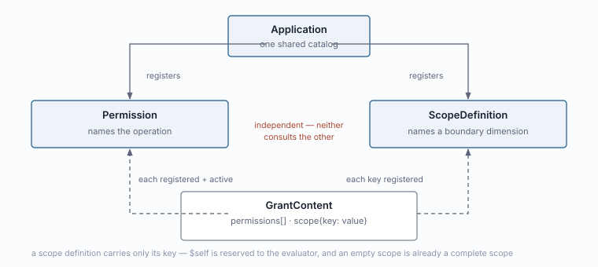
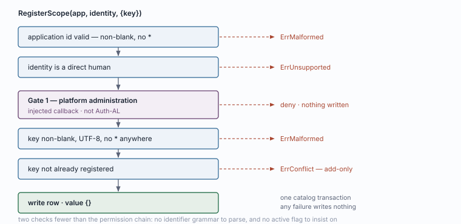
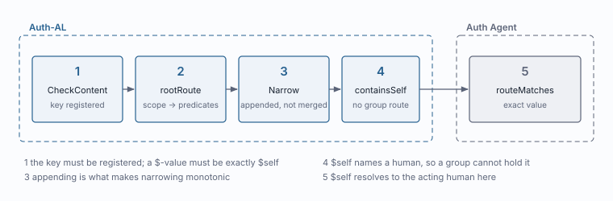
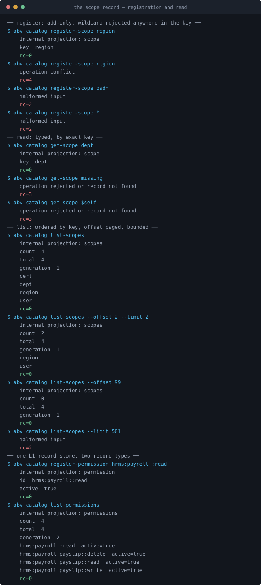
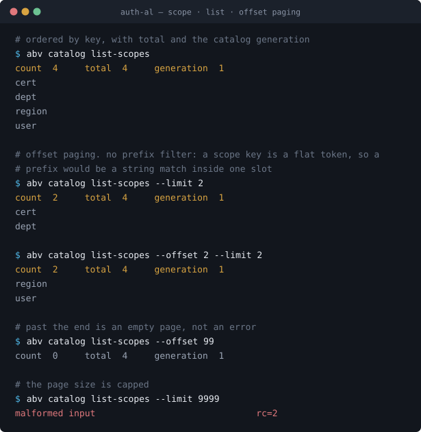
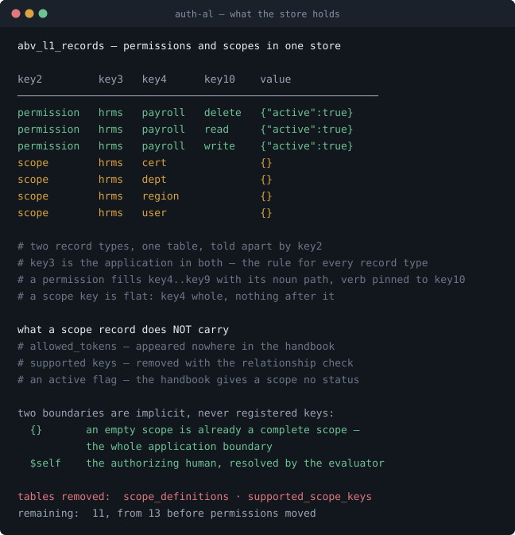

# `abv.scope` — canonical record

What a scope key is, the functions that operate on it, how it is stored, and
where it is consulted.

**Draft for review.** Behaviour marked *implemented* is read from
`implementation/abv`. Mirrors `record-permission.md`, which is merged.

---

## 1 · Canonical definition

> A **scope key** names a dimension along which authority can be bounded. It says
> *what kind of limit may be expressed* — never what the limit is, and never who
> is limited.

A grant's `{"dept": "FIN"}` is valid only because `dept` is registered here.
`FIN` is not, and never will be: **Auth-AL never enumerates domain values.** The
application owns what a department is and which records belong to one.

### Key

```
dept
region
```

A **single flat token**. Not a path, not hierarchical, no separators, no
wildcards — a key containing `*` is rejected outright, because evaluation matches
a key for equality and such a key could only mislead a reader into thinking it
covers more than itself.

### The complete canonical path

```
abv.scope:hrms:dept
└┬┘ └─┬─┘ └─┬┘ └┬─┘
 │    │     │    └─ the key · key4
 │    │     └────── the application · key3
 │    └──────────── record type · key2
 └───────────────── domain namespace · key1
```

`.` separates the domain namespace from the record type; `:` separates the
segments. There is no `::` — a scope key has no verb.

As with a permission, this string is a **rendering**, not a stored value. The row
holds the segments in their slots and the wrapper renders or parses at the
boundary, which is why there is no escaping.

### Canonical key layout

| Slot | Holds | Example |
|---|---|---|
| `key1` | domain namespace | `abv` |
| `key2` | record type | `scope` |
| `key3` | **the application** | `hrms` |
| `key4` | the key — whole, never split | `dept` |
| `key5` … `key10` | unused → `''` | `''` |

**For a scope, `key3` is the application** — written from `application_id`
directly, so it holds it by construction.

> **Not a cross-type guarantee.** A permission puts its *leading noun* in `key3`
> instead, and nothing checks that the noun is the application:
> `register-permission 'billing:invoice::read' --app hrms` is accepted and leaves
> `billing` in the slot. A reader who needs to know which application owns a row
> uses the `application_id` column, which is authoritative. See
> `record-permission.md` — whether to close that gap is open.

That duplicates `application_id`, and it is a deliberate choice: a canonical path
then renders complete on its own, with no column to consult and nothing to
reconstruct.

**Six slots stay empty.** A permission needs seven for its noun path; a scope key
needs one. Nothing is planned for the rest — leaving them empty is what keeps the
envelope one shape across record types.

### Worked example

```
dept

tenant_id       = ''               ← empty: shared by every tenant
key1            = abv
key2            = scope
key3            = hrms
key4            = dept
key5 … key10    = ''
value           = {}
state           = enabled
```

**The payload is `{}` — the record's presence is the entire fact.** A scope key
has no attributes: no allowed values, no active flag, no supported permissions.
The same shape as an installation row and a trusted-root row.

### The two implicit boundaries

Neither is ever a registered key. Both are named constants in `domain`, so the
rule lives in the code rather than in convention:

```
{}       an empty scope is already a complete scope — the whole application
         boundary, adding no local restriction
$self    the authorizing human, a reserved token the evaluator resolves at
         match time
```

`{}` needs no key because it is the absence of one. `$self` needs no key because
it is a **value**, and the only reserved one: any other `$`-prefixed value is
rejected wherever a grant's scope is validated. A key does not declare which
tokens may be used with it — the evaluator knows the one token there is.

### Where it lives

A scope definition belongs to an **application**, never a tenant. Under Q-123
there is one shared catalog per application. Registering a key gives every tenant
a new *dimension it may bound along*, never new access — the same property that
makes the permission catalog safe to extend.

It is **not** authority, **not** a value, **not** hierarchical, **not**
revisioned, and **not** deletable.

### Independent from permission



Two validation loops that never consult each other: a grant's permissions must
each be registered and active, its scope keys must each be registered. Neither
asks anything of the other. The single exception is section 5 — and it is now
absent by decision.

---

## 2 · The contract

**Three functions, not four.** A scope has no `active` flag, so there is no
status operation.

```go
RegisterScope(ctx, app, identity, definition)  (ScopeDefinition, error)
GetScope     (ctx, app, identity, key)         (ScopeDefinition, error)
ListScopes   (ctx, app, identity, filter)      (ScopePage, error)
```

```go
type ScopeDefinition struct {
    Key string
}
```

**No tenant argument anywhere** — a scope definition has no tenant dimension.
**Identity on every call, including reads**, so each function runs the injected
administrative check itself rather than assuming a caller did. **Returns are
self-contained** — the same three properties the permission contract holds.

Shared errors: `ErrMalformed` shape · `ErrUnsupported` identity or provider ·
`ErrRejected` a failed rule · `ErrConflict` key exists · `ErrNotFound` missing
read. An error is never a denial, and nothing writes on either.

### 2.1 · `RegisterScope` *(implemented)*

The only way a scope key comes into existence. Add-only.

| Parameter | |
|---|---|
| `app` | which application's catalog |
| `identity` | acting human; version `"1"`, actor type `user`, actor id = human id |
| `definition.Key` | non-blank, valid UTF-8, no `*` anywhere |

```go
app, _ := domain.NewApplication("hrms")
def := domain.ScopeDefinition{Key: "dept"}

f.RegisterScope(ctx, app, identity, def)
```



Validation and write share one transaction; any failure writes nothing. Gate 1 is
the injected application-platform check, not Auth-AL's. Re-registering is
`ErrConflict` — there is no update, and with a single field there is nothing an
update could change.

### 2.2 · `GetScope` *(implemented)*

Typed, application-scoped read of one key. No wildcard, no prefix.

```go
def, err := f.GetScope(ctx, app, identity, "dept")
// {Key: "dept"}
```

`ErrNotFound` for a key that was never registered, `ErrMalformed` for one that
could not be a key at all. The distinction matters to an administrator: the first
says *not yet*, the second says *never*.

> **`$self` and `{}` are not readable here, and should not be.** They are not
> records — `GetScope(ctx, app, identity, "$self")` is `ErrNotFound`, correctly.
> A caller asking what reserved tokens exist is asking about the evaluator, not
> about this application's catalog.

### 2.3 · `ListScopes` *(implemented)*

```go
type ScopeFilter struct {
    Offset int // rows to skip; ordering makes this stable
    Limit  int // server caps it at 500, defaults to 100
}

type ScopePage struct {
    Scopes     []domain.ScopeDefinition // ordered by key
    Total      int                      // every match, not this page
    Generation int64                    // the catalog's version at read time
}
```

**No prefix filter, and no active-only flag.** A scope key is flat, so a prefix
would be a lexical match inside one slot — the exact cost the permission key
layout exists to avoid. And there is no status to filter on. What is left is
paging, which is the same mechanism:

**Paging is by offset, not a cursor**, so a reader can jump to a page rather than
walk to it. `Total` is every match, so the page count is known up front.
`Generation` is the catalog's version at read time: read it before a walk and
again after, and unchanged means nothing moved between pages.

```go
f.ListScopes(ctx, app, identity, domain.ScopeFilter{Limit: 100})
f.ListScopes(ctx, app, identity, domain.ScopeFilter{Offset: 100, Limit: 100})
```

A scope catalog is a handful of keys per application rather than hundreds, so
paging here is for uniformity with the permission contract more than for volume.
Uniformity is worth it: one page shape, one generation rule, one thing for a UI
to implement.

**Absent:** wildcards, expressions, any sort order but key, unbounded results. A
listing past the end returns an empty page, never a fallback.

### Not in this contract

**No `SetScopeStatus`.** A permission has `active` and can be withdrawn; a scope
has no equivalent and nothing in the handbook grants one. Published grant content
references scope *keys*, so retiring a key would invalidate live grants rather
than merely stopping future evaluation — a stronger and less reversible effect
than permission retirement, which may be exactly why it does not exist. Left
absent until a case demands it.

**`Inspect` is excluded**, for the reasons the permission document gives: it is a
generic dispatcher over eight kinds, takes an `Area` requiring a tenant a scope
does not have, and cannot carry one fixed permission per endpoint.

Also absent: no update, no delete, no bulk register, and no accessor for allowed
tokens — there are none.

---

## 3 · Queries

The row is shown in section 1, and it is **live**: scopes are stored in
`abv_l1_records` today. `scope_definitions` is gone.

`tenant_id` is `''` rather than NULL for an application-scoped record. SQLite and
PostgreSQL both treat NULLs in a unique index as distinct, which would let
duplicate catalog rows coexist; an empty string is comparable, and an empty
tenant is itself the statement that the record is application-wide.

```sql
-- fetch one: every slot constrained, a unique hit
get     tenant_id = ''
        AND key1 = 'abv' AND key2 = 'scope'
        AND key3 = $1 AND key4 = $2

-- every scope key in an application
list    ... AND key1 = 'abv' AND key2 = 'scope' AND key3 = $1
        ORDER BY key4
```

Both are left-anchored on the identity index — `boundary, tenant_id,
application_id, key1, key2, key3, key4` is a strict prefix of it — so neither
needs an index of its own. There is no third query, because there is no third
way to ask.

**Nothing here is a string match.** That is the whole point of the layout: the
permission side had to earn it by decomposing an identifier across slots, and the
scope side gets it for free by being one token in one slot.

### Ordering and offset

Ordering is by `key4`, which is key order exactly. An offset past the end returns
an empty page rather than an error, so a reader that jumps beyond the last page
sees nothing instead of failing.

The cost profile is the permission one, and the bottleneck is the same: a full
catalog read from storage is **7.5 ms**, and every authority resolution performs
one. Scope keys ride in that same snapshot, so adding them to the L1 store
changed the number not at all — which is the useful measurement here.

---

## 4 · Where it is consulted



| | Point | What it checks |
|---|---|---|
| ① | `CheckContent` | Every key in a grant revision's scope is registered in the catalog. A `$`-prefixed **value** must be exactly `$self`; any other is rejected. |
| ② | `rootRoute` | A root grant's own scope becomes its route predicates, sorted by key. |
| ③ | `Narrow` | A child's scope entries are **appended** to the parent's predicates, never merged by key. |
| ④ | `containsSelf` | A grant whose scope uses `$self` cannot resolve through a **group**: the token names the authorizing human, and a group is not one. `ErrUnsupported`. |
| ⑤ | `routeMatches` *(Agent)* | The predicate's value must equal the request's material **exactly**, and `$self` is resolved to the acting human's id at this point and nowhere earlier. |

③ is the one worth dwelling on. Appending rather than merging is what makes
narrowing monotonic: two predicates on the same key both have to hold, so a child
can only ever add a constraint. A merge would let a child *replace* the parent's
value and widen its own authority — the child scope `{"dept": "ENG"}` under a
parent bounded to `FIN` yields a route that matches neither, which is correct, not
a bug.

⑤ is why Auth-AL never needs to know what a human's department is. It publishes
the boundary; the Agent compares it to the request material it already holds.

---

## 5 · Permission–scope relationship validation

The handbook records the feature and nothing else:

> An application explicitly declares whether permission/scope compatibility
> validation is enabled. The feature is optional; its mode is not guessed for
> individual grants. When enabled, every relevant grant must satisfy the declared
> support relationships.
> — `handbook/implementation/06-auth-service.md`

**How the support relationships are represented is not canonical.** Appendix P-11
lists *optional declared compatibility checking* as pending, so the
representation was left open deliberately.

**This change removes the prototype's invented shape, and the check that read
it.** `supported_scope_keys` held a per-permission list of which scope keys could
bound it. Moving scope into the record store would have taken that table's second
foreign key, leaving it holding two identifiers referencing nothing — but the
storage question is not why it went. A per-permission list of which boundary
*dimension is meaningful for which operation* is application domain knowledge,
and the handbook is explicit that a scope key has meaning "because the
application defines the department relationship, not because a generic grant
engine recognizes a familiar word."

Scope registration is what makes a key canonical, and a grant's scope key must be
registered — ① above. That check is mandatory and always on. The relationship
check was a second, stricter one that was optional, off by default, and used
nowhere: `CompatibilityEnabled: true` appeared exactly once in the repository, in
a conformance-test fixture.

**The feature is not deleted; its unapproved shape is.** Q-039 to Q-042 approve
relationship validation as an optional declared feature. `compatibility_enabled`
remains on the application record as the declared choice under Q-041, enforcing
nothing. What is gone is a representation nothing read.

`RegisterPermission` therefore no longer takes a `supportedKeys` argument, which
also removes an ordering dependency: scopes no longer have to be registered
before the permissions that named them.

> **Gap for the model, not for this record.** Q-042 requires the entire existing
> grant population to pass before the mode can be enabled — rejecting activation
> and reporting incompatibilities rather than rewriting or grandfathering. No
> operation does that. It belongs with the application record and the relationship
> contract, wherever P-11 settles it.

---

## 6 · Open questions

1. **P-11 — relationship representation.** The feature is canonical, its shape is
   not. Until it is decided, no scope-side field or record exists.
2. **Key grammar.** A scope key is checked for blankness, UTF-8 and `*`, and
   nothing else — `Dept`, `dept-id` and `dept id` are all accepted as distinct
   keys. Whether to constrain the character set, and whether matching is
   case-sensitive, is unsettled. Worth settling before keys are registered: a
   key is referenced by published grant content, so renaming one is not free.
3. **Scope evolution.** P-11 lists it as pending. Retirement is the obvious
   first question and section 2 recommends leaving it absent.

**Settled:** the payload is `{}` · `{}` and `$self` are implicit and never
registered keys · no prefix filter · no status operation · the contract is three
functions.

---

## 8 · Demonstrated

Real CLI output against a real SQLite store, captured after the contract was
built. Every value is real — written and read through the CLI, never by touching
the tables. Layout is reconstructed for legibility; no value is altered.







**A defect the first run found.** Registration rejected a key that was exactly
`*` but accepted one merely containing it, unlike the permission path. Fixed,
with `TestScopeRegistrationRejectsAnyWildcard`. Running the demo found it;
reading the code had not.

Read the third and the model is visible without the prose: one store, two record
types separated by `key2`, the application in `key3` for both. A permission
spreads its noun path from `key4` and pins its verb to `key10`; a scope key sits
in `key4` whole.

```
14 packages green · race clean · vet clean · authmiddleware untouched
tables 13 → 11   scope_definitions and supported_scope_keys both removed
```
