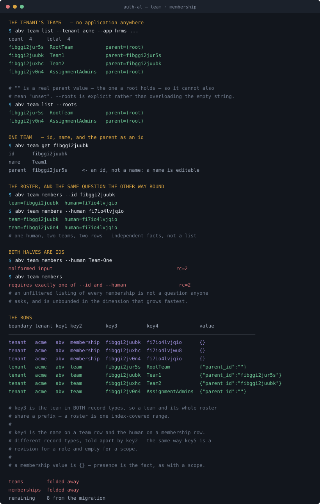
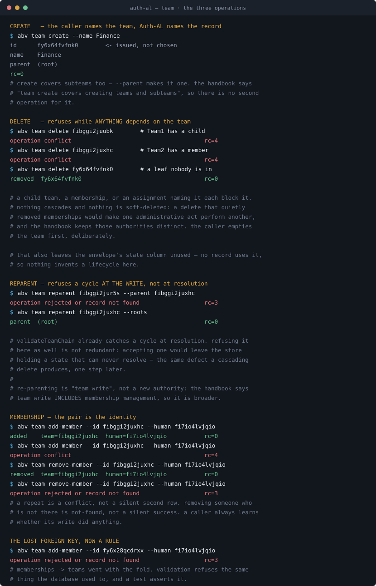

# `abv.team` and `abv.membership` — canonical records

What a team is, what a membership is, why they are two records rather than one,
the functions that operate on them, how they are stored, and where they are
consulted.

**Implemented.** Behaviour marked *implemented* is read from
`implementation/abv`. Mirrors `record-permission.md`, `record-scope.md` and
`record-role.md`, all merged.

---

## 0 · What is already approved, and what is not

This pair sits where roles did: meanings settled, representation pending. The
handbook draws the line in one sentence.

| | Status | Source |
|---|---|---|
| Team and group are **synonyms** — an Auth-owned collection of explicit human members | **approved** | `theory/canonical-terms.md` |
| Membership is the **human-to-group relationship** through which a human receives the group's assigned authority | **approved** | same |
| **No inherited human membership** | **approved** | P-05 |
| **Bounded** team hierarchy | **approved** | P-05 |
| Team create / team write / team delete as distinct **operations** | **approved** | same |
| Adding a member distributes existing access, and the administrator need not hold those permissions personally | **approved** | same |
| The complete **team, membership and owner records** | **pending** | P-05 |
| A public **wire schema** | **pending, explicitly** | see below |

The sentence that governs this whole change:

> **Representation:** … Complete team, membership and owner records remain
> pending; earlier tentative scratch JSON must not be presented as finalized
> contracts. **The relationship can be persisted in database tables without that
> choosing a public wire schema.**

So **the storage fold is explicitly allowed** and a JSON contract is explicitly
not. That is the opposite way round from roles, where Q-118 published the content
shape and left the operations open — here the *persistence* is sanctioned and the
*shape a caller sees* is not.

**What follows from that:** fold the tables, expose reads, and do not invent a
published record format. Writes are the part that needs your decision, and §2.4
separates them out rather than assuming.

---

## 1 · Canonical definition

> A **team** is an Auth-owned collection of explicit human members, optionally
> inside another team. A **membership** is one human's place in one team.

A team is not a role, not a grant and not a permission. It holds no authority of
its own: authority reaches a team through an **assignment**, and reaches a human
through their membership of that team.

### Why two records and not one

A team could carry its members in its value, the way a role carries its
permissions. It should not, and the reason is that **the two lists mean
different things**:

| | A role's permissions | A team's members |
|---|---|---|
| Lifetime | **immutable** — a new bundle is a new revision | **live** — people join and leave |
| Changing it | publishes a new revision; the old one keeps resolving | changes nothing about the team |
| The handbook | *"a role revision identifies immutable bundle content"* | *"adding Nutan distributes the team's existing effective access"* — the team is unchanged |

A role's bundle **is** the published thing, so it lives in the value and the
revision names it. A team's membership is state *about* a relationship that
changes without the team changing, so each membership is its own record.

Putting members in the team's value would also mean every join and leave rewrites
the team record — turning a membership change into a team change, which is
exactly the conflation the handbook warns against: *"Changing the team's grants is
a different operation."*

### There is no canonical JSON — and the handbook says so three times

Permission and scope had *"registration payload pending"*. A role had an approved
four-field shape under Q-118. **A team has neither.** The only approved JSON that
mentions a team is the recipient reference inside an assignment:

```json
{
  "version": "1",
  "id": "A1",
  "grant_id": "G1",
  "grant_revision": 2,
  "recipient": {"type": "group", "id": "Team1"},
  "status": "enabled"
}
```

`Team1` appears there as **an id being referenced**, never as a record with a
shape. The three refusals:

> Complete team, membership and owner records **remain pending**; earlier
> tentative scratch JSON **must not be presented as finalized contracts**.

> The relationship **can be persisted in database tables without that choosing a
> public wire schema.**

> The team-parent relationship is a required premise here: its full JSON is
> pending, **not encoded by inventing a `parent_team_id` field.**

**The third line names the field this draft first invented.** An earlier version
of this document wrote the team's value as `{"parent_id": "RootTeam"}` under a
heading that read as a contract. It is not one.

**What is legitimate, and what is not:**

| | |
|---|---|
| **Persisting the parent in storage** | allowed — the `teams` table already carries a `parent_id` column, and the handbook sanctions tables explicitly |
| **Publishing a team JSON with a parent field** | **not allowed** — pending under P-05, and named as a thing not to invent |
| **A read operation returning `Team{ID, ParentID}`** | an internal projection, the way `RoleContent` was before Q-118 approved it — `domain/records.go` already marks these *"internal projections, NOT canonical JSON contracts"* |

So this proposal carries **no wire contract at all**. It folds storage, which is
sanctioned, and exposes typed reads whose return values are Go projections rather
than a published format. Whatever P-05 eventually approves can be rendered from
these rows without any of them moving.

### The table

```
boundary  tenant_id  key1  key2        key3          key4          value
────────────────────────────────────────────────────────────────────────────────────────────
tenant    acme       abv   team        fibggi2jur5s  RootTeam      {"parent_id":""}
tenant    acme       abv   team        fibggi2juubk  Team1         {"parent_id":"fibggi2jur5s"}
tenant    acme       abv   team        fibggi2juxhc  Team2         {"parent_id":"fibggi2juubk"}
tenant    acme       abv   team        fibggi2jv0n4  AssignmentAd  {"parent_id":""}
tenant    acme       abv   membership  fibggi2juubk  fi7io4lvjqio  {}
tenant    acme       abv   membership  fibggi2juxhc  fi7io4lvjwu8  {}
tenant    acme       abv   membership  fibggi2jv0n4  fi7io4lvjqio  {}
```

Reading it:

- **`key3` is the team in both record types.** A team's own row, and every
  membership of it, share a prefix — so a roster is one index-covered range.
- **No application column and no application slot.** The tenant is the whole
  scoping.
- **`key4` means the name on a team row and the human on a membership row.**
  Different record types, told apart by `key2` — the same way `key5` is a revision
  for a role and empty for a scope.
- **`maya` appears twice** (`fi7io4lvjqio`): once in `Team1`, once in
  `AssignmentAdmins`. Two rows, two independent facts.
- **A root team carries `{"parent_id":""}`** — the real value, not an omission.
- **A membership's value is `{}`.** Presence is the fact, as with a scope.

### Storage paths

```
abv.team:fibggi2juubk
└┬┘ └┬─┘ └─────┬─────┘
 │   │         └─ the team id · key3 — base-36 Snowflake
 │   └─────────── record type · key2
 └─────────────── domain namespace · key1

abv.membership:fibggi2juubk:fi7io4lvjqio
└┬┘ └───┬────┘ └─────┬─────┘ └────┬─────┘
 │      │            │            └─ the human · key4
 │      │            └─────────────── the team · key3
 │      └──────────────────────────── record type · key2
 └───────────────────────────────────  domain namespace · key1
```

**There is no application in either path, and that is the point.**

These are **storage paths, not a wire format.** They say where a row lives; they
do not propose anything a caller sees.

A membership's identity is the **pair**. That is what makes it add-only and
idempotent by construction: the same human in the same team is the same row.

### Canonical key layout

**`abv.team`**

| Slot | Holds | Example |
|---|---|---|
| `key1` | domain namespace | `abv` |
| `key2` | record type | `team` |
| `key3` | **the team id** — base-36 Snowflake | `fibggi2juubk` |
| `key4` | the name — human label, **not unique** | `Team1` |
| `key5` … `key10` | unused → `''` | `''` |
| `value` | `{"parent_id": "fibggi2jur5s"}` — **storage only**, not a published shape | |
| `tenant_id` | the tenant, and the whole of the scoping | `acme` |
| `boundary` | `tenant` | |

**`abv.membership`**

| Slot | Holds | Example |
|---|---|---|
| `key1` | domain namespace | `abv` |
| `key2` | record type | `membership` |
| `key3` | **the team id** — base-36 Snowflake | `fibggi2juubk` |
| `key4` | **the human id** — a Snowflake from the auth service, same rendering | `fi7io4lvjqio` |
| `key5` … `key10` | unused → `''` | `''` |
| `value` | `{}` — presence is the fact | |
| `tenant_id` | the tenant | `acme` |
| `boundary` | `tenant` | |

### Ids are base-36 Snowflakes, here as everywhere

The rule the role record settled applies unchanged: **an id Auth-AL issues is a
base-36 Snowflake, and the human name is a separate, non-unique label.**

```
key3 = fibggi2juubk    the team id — issued, never chosen
key4 = Team1           the name — editable, not unique, never an identifier
```

**The same shape the role record settled**, slot for slot:

| | `abv.role` | `abv.team` |
|---|---|---|
| the record's own id | `key4` — base-36 Snowflake | `key3` — base-36 Snowflake |
| the name, right after it | `key5` | `key4` |
| the label's rules | editable, **not unique**, never an identifier | identical |
| what the id's rules are | issued, never chosen; never renamed | identical |

The slot numbers differ by one because a role's path carries the application in
`key3` and a team's does not. The **pattern** is the same: the id first, the name
immediately after, and nothing else between them.

**A membership has no name slot**, and should not. Its identity is the *pair* —
`key3` the team, `key4` the human — so neither half is "its own" id with a label of
its own. The team's name is on the team's row; the human's name is the auth
service's, not ours.

A **human id** is not ours to issue — it comes from the auth service, which
generates Snowflakes through the same `go-common/id`. So it renders base 36 by the
same rule rather than by a second convention.

`Team1`, `RootTeam` and `maya` as *identifiers* are fixture spellings and stop
being legal. They survive as names.

**The parent is an id, not a name.** `{"parent_id": "fibggi2jur5s"}` — a name is
editable, so a hierarchy built on names would break when someone renames a team.

### A team belongs to the tenant, not to an application

The handbook says so twice:

> A team is an **authorization relationship**; FIN is an application boundary
> selected by a grant. **A different application may have no department concept at
> all.**

> **Team** and **group** are synonyms: an **Auth-owned** collection of explicit
> human members. **Applications may keep separate business groupings**;
> synchronization into Auth is explicit when those groupings must affect
> authorization.

A team is Auth's own object, holding *this tenant's* humans. An application's own
groupings are a different thing the application keeps itself. Scoping a team by
application would say Acme's `Team1` in `hrms` is a different collection of people
from Acme's `Team1` in `crm` — which contradicts both lines. The same people are
the same people.

**So `application_id` on the `teams` table is drift**, of exactly the kind the
envelope correction removed: a dimension the record does not have.

**And the schema makes the alternative impossible anyway.** The contiguity CHECK
added by the envelope correction forbids a gap — `key3 = ''` with `key4` set is
rejected. A team cannot leave `key3` empty and start at `key4`, so the team id
occupies it.

### What `key3` actually means

| Record | `key3` | Because |
|---|---|---|
| `permission`, `scope` | the application | it is that application's vocabulary |
| `role` | the application | it bundles that application's permissions |
| **`team`, `membership`** | **the team id** | there is no application — it is Auth's own object |

`key3` is **the first segment of the record's own identity.** For three record
types that segment is an application. For a team it is not, and forcing one in
would invent a dimension the model does not have.

### The parent is in the value, not a key slot

A revision went into `key5` because a role's revision is part of its **identity** —
two revisions are two records. A team's parent is **state**: `Team2` moving from
`Team1` to `RootTeam` is the same team, with a different parent.

Put it in a slot and re-parenting would mean deleting a row and inserting
another, which would take every membership's foreign relationship with it and
make an ordinary administrative change look like a deletion. In the value, a
re-parent is one update of one record.

> **The test, stated once:** *does this change make it a different record?* Yes →
> a key slot. No → the value. A role revision passes; a team parent does not.

### Where they live

Both are **tenant-scoped and nothing else**: `boundary = tenant`, `tenant_id`
naming the tenant. Acme's `Team1` is unrelated to Globex's, and identical across
every application Acme has installed.

There is no application-managed or platform-managed team. A team is a collection
of *this tenant's* humans, and neither an application nor the platform has humans
of its own.

> **A behaviour change, not only a storage one.** Today the snapshot loads teams
> per `Area`, so a team exists inside one tenant-application pair. Tenant-only
> teams are visible in every application that tenant has installed — which is the
> point, since the same people are the same people, but it is a real change and
> the lineage tests are where it will show.

---

## 2 · The contract

### 2.1 · What exists today

**Nothing.** No operation creates a team, changes a parent, or adds a member.
Teams and memberships reach the store only through lab fixtures, and are read
only through `Inspect`, the generic dispatcher the permission document already
excludes from a record contract.

That makes this different from every record so far: permission had registration,
scope had registration, role had publication. Here the read gap and the write gap
are both total.

### 2.2 · `GetTeam` *(proposed)*

```go
GetTeam(ctx, area, identity, id) (Team, error)
```

**Returns** one team, its name and its parent:

```
Team{
    ID:       "fibggi2juubk",
    Name:     "Team1",
    ParentID: "fibggi2jur5s",
}
```

`ID` and `ParentID` are ids; `Name` is the label. A root team returns
`ParentID: ""`.

That empty parent is the real value and not an omission — the hierarchy's top is
a team whose parent is empty.

| Error | When |
|---|---|
| `ErrMalformed` | blank or non-UTF-8 id |
| `ErrNotFound` | no such team in this tenant's installation |
| `ErrUnsupported` | identity is not a direct human, or the seam is absent |
| `ErrRejected` | the gate denied, or the area does not match |

### 2.3 · `ListTeams` and `ListMembers` *(proposed)*

```go
type TeamFilter struct {
    ParentID *string // exact id; nil lists every team, &"" gives roots only
    Name     string  // exact; not unique, so may match several teams
    Offset   int
    Limit    int
}

type TeamPage struct {
    Teams      []domain.Team
    Total      int
    Generation int64
}

type MemberFilter struct {
    TeamID  string // exact id; one of TeamID or HumanID is required
    HumanID string // exact id — "which teams is this person in"
    Offset  int
    Limit   int
}

type MemberPage struct {
    Members    []domain.Membership
    Total      int
    Generation int64
}
```

**`ListMembers` answers in both directions.** `TeamID` gives a team's roster —
`key4` equality, an index hit. `HumanID` gives one person's teams — `key5` without
`key4`, so a bounded scan of the tenant's memberships. Both are real
administrative questions, and the second is the one an audit asks.

`ParentID` is a `*string` because `""` is a real value — the parent a root team
holds — so it cannot double as *unset*. `nil` means unset, `&""` means roots only.
`RoleFilter.Managed` solved the same problem the same way.

Paging, `Total` and `Generation` carry the same meanings as the three merged
pages.

### 2.4 · Writes *(implemented)*

The handbook names three operations, and the contract is those three:

```go
CreateTeam   (ctx, area, identity, name, parentID)   (Team, error)   // team create
SetTeamParent(ctx, area, identity, id, parentID)     (Team, error)   // team write
DeleteTeam   (ctx, area, identity, id)               error           // team delete
AddMember    (ctx, area, identity, teamID, humanID)  error           // team write
RemoveMember (ctx, area, identity, teamID, humanID)  error           // team write
```

> **Team create** covers creating teams and subteams; **team write** includes
> human membership management; **team delete** removes teams.

That sentence settles two things without a decision being needed. *Create* covers
subteams, so there is no separate operation for one. And *team write* **includes**
membership management — "includes" makes it broader, so a re-parent is a team
write rather than a new authority. Inventing one would have been the addition P-05
excludes.

**`CreateTeam` takes a name, not an id.** The id is issued, the same rule roles
hold: the caller names the team, Auth-AL names the record.

**One rule underneath all five: validate at the write, refuse rather than defer.**

#### Delete refuses while anything depends on the team

Not just a child team — anything:

| Blocks a delete | |
|---|---|
| a child team | the hierarchy would break |
| a membership | someone is in it |
| an assignment naming it | authority is held against it |

```
$ abv team delete fibggi2juubk      # has a child
    operation conflict                                  rc=4
$ abv team delete fibggi2juxhc      # has a member
    operation conflict                                  rc=4
$ abv team delete fy6x64fvfnk0      # a leaf nobody is in
    removed  fy6x64fvfnk0                               rc=0
```

**Nothing cascades and nothing is soft-deleted.** A delete that quietly removed
memberships would make one administrative act perform another, and the handbook
keeps team administration, membership administration and assignment authority
distinct. The caller empties the team first, deliberately.

That also leaves the envelope's `state` column unused, which is the right
outcome: no record uses it, so nothing invents a lifecycle here.

#### Re-parent refuses a cycle at the write

```
$ abv team reparent fibggi2jur5s --parent fibggi2juxhc   # under its own grandchild
    operation rejected or record not found               rc=3
$ abv team reparent fibggi2juxhc --roots                 # promoting to a root
    parent  (root)                                       rc=0
```

`validateTeamChain` already catches a cycle at resolution. Refusing it at the
write as well is not redundant: accepting one would leave the store holding a
state that can never resolve — the same defect a cascading delete produces, one
step later. The walk is bounded, so a hierarchy corrupted by some other route
cannot make a write loop.

#### A membership's identity is the pair

```
$ abv team add-member --id fibggi2juxhc --human fi7io4lvjqio
    added                                                rc=0
$ abv team add-member --id fibggi2juxhc --human fi7io4lvjqio
    operation conflict                                   rc=4
$ abv team remove-member --id fibggi2juxhc --human fi7io4lvjqio
    removed                                              rc=0
$ abv team remove-member --id fibggi2juxhc --human fi7io4lvjqio
    operation rejected or record not found               rc=3
```

Adding someone already in the team is a conflict rather than a silent second row,
and removing someone who is not in it is `ErrNotFound` rather than a silent
success. A caller always learns whether its write did anything.

**The administrator need not hold the team's permissions personally.** The
handbook is explicit: *"the approved rule does not invent an additional
requirement that this membership administrator personally possess each of the
team's business permissions."*

#### The lost foreign keys are now rules

```
$ abv team add-member --id fy6x28qcdrxx --human fi7io4lvjqio
    operation rejected or record not found               rc=3
```

`memberships → teams` and `teams → installations` both went with the fold.
`CheckMembership` and `CheckTeamCreation` refuse the same things the database
used to, and a test asserts each.

## 3 · Storage

Today:

```sql
CREATE TABLE teams (
    tenant_id, application_id, team_id, parent_id,
    PRIMARY KEY (tenant_id, application_id, team_id),
    FOREIGN KEY (tenant_id, application_id) REFERENCES installations(...)
);
CREATE TABLE memberships (
    tenant_id, application_id, team_id, human_id,
    PRIMARY KEY (tenant_id, application_id, team_id, human_id),
    FOREIGN KEY (tenant_id, application_id, team_id) REFERENCES teams(...)
);
```

After the fold, both are rows in `abv_l1_records` and both tables go —
**10 tables → 8**. `application_id` disappears from both, because neither record
has that dimension.

```sql
-- one team
get     boundary = 'tenant' AND tenant_id = $1
        AND key1 = 'abv' AND key2 = 'team' AND key3 = $2

-- every team the tenant has
list    ... AND key2 = 'team'  ORDER BY key3

-- a team's roster
roster  ... AND key2 = 'membership' AND key3 = $2  ORDER BY key4

-- one human's teams — key4 without key3, so a bounded scan
teams   ... AND key2 = 'membership' AND key4 = $2  ORDER BY key3

-- by name: key4 on a team row, so a bounded scan, and it may match
-- more than one team since a name is not unique
byname  ... AND key2 = 'team' AND key4 = $2  ORDER BY key3
```

The first three are left-anchored on the identity key. The fourth is not, and is
bounded to one tenant's memberships — the same trade the verb in `key10` and the
role name in `key6` already make.

**No application appears in any of them**, which is the clearest evidence the
dimension was never real: every question about teams is answerable without it.

**Two foreign keys are lost**, and this is the largest such loss so far:

| Lost | What it enforced |
|---|---|
| `teams → installations` | a team cannot exist without a tenant installation — and this one was **enforcing the wrong thing**, since a team belongs to the tenant rather than to an installation |
| `memberships → teams` | **a membership cannot name a team that does not exist** |

The second is the one that matters. Today the database refuses an orphan
membership; after the fold, only validation does. Every other fold moved a check
about *existence of a parent record*; this one moves a check that is currently
the only thing preventing a dangling relationship.

> **This strengthens the case for writing the checks before the fold, not after.**
> With no write path today, nothing can create an orphan — but the moment §2.4
> lands, validation is the only guard. Worth building the reads and the fold
> together, and the writes with their validation in one change rather than two.

---

## 4 · Where they are consulted

| | Point | What it does |
|---|---|---|
| ① | `ResolveTeamAssignment` | An assignment naming a group resolves through that team. |
| ② | `ResolveParentTeam` | A child grant's support is looked for in the parent team's holdings. |
| ③ | `validateTeamChain` | Walks parent to root: **bounded** by `maxChainSteps`, and refuses a **cycle**. Both are the handbook's *bounded hierarchy*. |
| ④ | `CreateAssignment` | A group recipient must name a team that exists. |
| ⑤ | `containsSelf` + membership | `$self` cannot resolve through a group — the token names a human, and a team is not one. |
| ⑥ | Gate 1 (lab) | Every administration check reads `Memberships` to decide whether the actor administers. |

⑥ is worth noting: **membership is what the injected gate actually consults**, in
every lab administration path. It is not decorative — it is how the fixture
decides who may publish a role, change a grant, or create an assignment.

---

## 5 · Open questions

1. ~~**The three write questions.**~~ **Settled** — see §2.4 and §6.
2. ~~**Root filtering.**~~ **Settled:** `ParentID` is a `*string` — nil is unset,
   a pointer to `""` is roots only.
3. ~~**The lost foreign keys.**~~ **Now validation rules**, with a test asserting
   each refuses what the database used to.
4. **Does a team have a state?** The envelope has `state` and no record uses it.
   Delete refusing rather than disabling leaves it unused, which is consistent —
   but a *disabled* team may still be wanted, and that is a lifecycle question
   for every record type rather than this one.
5. **Owner records.** P-05 lists ownership contracts as pending alongside
   membership. This proposal deliberately does not touch them — *owner* is a
   third relationship, and the handbook is explicit that membership, assignment
   administration and team administration are three different things.

**Settled by the handbook, not open:** team and group are synonyms; membership is
the human-to-group relationship; no inherited membership; the hierarchy is
bounded; and the relationship may be persisted in tables without that choosing a
wire schema.

---

## 6 · Scope, and what was built

**Teams and membership. Nothing else.** No other record's code changed.

| Built | |
|---|---|
| `abv.team` | id, name, parent — the parent as an id, in the value |
| `abv.membership` | the pair; presence is the fact |
| `GetTeam`, `ListTeams`, `ListMembers` | the reads, where there was no path at all |
| `CreateTeam`, `SetTeamParent`, `DeleteTeam`, `AddMember`, `RemoveMember` | the handbook's three operations |
| the storage fold | both tables dropped, **10 → 8** |

**The three open write questions are settled**, two of them by one rule and the
third by the handbook:

| | Answer |
|---|---|
| Does delete cascade? | **No.** It refuses while a child, a membership or an assignment depends on the team. |
| Is re-parenting its own authority? | **No** — *team write* "includes human membership management", so it is broader, and a re-parent is a team change. |
| Who refuses a cycle? | **The write**, not resolution. Accepting one would store a state that can never resolve. |

The rule underneath the first and third: **validate at the write, refuse rather
than defer.**

---

## 7 · Demonstrated





### What is tested

| | |
|---|---|
| **the records** | a team carries an id and a separate name · the parent is an id not a name · one human in two teams is two records · every id in both records is base-36 |
| **the fold** | a tenant's teams are visible in every application and invisible to other tenants · both tables are gone |
| **the reads** | both directions of the roster question · `--roots` · a name refused where an id is required · the missing-filter refusal |
| **create** | an id is issued · two creates differ · a subteam is the same operation · an absent parent is refused |
| **delete** | a child blocks it · a member blocks it · an assignment naming it blocks it · **a refused delete removes nothing** · an empty leaf goes · deleting it again is `ErrNotFound` |
| **re-parent** | it persists and leaves the name alone · a cycle is refused · **a refused re-parent changes no row** |
| **membership** | adding an existing member is `ErrConflict` · removing an absent one is `ErrNotFound` · **one write moves one row** and leaves the roster intact |
| **the gates** | all five writes refuse a wrong fixture context |
| **the lost foreign keys** | each refuses what the database used to |

The write tests run against a real SQLite store rather than a validation
function, because what they are checking is that the write *persists* and that a
refused write persists nothing.

```
14 packages green · race clean · vet clean · authmiddleware untouched
tables 10 -> 8   teams and memberships both folded away
schema 7 -> 8
```

---

## 8 · What the implementation found

**The base-36 sweep was 69 files, not the 23 estimated.** `other`, `p`, `admin`
and `publisher` are human ids too, and team ids appear as assignment recipients
throughout. Single-quoted SQL literals were missed on the first pass, which
silently turned a negative test positive until it was caught — a `DELETE … WHERE
human_id='maya'` that matched nothing, leaving the membership the test meant to
remove.

**Non-ASCII coverage survived.** `許可🚀` and `部門` live on permission identifiers
and scope keys, which are not ids Auth-AL issues, so the base-36 rule does not
reach them and no test was lost.

**Two fixtures encoded the old model and had to change:**

- `seedArea` now skips a team already present for the tenant. A fixture seeding
  two applications for one tenant states the same team twice, and under
  tenant-only teams that is the same fact rather than a conflict. The *write*
  path keeps its conflict — a caller creating a team that exists is a different
  situation from a fixture restating one.
- The contract suite gave the same tenant different members in two applications,
  which is now a contradiction rather than an isolation test. Its two snapshots
  for one tenant agree; the isolation it checks lives between *tenants*.

**The writes had no automated coverage when first written.** They were
implemented and demonstrated through the CLI, which proves the path works once
but catches no regression. The gap was found by asking what covered them rather
than by a failure — every write operation had zero test references — and closed
before merge.

**One query moved off a table.** `CreateAssignment` asked
`SELECT 1 FROM teams WHERE tenant_id=? AND application_id=? AND team_id=?`. It now
asks the record store, and drops the application from the question — a group
recipient names a team of the tenant, not of the tenant-and-application.
