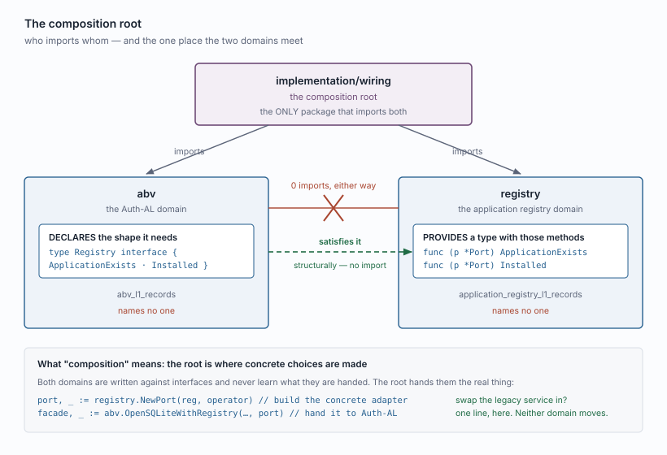
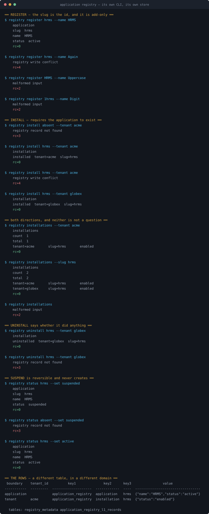
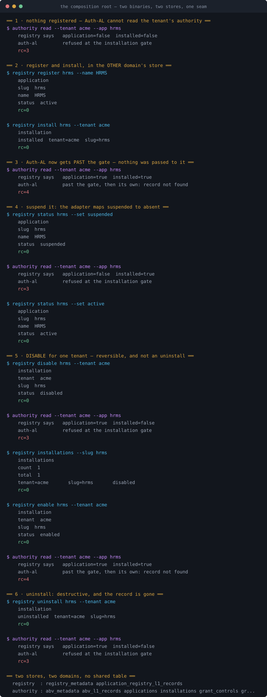

# `application_registry` — a minimal domain

A separate 123 domain, deliberately small: enough to unblock Auth-AL and nothing
more. **Implemented.**

---

## 1 · Why minimal

The registry is **not Auth-AL's business.** It is its own domain, and Auth-AL
only consumes two facts from it. Building the full registry now would delay
finishing Auth-AL for months and would be designing ahead of need.

So this domain starts at the size of the dependency, and grows later when it is
being built out for its own sake.

**The direction, stated once so the minimal version is not mistaken for a
throwaway:** this domain, on 123, eventually becomes the authoritative
application registry. `agentlabs-auth` leverages it, and the legacy application
management is deprecated. What follows is step one of that, not a stub that gets
discarded.

---

## 2 · The whole dependency is two facts

Auth-AL asks the database exactly two questions about applications:

```go
snapshot.go:33   SELECT 1 FROM installations WHERE tenant_id=? AND application_id=?
catalog.go:177   SELECT 1 FROM applications   WHERE application_id=?
```

Everything else Auth-AL holds about an application — the Q-041 compatibility
declaration, the generation counter — is Auth-AL's own and stays on Auth-AL's
side of the seam. Both are columns on its `applications` table today.

**Two facts, so two record types. That is the domain.**

---

## 3 · The domain

**`application_registry`**, table `application_registry_l1_records`.

Not `registry` — a registry of what? The name sits beside `abv_l1_records` and
`payroll_l1_records` and must answer that without being asked.

### `application_registry.application`

```
key1=application_registry  key2=application  key3=<slug>
value={"name": "...", "status": "active"}
boundary=application, tenant_id=''
```

The slug is the id: `hrms`, `payroll`. Lowercase, hyphens, starts with a letter —
the shape `agentlabs-auth` already enforces. **Not a Snowflake**, because an
application id appears in every canonical path of every record it owns, and a
generated one would make every path unreadable.

`status` is `active | suspended` for now. The real registry has five; the
remaining three describe a publishing lifecycle this domain does not yet have.

### `application_registry.installation`

```
key1=application_registry  key2=installation  key3=<slug>
value={"status": "enabled"}
boundary=tenant, tenant_id=<tenant>
```

Identity is the pair, presence is the fact — the same shape as a membership, for
the same reason: a relationship has no id of its own.

---

## 4 · The contract

**Two contracts, and keeping them apart is the point.** The domain has its own
operations; Auth-AL sees only the port in §5.

### 4.1 · The application

```go
RegisterApplication (ctx, identity, slug, name)        (Application, error)
GetApplication      (ctx, identity, slug)              (Application, error)
ListApplications    (ctx, identity, filter)            (ApplicationPage, error)
SetApplicationStatus(ctx, identity, slug, status)      (Application, error)
```

```go
type Application struct {
    Slug   string
    Name   string
    Status string   // "active" | "suspended"
}
```

**Platform-gated, not tenant-gated.** An application is not a tenant's, so
registering one is the platform administrator acting — the same authority that
publishes platform permissions. `identity` on every call including reads, as
everywhere else.

**`RegisterApplication` is add-only.** Re-registering a slug is `ErrConflict`.
The slug is the id and is never reassigned: it appears in the canonical path of
every record that application owns, so reusing one would silently re-point them.

**`SetApplicationStatus` is reversible**, the shape `SetPermissionStatus` holds —
`active | suspended`, and suspending does not delete anything.

**No `DeleteApplication`.** A slug appears in every canonical path of every record
that application owns; deleting one asks what happens to that whole catalog, and
this domain does not answer it.

| Returns | |
|---|---|
| success | the complete record, no follow-up call |
| `ErrMalformed` | a slug that is not `^[a-z][a-z0-9-]{1,63}$`, a blank name, an unknown status |
| `ErrConflict` | the slug is registered |
| `ErrNotFound` | no such application |
| `ErrRejected` | the platform gate denied |
| `ErrUnsupported` | identity is not a direct human, or the seam is absent |

> **The reserved-slug list stays in `agentlabs-auth`.** `system`, `platform`,
> `auth` and `admin` are the registry's rule. This domain checks the *shape* a
> slug must have and does not hold the list — the same reason Auth-AL does not
> hold it.

### 4.2 · The installation

```go
Install               (ctx, identity, tenantID, slug)          error
Uninstall             (ctx, identity, tenantID, slug)          error
SetInstallationStatus (ctx, identity, tenantID, slug, status)  (Installation, error)
GetInstallation       (ctx, identity, tenantID, slug)          (Installation, error)
IsInstalled           (ctx, identity, tenantID, slug)          (bool, error)
ListInstallations     (ctx, identity, filter)                  (InstallationPage, error)
```

### Two statuses, two scopes

**The charter first shipped without a tenant-side status, and that was wrong.**

```
application   active | suspended     platform-wide — every tenant at once
installation  enabled | disabled     one tenant
```

It was deferred as part of the real registry's five-state lifecycle. But
`disabled` is not lifecycle richness — it is the basic pairing of the status the
application already had, and leaving it out meant a tenant could only stop an
application by **uninstalling** it, which is destructive.

**Disabled and uninstalled are different things.** Disable is reversible and keeps
the record — with whatever configuration a fuller registry later holds. Uninstall
destroys it. A tenant pausing an application should not lose its setup.

**Installing over an existing installation is `ErrConflict`, not a quiet
re-enable.** Install means *create the relationship*; reviving a disabled one is
`SetInstallationStatus`. One operation, one meaning — an upsert would hide a
state change.

```go
type InstallationFilter struct {
    TenantID string  // exact; one of TenantID or Slug is required
    Slug     string  // exact — "which tenants have this application"
    Offset   int
    Limit    int
}
```

**`ListInstallations` answers in both directions** — a tenant's applications, or
an application's tenants — and requires exactly one filter, the rule
`ListMembers` holds for the same reason: an unfiltered listing of every
installation is unbounded in the dimension that grows fastest.

**`Install` is add-only and `Uninstall` says whether it did anything.** Installing
twice is `ErrConflict`; uninstalling something not installed is `ErrNotFound`.
Identity is the pair, as with a membership.

**`Install` requires the application to exist** — the foreign key the fold
removes, as a rule.

> **Open — does `Uninstall` refuse while the tenant holds authority?** By the rule
> teams settled — *refuse while anything depends on it* — it should: a tenant with
> live grants in an application has not finished with it. But the dependants live
> in **Auth-AL's** domain, and this domain cannot see them. Either the port grows
> a third method Auth-AL answers, or uninstall is unguarded and Auth-AL simply
> stops resolving. **Needs deciding**, and it is the one place the two domains
> genuinely interlock.

---

## 5 · Auth-AL depends on a port, not on this domain

This is what keeps the adaptation clean, and it is the part that matters most.

```go
type Registry interface {
    ApplicationExists(ctx, applicationID string) (bool, error)
    Installed(ctx, tenantID, applicationID string) (bool, error)
}
```

**The mechanism, and why neither domain imports the other:**



Go interfaces are **structural** — a type satisfies one by having the right
methods, not by declaring it does. So Auth-AL names no one, the registry names no
one, and `implementation/wiring` is the only package that knows both exist.

```
abv      -> registry :  0 imports
registry -> abv      :  0 imports
```

| Behind the port | |
|---|---|
| today | `application_registry_l1_records` |
| or | the legacy `applications` + `tenant_applications` |
| or | both, during a migration |

**Auth-AL does not change in any of those cases**, and the registry can grow at
its own pace without touching it.

> **`Installed` returns a bool deliberately, and the adapter maps two facts to
> it:** true only when the application is `active` **and** the installation
> `enabled`. Auth-AL never learns there are two ways to answer no — its question
> stays *may this tenant hold authority here*.
>
> **`ApplicationExists` reports a suspended application as absent**, for the same
> reason: Auth-AL's question is whether it may accept catalog writes, and it may
> not for one the platform has suspended. Both mappings are policy, and both live
> at the seam where they are visible rather than inside either domain.

---

## 6 · What this deliberately leaves out

Everything the real registry has that Auth-AL does not need: publishers, owners,
trust classes, signed bootstrap releases, distribution rules and allowlists,
installation admins, access modes, the lifecycle audit trail, and the five-state
installation machine.

**They arrive when this domain is built out to replace the legacy one**, each
with its own record document. Leaving them out now costs nothing, because the
port means adding them later does not touch Auth-AL.

Two envelope questions also wait for that work rather than this one: **optimistic
locking** (the real registry versions its definitions and distribution rules; our
envelope has no answer) and **lifecycles richer than `enabled/disabled/deleted`**.
Neither is needed for two record types with a two-value status.

---

## 7 · Scope

**The domain, its two records, and the port. Nothing else.**

1. `application_registry_l1_records` and its two record types
2. The ten functions in §4
3. `Registry` as a port, with an implementation over the new domain
4. Auth-AL's two direct reads cut over to it
5. Demonstrations through the CLI

**What shipped, and what did not.** Items 1-4 and 6 shipped. Dropping Auth-AL's
own `applications` and `installations` tables did **not**, and deliberately:

- `applications` also carries `compatibility_enabled` and `generation`, which are
  Auth-AL's facts, not the registry's. Dropping the table means first moving those
  into `abv_l1_records` — its own piece of work, with its own record type.
- `installations` is still the fallback when no port is wired. Auth-AL opened
  without a registry keeps working against its own tables; only
  `OpenSQLiteWithRegistry` routes the two questions across the seam.

So the count stays at **8 tables**. The fold is a *move to another domain* when it
happens, never into `abv_l1_records` as a second copy.

**Success criterion: Auth-AL's behaviour is unchanged.** Every existing test
passes untouched. If one needs editing, the port is leaking.

**Then back to Auth-AL** — the authority core is what remains.

---

## 8 · Demonstrations

Both are captured terminal output, not hand-written. The two CLIs were run, the
session captured, and the SVG generated line by line from that capture — so every
line in the picture was produced by a run, including the layout.

### The domain on its own



`registry` is the domain's own binary against its own store. It shows
registration refusing a second `hrms` and refusing `HRMS` and `1hrms` on shape;
install refusing an application that is not registered; `installations` answering
by tenant and by slug and refusing to answer unfiltered; uninstall reporting
whether it did anything; and suspend as a reversible status rather than a delete.
It ends on the rows themselves — two record types in one table, told apart by
`key2`, with the boundary and tenant the envelope carries.

### The two domains composed



`authority` is the composed binary. It prints what the port answered and what
Auth-AL then did, side by side, so the two are never confused — an earlier version
of this demo matched on an error string and reported Auth-AL's own missing record
as the registry refusing.

It walks four states: nothing registered, so the gate is shut; register and
install **in the other domain's store**, and the gate opens with nothing passed
between the binaries; suspend the application, and the adapter maps it back to
absent; disable the installation, same. It ends by listing both stores' tables to
show there is no shared one.
